# Execution sequence: P3.7 through P8

Planning snapshot: 4 October 2026, America/Los_Angeles.

This is a dependency-based execution plan for the active `v2/` implementation
on PyPy implementing Python 3.11, targeting general factoring below 100 decimal
digits on the Apple M4 / 24 GiB machine. It preserves the existing roadmap IDs
and acceptance gates. It does not mark experiments complete or authorize their
execution. `v1/` remains the baseline.

**Recommended immediate allocation: start R1 calibration on the integrated R2
control; start an isolated P4.3 backend tranche; use another available slot for
P5.2 schedule/coverage design or P4.1 chain verification.** A1 is complete for
the bounded R2 tranche. Conditional capacity/CRT follow-ups can remain
deferred; ECM work can start independently.

**Williams p+1 is P5.1, scheduled at A5 now; its special starts and Lucas-chain
optimizations are B8 under P5.1/P5.3.** It does not wait for P6. P6 instead owns
advanced ECM curve families, polynomial continuations, richer relation
experiments, broader workers and comparative publication. P7 owns GNFS; P8
owns the later integrated portfolio reconciliation.

The public acceptance catalogue is [v2/ROADMAP.md](v2/ROADMAP.md). Both files
carry the same six-column execution tables; update their mirrored rows together.
The existing acceptance checkboxes are unchanged.

## How to read the phases

Phases A–I are execution layers, distinct from the roadmap's numbered phases.
Rows in one layer have no dependency on one another's unfinished deliverables.
Each row names its predecessors; it may start as soon as those predecessors
are settled, without waiting for unrelated rows in an earlier layer.

The plan includes two kinds of edge:

- **Required:** an interface, oracle, implementation or measurement needed by
  the successor. These are stated in the predecessor column.
- **Evidence/order gate:** a deliberate choice to evaluate a cheaper control
  before spending on a more expensive challenger. These are labeled in the
  reason column; they are not mathematical necessities.

An experimental predecessor is settled by an accepted implementation **or a
documented retain-baseline/defer/reject decision**. If a required mathematical
capability is missing, its dependent implementation stays deferred. A recorded
deferral cannot stand in for a correctness proof.

Priority means expected return per engineering/measurement effort, inferred
from current evidence, not a promised speedup. **High** gets the next available
slot; **medium** is useful independent work; **conditional** requires its stated
trigger; **low/conditional** is deliberately a later investment. Within a
phase, prefer higher-priority rows when slots are limited.

## Current foundation: already available

| Foundation | Confirmed scope | Consequence for this plan |
| --- | --- | --- |
| P1/P2 and P3.1–P3.4 | Exact bounded algorithms, recovery and a working SIQS relation/filter/extraction baseline exist. | ECM and complementary-method correctness work can start now. Full P3.8 completion is not a prerequisite. |
| P3.6.1 and the follow-up repair pass | Accepted budget/storage/setup fixes and measured decisions are recorded; native defaults remain conservative. | Reuse these fixes. R2/R5 should reconcile the current baseline rather than reimplement polling, leases, base verification or rejected batching experiments. |
| P3.8-R1 implementation | External-square MPQS, streamed assignments, up to 32 A factors, bounded quota extension and sparse initial charging are integrated. Broader calibration remains open. | R1 is now mainly a workload/parameter/evidence task. Capacity reachability is not evidence of large balanced completion. |
| P3.8-R3 bounded tranche | Stable mixed rows, complete identities and checked recovery are integrated. Cadence 32 has a scoped opt-in win; general policy and larger provenance/storage bounds remain open. | Matrix controls can start now. Do not reopen the accepted R3 work or assume its existing dense storage reservation has disappeared. |
| P3.8-R2 bounded tranche | The isolated study and combined repaired/R3 acceptance pass; fixed scores and capped plans are integrated as opt-ins. The original promotion decision retains defaults. | A1 is complete for this scope and B1 can start. B13 resieve capacity and C8 family-wide CRT remain conditional follow-ups. |

The prior R1 flyer comparison reduced a one-input, two-seed 30-digit cohort
from 1.767 to 1.444 seconds (18.3%); the fixed legacy schedule was 3.0% slower
in its frozen comparison. R1's one-second upper-band runs do not establish
practical upper-band completion. R3's scoped cadence-32 confirmation reduced
complete-cohort time by 38.7%, with 54/54 attempts completing per arm; this is
not a universal filtering policy. These results favor careful calibration,
not an assumption that every proposed optimization will win. See the
[benchmark evidence](v2/benchmarks/README.md).

The isolated R2 fixed-score/plan arm reduced 30-digit held-out complete-cohort
time by 5.7%; no candidate passed the prespecified causal training promotion
gate. Keep fixed scores and capped plans opt-in, retain the streamed default,
and carry the rejected tiny-prime/batch/grouped-charge decisions into A1.
The 20–21-digit held-out median gain has an interval crossing zero. These
results settle the bounded study, not mainline acceptance or broad scaling.

## Model and effort key

For **new** tasks, **Sol** means **GPT-6.1 Sol** (`gpt-6.1-sol`) and **Astra**
means **GPT-6 Astra** (`gpt-6-astra`). Keep the active R2 task on its current
configured model; this plan does not switch it. The earlier user label
“Sol 6.2 / ll1” is not established by the official pages checked here.

Use Sol for bounded implementation, measurement and integration; use Astra
for difficult algebraic/provenance invariants and new solver designs. `high`
fits controlled execution and reconciliation; `xhigh` fits coupled correctness
or selection decisions. Escalate to `max` only for a named unresolved proof or
repeatedly failing design, not as the default for a long benchmark run.

These assignments are engineering recommendations, not results of a model
benchmark on Factor. They follow the general distinctions in
[OpenAI model-selection guidance](https://developers.openai.com/api/docs/guides/model-selection).
The [Sol](https://developers.openai.com/api/docs/models/gpt-6.1-sol) and
[Astra](https://developers.openai.com/api/docs/models/gpt-6-astra) model pages
confirm the model names and supported effort settings.

## Phase A — independent foundations that can proceed now

All rows depend only on the existing foundation above. Parallel means isolated
development and coordinated integration, not concurrent performance runs.

| ID / roadmap work | Concrete deliverable | Predecessors | Priority and reason for placement | Model / effort | Why this model / effort |
| --- | --- | --- | --- | --- | --- |
| A1 — P3.8-R2 integration and acceptance | Completed for the bounded tranche: integrate fixed scores/capped plans with the latest repairs, migrate required inputs/evidence without changing historical pins, validate combined budgets/checkpoints and matched comparisons, and verify committed-files-only tests/imports. | Existing R1/R3/repair contracts; isolated R2 implementation and frozen decisions | **Complete for bounded scope.** The accepted options remain opt-in and defaults are retained. B1 calibration is unblocked; B13/C8 remain conditional on new workload evidence. | Current Sol / **xhigh** | Sol preserves task continuity and existing controls. xhigh covers provenance-preserving migration, budget/checkpoint composition and combined-source validation. |
| A2 — P4.3 backend foundation | Specify coarse int/mpz boundaries; implement and validate specialized baseline ladder/stage paths, canonical checkpoints and explicit backend identity; compare available PyPy tracks. | Existing exact ECM and checkpoint controls | **High, bounded experiment.** Broad arithmetic costs make this a useful early test and it settles interfaces for later ECM work. Installed gmpy2 is availability evidence, not a speedup; retain int if GMP loses. | Sol / **xhigh** | Sol fits a bounded backend implementation with exact reference outputs. xhigh helps reconcile type validation, nonunit handling, conversions and checkpoint identity across the complete stage. |
| A3 — P5.2 reusable programs and campaign feasibility | Build bounded immutable prime-power/coverage programs and independent coverage oracles; compare schedule reuse on the current int control; define finite curve/bound/storage/extension contracts. | Existing P2 schedules, recovery and ECM | **High.** Research identified repeated schedule generation and infeasible allowance combinations. Reusing bound-owned work across curves can matter without changing curve mathematics. This planning/schedule tranche does not need PRAC or GMP. | Sol / **xhigh** | Sol fits schedule construction and oracle-driven implementation. xhigh is warranted because coverage, amortization, memory limits and resumed execution must agree, even when individual arithmetic actions are unchanged. |
| A4 — P4.1 chain correctness | Verify bounded PRAC/precomputed prime-power chain records against integer and independent point oracles; retain the ladder. | Existing exact point/ladder controls | **Medium/high potential, higher proof risk.** Mathematical validation can run independently of backend implementation. It must precede production chain execution; old exceptional `(0,0)` cases do not count as equality successes. | Astra / **xhigh** | Choose Astra for the proof-intensive chain invariants and exceptional composite-modulus cases. xhigh supports checking termination and valid projective states against independent oracles before production use. |
| A5 — P5.1 Williams p+1 binary baseline | Implement exact binary Lucas stages 1 and 2, bounded parameter trials, discriminant checks, saturation recovery and checkpoints. | Existing P2 bounded recovery | **Medium, complementary coverage.** This is independent of SIQS and PRAC. Binary Lucas supplies the correctness control required before optimized Lucas chains or special starts are ranked. | Sol / **xhigh** | Sol fits established binary Lucas formulas with direct small-index controls. xhigh is for integrating both stages, discriminant checks, parameter identity and saturation recovery without conflating group actions. |
| A6 — P5.3 p−1 and extension correctness | Compare bounded prime-power/chunk powering and gap reuse against current p−1; define and test exact increased-B1 schedule ratios without requiring new p+1 code. | Existing p−1/P2 controls | **Medium.** Cheap structured-factor coverage and correct continuation can be developed now. Raising B1 must include increased powers of old primes, not just new primes. Keep this p−1 tranche separate from the later Lucas optimization. | Sol / **xhigh** | Sol fits incremental changes to an existing verified method. xhigh is for proving exact schedule ratios, preserving chunk replay and separating genuine extra coverage from repeated work. |
| A7 — P3.8-R5 reconciliation | Reconcile SSS/SSSf, workers, forced factors, loss policies, API/checkpoints and the two repair-pass decisions; prepare comparable arms. | Accepted repair and R3 records | **High leverage, modest scope.** Prevents duplicate work and stale comparisons. This is the early interface/evidence audit; broad promotion waits for the final portfolio comparison. | Sol / **high** | Sol fits reconciliation against existing code and accepted evidence. high is sufficient for bounded API/documentation and checkpoint audits; escalate to xhigh only if a new conflicting invariant appears. |
| A8 — P3.8 matrix control + remaining R3 diagnosis | Freeze exact matrix/operator/lifting interfaces and genuine post-filter fixtures; profile solving, filtering, provenance and capacity refusals; establish independent packed-product oracles. | Accepted R3 identities/lifting and P3.3 control | **Conditional preparation.** It is safe now and unlocks Four Russians without waiting for R4. If representative useful matrices are missing, record the gap and revisit after B1/C1 rather than inventing a synthetic speed claim. | Astra / **xhigh** | Choose Astra because matrix orientation, nullspaces, lifting and representation bounds define the validity of every later solver comparison. xhigh is for designing independent oracles and distinguishing mathematical from capacity failures. |
| A9 — P7.1 GNFS contracts + P7.4 root-method scope | Define polynomial/field, nonmonic norm, ideal/root and bad-prime identities; choose a finite supported algebraic-root strategy before expanding fields. Use exact small oracles. | Existing P2 contracts and P3.3/P3.4 reference | **High for committed coverage.** GNFS is already committed scope. Its contracts can start now on Python integers; optional P3.8/P4/P5/P6 experiments do not block them. Root-method constraints must inform field selection early. | Astra / **xhigh** | Astra fits the coupled number-field, ideal and square-root contracts. xhigh is for nonmonic corrections, unsupported-field refusal and independently checkable identities; no max setting is needed merely for drafting contracts. |

## Phase B — exploit the settled controls

| ID / roadmap work | Concrete deliverable | Predecessors | Priority and reason for placement | Model / effort | Why this model / effort |
| --- | --- | --- | --- | --- | --- |
| B1 — P3.8-R1 calibration | Jointly train base size, interval, A selection/factor count, Gray reuse, residual/store/matrix allowances; freeze feasible configurations and evaluate fresh inputs. | A1 | **High.** Collector changes can move the best configuration, so broad tuning follows R2. Use meaningful upper-band allowances and explain collection, yield, storage and time failures separately. This supplies the R4 decision. | Sol / **high**, **xhigh** for selection | Sol fits controlled parameter sweeps and evidence summaries. Use high for executing the frozen protocol and xhigh for joint parameter selection, uncertainty and crossover decisions; long runs alone do not justify extra effort. |
| B2 — P5.2 paired continuation | Execute reusable ±-paired stage-two programs; tune basic D/table sizes; preserve coverage, curve-private points, tails and replay; integrate supported finite campaign extensions. | A2, A3; A6 for extensions of the stage-one bound | **High potential.** Combines repeated-schedule savings with fewer continuation terms. Stable backend/program contracts avoid competing rewrites of stage jobs. It does not require PRAC or a GMP win. | Astra / **xhigh** | Choose Astra for proving paired-prime coverage while preserving projective terms and mixed-factor recovery. xhigh is warranted by interactions among tails, table bounds, reusable plans and resumed campaigns. |
| B3 — P4.1 production chains | Route verified records into actual bounded ECM stage-one jobs, including chunk replay, finite caches and ladder fallback; compare whole-stage costs. | A2, A3, A4 | **Medium/high potential.** Verified chains cannot help while production still calls only the ladder. Backend and program contracts make this a controlled execution change rather than an orphan helper optimization. | Sol / **xhigh** | Sol fits production integration once chain mathematics is independently verified. xhigh is for routing the records through real stage jobs while preserving work charges, replay, caches and fallback behavior. |
| B4 — P4.2 fused/normalized kernels | Compare explicit squares, fused addition/doubling, selected reductions and unit-checked normalization on stable int/mpz paths. | A2 | **Medium/high potential.** Representation, conversions and formula conventions must be fixed before ranking kernels. This can use the ladder control and run independently of B3's chain integration. | Sol / **xhigh**; Astra for unresolved formula proofs | Sol fits a bounded set of kernels checked against fixed formulas. xhigh is for normalization assumptions, reduction bounds and backend interactions; use Astra / xhigh if a new algebraic equivalence remains unresolved. |
| B5 — P3.7 optional NumPy spike | Test bounded vectorized score/root-hit updates and candidate extraction against PyPy bytearray/array/list controls. | A1 plus a measured remaining array bottleneck | **Conditional.** Optimizing arrays before R2 risks accelerating work that R2 removes. Verify PyPy availability, overflow bounds, duplicate-hit accumulation and full-run conversion/import costs; otherwise defer. It is not required for Phase 3 exit. | Sol / **xhigh** | Sol fits a small optional array adapter with an exact scalar oracle. xhigh is needed for fixed-width overflow, duplicate accumulation, tails and conversion costs, despite the limited implementation scope. |
| B6 — P3.8 Four Russians | First bounded dense/hybrid challenger against the bitset control; account for tables, conversion, recovery, lifting and peak simultaneous storage. | A8 plus a representative solve-cost/memory case | **Conditional, first matrix investment.** Existing identities and real matrix controls are the prerequisites. It can overlap B1 and ECM work; it does not wait for R4, R5 or NumPy. | Astra / **xhigh** | Choose Astra for rank/nullspace preservation, table construction and dependency recovery across transformed matrices. xhigh is justified by lifting correctness and simultaneous memory bounds, not simply by the amount of XOR work. |
| B7 — remaining P3.8-R3 capacity/provenance | If diagnosed, prove and test new fill/provenance storage bounds; assess merge histories or accumulated square-root payloads with independent verification. | A8 plus a demonstrated capacity or provenance bottleneck | **Conditional.** Faster elimination cannot fix an admission refusal caused by representation bounds. Address a proved bottleneck without reopening rejected small-workload defaults or merely lowering a reservation constant. | Astra / **xhigh** | Choose Astra because the deliverable includes new representation and storage proofs, not merely code tuning. xhigh is needed to connect retained provenance, corrupt-state detection, exact lifting and peak live memory. |
| B8 — Williams p+1 starts (P5.1) / Lucas optimization (P5.3) | Compare bounded rational/seeded p+1 starts and validated Lucas-chain execution against the binary control; validate p+1 bound extension separately from ordinary powering. | A5, A4; A6's schedule-ratio contract | **Medium/conditional.** Binary correctness and verified chain machinery must exist first. This targets marginal p+1 coverage; the ECM recurrence is not a drop-in Lucas implementation. | Astra / **xhigh** | Choose Astra for transferring verified chain ideas to a distinct Lucas recurrence and reasoning about parameter-dependent orders. xhigh is for denominator/discriminant exceptions, composition and exact extension semantics. |
| B9 — P7.2 full-relation collector | Build bounded serial line sieving with exact two-norm/ideal verification, primitive-pair deduplication, collection cursors and bounded storage. Start with full relations. | A9 | **High for the GNFS reference.** Stable field/ideal identities must precede stored relations. Full relations provide a tractable control before partials and special-q scaling. | Astra / **xhigh** | Astra fits the rational/algebraic relation boundary and ideal valuation exceptions. xhigh is for deduplication, sign/known-factor corrections, norm reconstruction and bounded resume across both sides. |
| B10 — P7.3 GNFS matrix/character control | Implement exact bitset constraints and original-relation lifting on independently generated fixtures, with explicit sign/character placement and kernel correction. | A9; existing P3.3 solver control | **High for correctness.** Fixture-based solver development can run alongside collection. It does not require Four Russians, Lanczos or Wiedemann; ideal parity alone is insufficient. | Astra / **xhigh** | Astra fits the distinction between ideal parity, character constraints and actual algebraic squareness. xhigh is needed for exact lifting and correction without treating a screened vector as a proved square. |
| B11 — P7.4 algebraic/rational root implementation | Implement the selected bounded root method against known-square field fixtures, including coefficient/precision bounds, signs, denominators and modular mapping. Defer full pipeline acceptance to C7. | A9 | **High and proof-sensitive.** Root arithmetic can develop alongside B9/B10 using independent fixtures. An unsupported field or failed auxiliary-prime search must produce finite refusal, not an invalid root. | Astra / **xhigh**; **max** for a named unresolved proof | Astra fits reconstruction and number-field square-root arguments. xhigh is the normal setting; max is reserved for a concrete precision/sign/field-coverage counterexample that remains unresolved. |
| B12 — P6.3 worker-contract preparation | Specify reusable assignment IDs, immutable schedules, parent-owned leases, aggregate CPU/RSS, cancellation and restart contracts; reconcile existing QS workers. Prepare bounded fixtures, not a new worker default. | A2, A3, A7 | **Medium, early preparation.** Contracts can proceed once backend, program and repair interfaces settle. Production portfolio experiments wait for the stable serial tranche in F4; existing QS workers are reused. | Sol / **xhigh** | Sol fits state-machine and accounting design around existing workers. xhigh is for cross-process ownership, in-flight reservations and interrupted restart, not for adding more worker processes. |
| B13 — P3.8-R2 wide-block resieve capacity | Reconcile the repair owner's wide-block resieve accounting. If setup still refuses, prove a bound for the actual sparse scratch/storage representation, verify complete candidate coverage and refusal/resume, and compare bucket versus resieve complete runs under matched budgets. | A1; unresolved wide-block capacity refusal | **Conditional.** The isolated 30-digit resieve arm refused setup under the dense reservation. Reuse any accepted repair first; a new bound needs a proof, not a smaller constant. Streamed B1 calibration can proceed while this branch stays deferred. | Astra / **xhigh** | Astra fits representation/storage proofs and exceptional recovery cases. xhigh is for simultaneous live memory, exact coverage and first-uncommitted-position behavior under refusal and resume. |

B6 and B7 use the same frozen matrix contract but can be independent challenger
branches. If the B7 storage problem prevents even the representative B6 control
from running, B7 becomes an explicit prerequisite for that larger B6 workload;
run only the already-feasible B6 cases until it is fixed.

B13 follows A1 and reconciles the repair owner's result before new capacity
work. It is a prerequisite only for a B1 configuration that requires the
refusing resieve representation; streamed B1 calibration does not wait for it.
A1 can close with explicit B13/C8 deferrals, without marking their optional
implementations complete.

## Phase C — measured challengers and the small GNFS integration

| ID / roadmap work | Concrete deliverable | Predecessors | Priority and reason for placement | Model / effort | Why this model / effort |
| --- | --- | --- | --- | --- | --- |
| C1 — P3.8-R4 + P5.4, one workstream | Implement bounded double-large-prime residual splitting/cycle provenance under P5.4; evaluate useful dependencies and complete factoring under R4. | B1 showing insufficient useful yield; accepted R3 contracts | **High potential when yield-limited; otherwise defer.** Calibrated single-large-prime behavior is the fair control. One owner prevents duplicate DLP implementations. Splitting, unmatched occupancy, repeated-prime corrections and lifting can erase raw collection gains. | Astra / **xhigh** | Choose Astra for the combined residual-certainty, graph-cycle and exact-provenance contract. xhigh is needed for repeated primes, self-loops, disconnected cycles, eviction and the distinction between cycles and useful dependencies. |
| C2 — P5.2 wheel pruning/common-Z | Independently compare advanced prime-coverage pruning and no-inversion common-Z tables against paired continuation. | B2 plus remaining schedule/product cost | **Conditional.** A paired reference makes attribution possible. Common-Z scaling can be a nonunit over composite n, so denominator checks and mixed-factor replay remain necessary. | Astra / **xhigh** | Choose Astra for coverage-pruning proofs and common-Z identities over composite moduli. xhigh is needed because apparently harmless scaling can hide nonunits or change saturation recovery. |
| C3 — P5.2 ECM allocation/handoff | Train finite factor-size tiers, curve counts and automatic-pretest versus explicit-campaign policies; credit completed work and compare ECM-to-SIQS handoff. | B1, B2, B3 and B4 decisions | **High downstream value.** Allocation should reflect measured engine costs and a calibrated SIQS alternative. Stratify by smaller-factor size; total digit count alone cannot choose an economical ECM investment. | Sol / **xhigh** | Sol fits integrating measured engine costs into a bounded policy. xhigh is for weighing uncertain marginal success, factor-size strata, prior-work credit and handoff costs without overfitting a digit threshold. |
| C4 — P3.8 other dense/hybrid/filtering | Compare PLE/free-variable recovery, sparse-to-dense cores, components and stronger bounded filtering; integrate any accepted provenance representation. | B6 decision; B7 decision for changed representations | **Conditional.** Four Russians goes first by evaluation policy, not mathematical necessity. Reuse its control before adding more interacting transformations; charge fill, retained history and recovery, not just matrix dimension. | Astra / **xhigh** | Choose Astra for interacting rank, fill, component and lifting transformations. xhigh is needed to distinguish exact simplifications from lossy pruning and evaluate their combined memory/recovery consequences. |
| C5 — P4.4 reducers | Revisit persistent Barrett/Montgomery contexts only in actual fused engine loops, with exact encoded identities, width bounds and canonical exits. | A2, B4 plus a remaining reduction bottleneck | **Low/conditional.** Earlier reducers lost near 166–200 bits. Backend/kernel results must provide a reason to reopen them; native `%` remains the default if the whole-run gate fails. | Astra / **xhigh** | Choose Astra for encoded-domain invariants, valid reduction ranges and GCD-preserving scaling. xhigh is warranted by subtle whole-loop correctness conditions; low expected performance return means defer the task, not lower its correctness standard. |
| C6 — P4.1 advanced offline chain search | Compare bounded/offline continued-fraction or near-optimal chain search with verified production chains. | B3 plus significant remaining stage-one cost | **Low/conditional.** First learn whether ordinary verified chains help. Shorter records or fewer search nodes alone cannot justify generation, dispatch and cache costs. No online search over the enormous full-lcm scalar. | Astra / **xhigh** | Choose Astra for chain-search termination, pruning validity and guaranteed-versus-heuristic claims. xhigh is for validating the search contract and generated records; optimize implementation cost only after those arguments hold. |
| C7 — P7.3–P7.5 small GNFS integration | Connect collected relations, constrained dependencies and both square roots; validate complete small general composites, corrupt-state checks, cumulative allowances and explicit opt-in dispatch. | B9, B10, B11; existing working SIQS baseline | **High committed milestone.** This is the first whole-pipeline GNFS correctness gate. It does not wait for every optional P4–P6 result; a matrix success or integer norm root cannot substitute for a proper divisor. | Astra / **xhigh** | Astra fits integrating new algebraic contracts with budget/checkpoint semantics. xhigh is for end-to-end identity checks, finite root retries and preserving unresolved cofactors; use the independent oracles from the preceding tasks. |
| C8 — P3.8-R2 family-wide CRT hit scheduling | Use calibrated whole-polynomial-interval prime/power eligibility and root costs to decide whether bounded CRT half-sum scheduling is warranted; if justified, verify every Gray/position hit, exceptional roots and table/queue limits, then compare complete factoring. | A1, B1; demonstrated family/root or eligible-prime scanning cost | **Low/conditional.** The isolated first-polynomial probe found zero eligible base primes and sparse eligible power hits. Retain the deferral until a calibrated workload supports the investment; block width is not the eligibility interval. | Astra / **xhigh** | Astra fits CRT/Gray hit coverage and exceptional-root invariants. xhigh is for exact prime-power and A-dividing-prime handling, bounded queued state and full-pipeline comparison. |

If B5, B13, C1 or C8 is adopted, recalibrate the affected SIQS configuration before
claiming a combined win. If C1 materially changes matrix density or dimensions,
refresh A8's workload evidence before promoting a solver. This is a new version
of the control for integration, not a cycle requiring every earlier experiment
to be rerun unconditionally.

A timeout or zero useful rows alone does not justify DLP: B1 must identify
a sufficiently useful population of residuals recoverable within the proposed
split/storage limits. Likewise, no useful matrix is a collection diagnosis,
not evidence that a more elaborate solver is needed.

## Phase D — GNFS scaling, P8 controls and sparse-solver alternatives

| ID / roadmap work | Concrete deliverable | Predecessors | Priority and reason for placement | Model / effort | Why this model / effort |
| --- | --- | --- | --- | --- | --- |
| D1 — P3.8 block Lanczos | Bounded seeded recurrence, singular-block handling, original-operator kernel correction, lifting and resumable state. | C4 decision and a remaining sparse-solve or dense-memory bottleneck | **Low/conditional.** A credible dense/hybrid comparison comes first by investment policy. Validate every candidate against original `M d = 0`; a Gram-kernel candidate can be spurious. | Astra / **xhigh**; **max** for a specific unresolved proof | Choose Astra for singular-block recurrence, self-orthogonality and original-operator kernel correction. xhigh is the starting point; max is reserved for a specific unresolved invariant or counterexample, not routine benchmark execution. |
| D2 — P3.8 block Wiedemann | Projected Krylov sequence, a genuine block polynomial generator, reconstruction, original-kernel verification and bounded checkpoints. | C4 decision and a remaining sparse-solve or dense-memory bottleneck | **Low/conditional.** It is an alternative to D1, not dependent on D1. Generator/reconstruction/I/O costs and failure rates can outweigh sparse products. A correct base-case generator precedes fast generator algorithms. | Astra / **xhigh**; **max** for a specific unresolved proof | Choose Astra for block polynomial generators, projection failure cases and reconstruction proofs. xhigh is the starting point; use max only for a named unresolved generator/kernel argument, not merely because the solver is large. |
| D3 — P7.6 polynomial selection | Compare bounded degree/skew/root-quality search and trial sieving with the base-m reference; verify every common root and charge selection cost. | C7, A2 decision | **High scaling candidate after correctness.** Better norms can affect the entire collector. Compare on a fixed reference collector so improvements are attributable; GMP is optional. | Astra / **xhigh** | Astra fits exact polynomial transformations plus heuristic selection criteria. xhigh is for separating valid algebraic changes from uncertain quality estimates and accounting for search cost. |
| D4 — P7.6 prime special-q lattice sieve | Implement bounded prime-special-q assignments, lattice mappings, forced ideal exponents, buckets/spills and exact duplicate coverage on fixed accepted polynomials. | C7, A2 decision | **High potential, substantial implementation.** The full-relation verifier is the control. This branch can run independently of D3 using frozen polynomials; composite special-q follows prime-q correctness within this track. | Astra / **xhigh** | Astra fits determinant/congruence and inverse-coordinate proofs. xhigh is needed for projective roots, overlapping assignments, forced factors and complete coverage under finite storage. |
| D5 — P7.6 two-sided cofactoring and large ideals | Evaluate bounded residual strategies and general side-labelled ideal incidence against the full-relation control; preserve repeated powers, certainty and distinct roots above the same prime. | C7, A2 decision | **Conditional on collection/cofactor cost.** Use fixed polynomial and sieve fixtures for independent work. QS DLP code supplies implementation experience, not a valid general GNFS edge-graph contract. | Astra / **xhigh** | Astra fits the interaction of ideal identities, cofactor certification and general incidence. xhigh is needed to prevent equal primes or multiple large ideals from being incorrectly collapsed. |
| D6 — P7.6 matrix/storage scaling | Profile genuine GNFS matrices, retain ideal/character constraints and lifting, and validate bounded layouts/spill. Reuse accepted P3.8 kernels; coordinate any new sparse solver with D1/D2. | C7, A2 decision | **Conditional on actual matrix pressure.** GNFS matrix preparation can run alongside D3–D5 against frozen fixtures. No duplicate Lanczos/Wiedemann implementation or compulsory sparse solver is introduced. | Astra / **xhigh** | Astra fits GNFS-specific constraint preservation and storage/lifting proofs. xhigh is for transferring infrastructure without confusing QS and GNFS relation semantics. |
| D7 — P8.1 fresh portfolio control | Freeze a measured SIQS/small-GNFS control and certified training/untouched confirmation inputs; profile separately and retain source/configuration identity for every later challenger. | C7; existing SIQS/P2 controls | **High enabling value, bounded scope.** P8 integrated experiments need small GNFS, not completed GNFS scaling or all P6 options. Keep this control immutable while later engines remain separately versioned candidates. | Sol / **high**; **xhigh** for protocol decisions | Sol fits corpus/runner reuse and reproducibility checks. high suffices for a fixed protocol; xhigh is for workload stratification, censoring and leakage-resistant comparison design. |

D1 and D2 belong in the same topological layer. With limited engineering
capacity, my scheduling preference is to try Lanczos first and fund Wiedemann
only if the evidence warrants another challenger. That preference is not a
dependency. Both can remain deferred while other accepted improvements ship.

## Phase E — earlier-tranche acceptance, scaled GNFS and P8 experiments

| ID / roadmap work | Concrete deliverable | Predecessors | Priority and reason for placement | Model / effort | Why this model / effort |
| --- | --- | --- | --- | --- | --- |
| E1 — final R1/R5 and P4/P5 acceptance | Integrate selected changes; recalibrate affected SIQS/ECM/p±1 parameters; freeze selections; run fresh complete-factor comparisons, R5 SSS/worker challengers, resume checks and clean-checkout validation; publish adopt/defer/reject decisions. | A1, A7 and chosen P3.7/P3.8/P4/P5 predecessor decisions; B13/C8 and other unchosen branches have recorded deferrals | **Required closure.** Independent wins are not additive and optional algorithms need not become defaults. Only the combined held-out comparison supports portfolio promotion. R5 consumes repaired interfaces and the final baseline rather than imposing a prerequisite on every earlier branch. | Sol / **xhigh**; targeted Astra / **xhigh** review for new arithmetic/provenance | Sol fits integration across established contracts and reproducible experiment runners. xhigh is for combined regressions, selection and uncertainty; targeted Astra / xhigh review is appropriate only where accepted changes introduce new arithmetic or provenance arguments. |
| E2 — P7.6 scaled GNFS integration | Integrate accepted selection/sieve/cofactor/matrix branches, retain rejected controls, validate full reconstruction and bounded restart, and freeze the scaling configuration before crossover measurement. | D3, D4, D5, D6 decisions; D1/D2 only if their solvers are selected | **High downstream milestone.** Independent stage wins can interact or lose useful relations. This is the serial scaling gate; broad process parallelism is optional and must use F4 accounting if later adopted. | Astra / **xhigh** | Astra fits interactions among new field, lattice, partial-relation and solver contracts. xhigh is for full-pipeline verification and resource composition; neither stage throughput nor accepted component tests close this gate. |
| E3 — P8.2 preprocessing | Compare trial cutoffs, exact power-exponent/rejection filters and finite Fermat updates on the frozen control; retain exact equality and primality certainty semantics. | D7 | **Medium; profile-gated.** Broad cheap-path savings may help, but prior repair decisions are retained. Full integrated evaluation now has the right control; a justified isolated oracle spike could occur earlier. | Sol / **xhigh** | Sol fits controlled filters around existing exact routines. xhigh is needed because a false rejection can silently lose a factor or power, particularly across partial trial progress and resume. |
| E4 — P8.3 rho calibration | Tune bounded batch/walk/restart policies under identical total budgets and assigned seeds; measure first-factor and complete runs including saturation recovery. | D7 | **Medium.** Parameter tuning is relatively contained, but must show marginal portfolio value on the new workload. It reuses current Brent/local-loop controls rather than rebuilding rho. | Sol / **high**; **xhigh** for changed recovery semantics | Sol/high fits sweeps over an existing verified implementation. Use xhigh if tuning changes replay, cancellation or consumed-work behavior; long sample collection alone needs no stronger setting. |
| E5 — P8.5 recovery/polling/checkpoint costs | Separate cooperative checks, atomic commits, recovery, explicit durable writes and JSON verification; revisit batching or bounded recovery trees only where profiles justify them. | D7 | **Medium; conditional on changed cost.** Existing repair gains remain the starting point. Revisit only unresolved or newly dominant overhead, preserving validation and disclosing work-unit changes. | Sol / **xhigh** | Sol fits measurement and bounded state-machine changes. xhigh is for proving no lost work, false saturation success or invalid resume while reducing overhead. |
| E6 — P8.6 contexts/schedules for changed workloads | Test lazy/staged setup, bounded reusable buffers and existing schedule/cache arms only when new bounds, backends or reuse alter their economics. | D7 | **Conditional.** This is workload-specific tuning after control freeze, not another implementation of P5.2 pairing. Retain prior cache/wheel/rolling decisions unless new evidence overturns them. | Sol / **high**; **xhigh** for ownership changes | Sol/high fits existing-arm comparisons. Escalate to xhigh when changing private scratch ownership, cache identity or upfront resource reservations. |

E1 is the P3–P5 release process; E2–E6 are independent work on the GNFS/P8
branches in this layer. Release individually accepted tranches once their
predecessors settle. A deferred reducer, NumPy spike or solver does not block
E1, and P6 experiments do not block GNFS correctness.

## Phase F — GNFS crossover and independent P6 challengers

The P6 production experiments use the measured P3–P5 tranche from E1.
GNFS correctness does not depend on these optional experiments. Each row is
separate; choose only the challengers supported by its cost/yield profile.

| ID / roadmap work | Concrete deliverable | Predecessors | Priority and reason for placement | Model / effort | Why this model / effort |
| --- | --- | --- | --- | --- | --- |
| F1 — P7.7 SIQS/GNFS crossover | Freeze scaled GNFS and calibrated SIQS arms; compare fresh general-composite bands, complete/factor-one outputs, exhaustion, CPU/RSS/disk and cold/warm costs before any default handoff. | E2, E1 | **High decision value.** A correct small GNFS engine is not evidence of a useful digit crossover. This needs both measured engines and remains independent of optional P6 research. | Sol / **xhigh** | Sol fits pinned-engine evaluation and dispatch policy. xhigh is for uncertainty, censored runs, observable decision features and separating special-form examples from general coverage. |
| F2 — P6.1 Edwards/windowed/torsion-aware ECM | Compare a complete curve-family/stage-one package and a validated Montgomery stage-two conversion with the accepted Suyama engine, including mixed-coordinate chains and setup costs. | E1; A2/B3/B4 accepted contracts or retained controls | **Conditional.** First establish how far ordinary backend/chain/kernel improvements go. Curve-order torsion, chosen-point order and exceptional maps need whole-engine evidence, not operation counts. | Astra / **xhigh** | Astra fits curve-family hypotheses, coordinate maps and low-order exceptions. xhigh is needed to check the conditions over hidden prime factors rather than infer them from a composite-modulus Jacobi symbol. |
| F3 — P6.2 polynomial ECM continuation | Choose one justified product/remainder-tree, multipoint or Brent–Suyama continuation challenger; bound nodes, coefficients, reconstruction precision and nonunit recovery. | E1, B2; C2 decision and a remaining continuation bottleneck | **Conditional, potentially important at larger targets.** Paired classical stage two is the baseline. Advance when per-prime continuation remains the limiting algorithm, not merely because larger bounds are available. | Astra / **xhigh** | Astra fits exact composite-ring polynomial arithmetic and coverage arguments. xhigh is required for coefficient/carry bounds, reconstruction and nonunit handling; floating FFT needs a separately proved exactness contract. |
| F4 — P6.3 production ECM/portfolio workers | Implement/reuse bounded parent-owned work leases, stable assignments, cancellation and restart; compare 1/2/4 workers for fixed-work and first-valid-factor cases with total CPU and aggregate RSS. | E1, B12; E2 if GNFS jobs are included | **Conditional measured parallelism.** Stable serial engines and worker contracts precede credible comparisons. Reuse P3.6/P3.6.1 results; extra cores and earlier thread improvements do not establish a first-factor win. | Sol / **xhigh** | Sol fits orchestration over settled engines. xhigh is needed for in-flight/returned/cancelled work, live and exited process accounting and restart identity; thread use additionally requires observed backend behavior. |
| F5 — P6.2 cross-family A=A0*q polynomial reuse | Compare bounded reuse across QS families with calibrated factor-base-smooth A, explicitly carrying any external q exponent, partial-relation role and duplicate policy. | E1; B1 calibrated QS control | **Conditional on polynomial/root setup cost.** This changes relation semantics and is not a drop-in root cache. Ordinary families and the R1 external-square distinction provide the control, not a correctness shortcut. | Astra / **xhigh** | Astra fits changed polynomial identities and external-factor provenance. xhigh is for separating an external factor from an external square correction and proving complete exponent recovery. |
| F6 — P6.2 triple-large-prime/general QS relations | If DLP economics justify another extension, implement general sparse incidence/provenance and bounded residual splitting; compare useful dependencies and complete factors with the calibrated DLP control. | E1, C1 with a viable DLP comparison and a remaining yield bottleneck | **Low/conditional.** A third large prime increases splitting, storage and verification complexity. Do not reuse a two-endpoint edge-cycle algorithm as though it represented every higher-arity relation. | Astra / **xhigh** | Astra fits the transition from graph cycles to general incidence and dependency lifting. xhigh is for residual certainty, repeated factors, eviction and resource bounds across the expanded provenance model. |
| F7 — P6.2 batch smooth-part/remainder-tree revisit | Revisit bounded batch recovery only if larger candidates or a new backend change the measured cost; retain scalar exact exponent recovery and compare full pipeline latency/storage. | E1; A1 decisions and a newly demonstrated candidate-division bottleneck | **Low/conditional.** R2 already evaluates batch recovery. This is a changed-workload revisit, not duplicate work or an automatic reversal of a loss. Sparse solvers and higher merges remain owned by the existing matrix rows. | Astra / **xhigh** | Astra fits exact tree arithmetic, coefficient/node bounds and recovery of every exponent. xhigh is warranted only once the new profile supports the experiment; throughput alone cannot justify adoption. |

## Phase G — integrated portfolio allocation

| ID / roadmap work | Concrete deliverable | Predecessors | Priority and reason for placement | Model / effort | Why this model / effort |
| --- | --- | --- | --- | --- | --- |
| G1 — P8.4 joint allocation and handoff | Fit bounded rho/p−1/p+1/ECM allocations and SIQS/GNFS handoff using observable input and completed-work metadata. Consume accepted engine changes without reimplementing them. | D7, E1, F1; E3–E6 and selected F2–F7 decisions | **High downstream value.** Allocation must use the settled engines and measured GNFS crossover. Known factor sizes stratify evaluation but are hidden from the dispatcher. P7.7 retains GNFS crossover ownership. | Sol / **xhigh** | Sol fits policy implementation using measured costs. xhigh is for uncertain marginal success, prior-work credit, shared child budgets and preventing hidden-label leakage or unmeasured native thresholds. |

## Phase H — final Phase 8 reconciliation

| ID / roadmap work | Concrete deliverable | Predecessors | Priority and reason for placement | Model / effort | Why this model / effort |
| --- | --- | --- | --- | --- | --- |
| H1 — P8.7 integrate and confirm selected winners | Integrate selected P8 and relevant P4–P6 winners, freeze the final configuration, confirm on untouched data and reconcile each historical P2 gate with adopt/retain/defer/reject evidence. | G1, E3, E4, E5, E6 decisions; selected P6 implementations | **Required for the selected final tranche.** Component wins do not prove combined performance. Optional losses do not block other accepted changes, and completed P2 work is not reopened by renumbering. | Sol / **xhigh** | Sol fits cross-module integration and reproducible acceptance. xhigh is for combined regressions, result/certainty and checkpoint invariants, frozen selection and honest attribution of performance changes. |

## Phase I — reproducible publication

| ID / roadmap work | Concrete deliverable | Predecessors | Priority and reason for placement | Model / effort | Why this model / effort |
| --- | --- | --- | --- | --- | --- |
| I1 — P6.4 final comparative publication | Publish source/configuration pins, commands, independent corpus/runner links, backend/core disclosures, supported limits and complete versus factor-one outcomes; run feasible pinned competitor arms. | H1, F1; selected P6 decisions and clean-checkout validation | **Required for comparative claims.** Final publication follows the measured integrated result, although individual milestone evidence can be published earlier. P8.1 supplies the protocol; P6.4 owns presentation/comparison rather than duplicating it. | Sol / **high**; **xhigh** for disputed comparisons | Sol/high fits evidence-backed reporting and reproduction checks. Use xhigh to resolve uncertain or incompatible comparisons; stronger model settings cannot replace missing measurements. |

## Dependency overview

The tables above are authoritative; this diagram shows the main branches.

```mermaid
flowchart TD
    S[Accepted P2 / SIQS / repairs / R3] --> R2[A1: integrated R2 opt-ins]
    ISO[Isolated R2 study: 171e69c] --> R2
    S --> GMP[A2: backend boundary]
    S --> PLAN[A3: reusable schedules and coverage]
    S --> CHAIN[A4: verified chain records]
    S --> PP[A5: Williams p+1 binary reference]
    S --> PM[A6: p-1 and extension]
    S --> AUD[A7: R5 reconciliation]
    S --> MAT[A8: matrix control]
    R2 --> CAL[B1: R1 calibration]
    R2 --> NP[B5: NumPy if array-bound]
    R2 --> RSV[B13: resieve capacity if still refused]
    R2 --> CRT[C8: family-wide CRT if justified]
    CAL --> CRT
    GMP --> PAIR[B2: paired continuation]
    PLAN --> PAIR
    PM --> PAIR
    GMP --> EXEC[B3: production chains]
    PLAN --> EXEC
    CHAIN --> EXEC
    GMP --> KERN[B4: fused kernels]
    PP --> LUC[B8: p+1 starts and Lucas chains]
    CHAIN --> LUC
    PM --> LUC
    MAT --> FR[B6: Four Russians]
    MAT --> PROV[B7: provenance/capacity if needed]
    CAL --> DLP[C1: R4 + P5.4 DLP if yield-limited]
    PAIR --> ADV[C2: advanced stage two]
    CAL --> POL[C3: ECM allocation/handoff]
    PAIR --> POL
    EXEC --> POL
    KERN --> POL
    FR --> DENSE[C4: other dense/hybrid/filtering]
    PROV --> DENSE
    KERN --> RED[C5: reducers if justified]
    EXEC --> SEARCH[C6: offline chain search if justified]
    DENSE --> BL[D1: block Lanczos if justified]
    DENSE --> BW[D2: block Wiedemann if justified]
    R2 --> END[E1: selected-tranche integration and acceptance]
    AUD --> END
    RSV -->|adopt or defer| END
    CRT -->|adopt or defer| END
    NP --> END
    LUC --> END
    DLP --> END
    ADV --> END
    POL --> END
    RED --> END
    SEARCH --> END
    BL --> END
    BW --> END
    S --> NF[A9: GNFS field and root contracts]
    NF --> NC[B9: full relations]
    NF --> NM[B10: GNFS matrix control]
    NF --> NR[B11: exact field roots]
    NC --> SMALL[C7: bounded small GNFS]
    NM --> SMALL
    NR --> SMALL
    SMALL --> SCALE[D3-D6: independent scaling branches]
    GMP --> SCALE
    SCALE --> SCALED[E2: integrated scaling]
    SMALL --> FREEZE[D7: P8.1 control]
    FREEZE --> P8[E3-E6: independent P8 experiments]
    SCALED --> CROSS[F1: measured SIQS-GNFS crossover]
    END --> CROSS
    END --> P6[F2-F3 and F5-F7: conditional P6 challengers]
    GMP --> WC[B12: worker contracts]
    PLAN --> WC
    AUD --> WC
    WC --> WORKERS[F4: production workers]
    END --> WORKERS
    WORKERS --> ALLOC
    CROSS --> ALLOC[G1: final allocation]
    P8 --> ALLOC
    P6 --> ALLOC
    ALLOC --> ACCEPT[H1: P8.7 acceptance]
    ACCEPT --> PUB[I1: P6.4 publication]
```

## Parallel execution and ownership

Use these lanes, with one integration owner for shared files:

| Lane | Scope and collision rule |
| --- | --- |
| QS collector | A1 R2 integration then B1 R1 calibration; B13 resieve capacity and C8 CRT are conditional. Reconcile the repair owner before shared collector edits; NumPy and DLP branch from explicit frozen versions. |
| Matrix/provenance | A8/B6/B7/C4/D1/D2; preserve the agreed row/operator/lifting contract. Shared relation/checkpoint edits need a coordinated integration slot. |
| ECM arithmetic | P4.3/P4.1/P4.2/P4.4; separate oracle/record work from production `ecm.py` and `stage_jobs.py` integration. |
| Schedules/continuations | P5.2/P5.3 and p+1; coordinate `schedules.py`, `stage_jobs.py`, backend boundaries and checkpoint versions with the arithmetic lane. |
| Evidence/integration | R5, final calibration and docs; one writer reconciles shared configuration, portfolio, benchmark guide and roadmap decisions. |

Start with A1 R2 integration plus one substantial ECM implementation lane and, if useful,
one lighter schedule/oracle lane. There is no benefit in launching every
eligible row at once. Worktrees isolate edits but not CPU, RAM, disk or thermal
conditions. Reserve one machine-wide performance window; pause competing
tests, compression, profiling and heavy correctness runs during accepted
timings. Integrate changes sequentially and compare the exact combined source.

## Acceptance, evidence and stop rules

1. **Separate workload classes.** Train on prespecified total-size bands such
   as 30/40/60/70/80/90/99 digits, with balanced inputs distinct from uneven
   smaller-factor bands and smooth/close/power controls. Feasibility probes
   choose finite allowances before fresh confirmation; they are not held-out
   performance evidence. Do not substitute a single 50-digit target for the
   general below-100-digit objective.
2. **Require exact outputs and finite resources.** Preserve proper divisors,
   complete reconstruction including unresolved cofactors, certainty labels,
   nonunit recovery, cumulative work/time/storage and checked resume. Add
   checkpoint identity/budget handling alongside each implementation, not
   after the optimization is finished.
3. **Measure the whole consequence.** Include setup, import/conversion where
   relevant, planning, failed attempts, splitting, filtering, lifting,
   serialization, replay and retained storage. Report owned bounds separately
   from observed RSS. Benchmarks must use matched inputs, seeds and budgets,
   at least three seconds of validated PyPy warmup and nine samples, extended
   when unstable. Cold startup and instrumented profiles stay separate.
4. **Use existing promotion gates.** Zero correctness failures; at least 10%
   lower complete-run median time or 10 percentage points more completion on
   a prespecified comparable cohort, with no more than 5 percentage points
   of completion regression in another declared class, and uncertainty
   reported. Faster refusal, microkernel throughput, extra rows and synthetic
   matrix capacity alone do not establish a factoring win.
5. **Run relevant checks.** Implementation changes use `make -C v2 test` and
   `make -C v2 lint`; before publishing, verify tests and benchmark imports
   in a committed-files-only checkout. Update API docs, accepted behavior and
   measured summaries only after the corresponding gates pass.
6. **Use the new evidence layout.** Required immutable corpora, baselines and
   loader source snapshots belong in versioned `v2/benchmarks/inputs/`.
   New generated captures, profiles and scratch evidence go under ignored
   `results/` trees. The entire `v2/audit/` tree is local. Keep historical archives
   at their recorded restoration locations; do not recreate obsolete loose
   `_LOCAL` files or force-add generated outputs.
7. **Re-rank after each meaningful result.** If collection dominates, prefer
   calibrated collection/yield work; if sparse admission fails, require a
   storage proof; if stage-two schedules dominate, prefer reuse/pairing; if
   arithmetic dominates, use the backend/kernel evidence. Rejecting a
   challenger and retaining the baseline is a valid completed experiment.

This plan includes P6 research/parallelism/publication, P7 GNFS and P8 portfolio
reconciliation. Their roadmap numbers are ownership labels, not a requirement
to finish all lower-numbered optional experiments. Small GNFS starts at A9 and
reaches its integration gate at C7; P4.3 is settled before scaling. P8.1 follows
small GNFS, while final P8 allocation consumes the measured crossover later.
Independent P8 oracle/profile spikes may start earlier when justified, without
claiming integrated promotion. Preserve this distinction between early research
and the named production/acceptance gates.

## Sources and verification scope

- [Canonical task IDs and acceptance gates](v2/ROADMAP.md).
- Phase 3+ research and below-100-digit priorities (local audit material), especially ECM schedule/backend priorities and R4/P5.4 ownership.
- Matrix research (local audit material) and [benchmark results](v2/benchmarks/README.md).
- [Accepted implementation record](CHANGELOG.md), [ECM control](v2/ecm.py), [bounded stage execution](v2/stage_jobs.py), [schedules](v2/schedules.py) and [portfolio configuration](v2/portfolio.py).

Current roadmap, code and the isolated R2 commit/acceptance record were
inspected for this update. No new algorithm benchmarks were run. A1 records
completed layout, combined-source validation and mainline integration;
B13/C8 retain explicit conditional deferrals. This file records sequencing
and recommendations only; it changes no implementation or completion checkbox.
