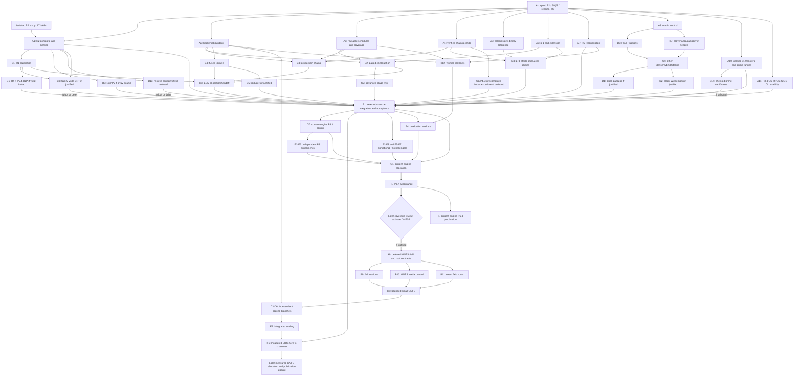

# Factor: phased TODOs and decision gates

Generated run captures and detailed milestone journals are local records,
excluded from GitHub. Historical evidence references below appear as
plain labels; retained inputs remain linked; research notes and diagnostic tools are local. See the
[benchmark guide](benchmarks/README.md#p36-coarse-siqs-workers-4-october-2026) for rerun commands and
[public changelog](../CHANGELOG.md) for accepted behavior.

Date: 3 October 2026  
Source: codebase audit, reviewed commit `1272e033f889a105792cbb924bf8a12a46ac88ae`.

Research reconciliation: 4 October 2026. The
Phases 3+ research pass (local audit material) compares the active
worktree, accepted evidence and current primary literature/source code.
All new Phase 3 research findings live in P3.8; this pass edits none of
P3.1–P3.7's milestone records.
P3.4's bounded implementation and declared large-number experiment gate
are complete at M31; broader scaling/default promotion stays separate.
Phase 8 remains the M23 Phase 2 optimization follow-up. Research additions below close no implementation or experiment gate.

Start with correctness repairs in Phase 1. Establish bounded, reproducible
execution in Phase 2, add SIQS coverage in Phase 3, then optimize and calibrate
the current engines before revisiting GNFS as a later workstream.
Keep the factoring algorithms in Python on PyPy Python
3.11; compare built-in integers and optional gmpy2 arithmetic on that runtime
as separate performance tracks. Existing phase/task IDs stay stable; the
execution order below governs dependencies rather than numerical order.

This is an implementation backlog; checked items have acceptance evidence below. Findings and existing counterexamples come from the audit; task boundaries, numerical promotion thresholds, and experiment designs below are recommendations. Report statements are evidence to evaluate, not instructions to execute. This document alone does not authorize implementation or benchmarks; Phase 1 was subsequently implemented at your explicit request.

Implementation target: PyPy implementing Python 3.11 only in `v2/`. CPython
support and routine compatibility runs are retired; their historical results
remain evidence. Retain `v1/` and historical audit captures for provenance.
Large result captures are losslessly compressed; original paths and hashes
are recorded in the archive manifest.
Source filenames in the original report refer to v1;
the production modules now use snake_case. Maintain milestone evidence and
measured improvements/regressions in [public changelog](../CHANGELOG.md).

Your C sieve versions were inspected at commit
`5b4afb8f344ad5f6fbd20a186cd57b36182ea710`. The
C-to-Python transfer review (local audit material) maps useful ideas to the
phases below. C thresholds and OpenMP speedups are reference evidence, not
Python defaults or measured Python improvements.

## How to use the gates

- **Acceptance gate (A):** the observable behavior required to close a TODO. Every returned split must satisfy `1 < g < n` and `n % g == 0`.
- **Experiment gate (E):** the comparison or adversarial experiment required before integration or changing a default. For correctness repairs, this means passing regression and fault-injection cases; speed is not a prerequisite for fixing incorrect behavior.
- **Phase exit:** the condition for moving the dependent production work into the next phase. Independent research spikes may proceed once their stated prerequisites exist.
- **Evidence:** store the implementation commit, command, corpus identifier, seeds, environment, raw results, and decision in a separate artifact for each task. Preserve the original audit JSON as historical evidence.

Performance promotion policy proposed for Phases 3–8: zero correctness failures; obey the same time, CPU, and memory limits; show either at least 10% lower end-to-end median time on a prespecified comparable cohort or at least 10 percentage points higher completion within budget; allow no more than a 5-percentage-point completion regression in another declared workload class. Check uncertainty with repeated seeds and a confidence interval for the relevant difference. If evidence is inconclusive, retain the baseline and expand the sample. Include setup, conversion, timeout, and recovery costs. These thresholds are project policy suggestions, not measured predictions.

## Execution order: optimize current engines, then revisit GNFS

**Decision (5 October 2026): prioritize the current factoring engines.**
GNFS remains future roadmap scope and is deferred; this supersedes M18's
immediate execution priority. First calibrate SIQS/MPQS, improve measured
ECM and p±1 bottlenecks, reconcile v1 capabilities and tune the existing
portfolio. Confirm selected changes together on fresh inputs before deciding
whether remaining coverage gaps justify starting GNFS. Keep optional losses
or inconclusive experiments as explicit deferrals rather than requiring every
challenger to be implemented.

- [x] ~~P3.8-R2 bounded candidate-cascade evaluation and integration~~ — merged
  as `758d5b3`; acceptance and the retain-defaults decision are complete.
  Conditional B13/C8 follow-ups remain separately open.
- [ ] Optimize and confirm the current-engine portfolio through E1 and H1,
  including selected P6 challengers and fresh P8 calibration.
- [ ] Review measured coverage and marginal gains after H1; decide whether
  to activate the deferred GNFS tranche starting at A9.

Sequence by these prerequisites:

1. P3.4's SIQS implementation, complete extraction/checkpoints and optional
   dispatch are tested. M31 completes the declared longer 30–80-digit and
   varied-input evaluation with one fresh 50-digit success and explicit
   negative outcomes; retain ECM defaults. Broader scaling remains open.
   P3.1–P3.3's exact relation/filter/dependency controls and their M28 repairs
   provide shared infrastructure and a comparison baseline.
2. Optimize the existing engines: B1 SIQS calibration, P4.3 backend and
   P4/P5 arithmetic/schedule improvements, profile-triggered relation/matrix
   work and selected P6 challengers. Freeze the accepted E1 control for P8
   tuning, then confirm the combined current-engine portfolio at H1. Keep
   conversions outside hot loops and preserve canonical checkpoints; GMP
   availability alone is not a speedup.
3. After H1 and an explicit coverage review, revisit P7.1–P7.5: a bounded
   GNFS pipeline that completes small general composites through both
   rational and algebraic square roots. Shared
   relation storage/filtering interfaces may be reused, but SIQS relations and
   GNFS ideal/character data have distinct mathematical contracts.
4. Scale P7.6–P7.7: improve polynomial selection, lattice sieving and sparse
   linear algebra, then measure a SIQS/GNFS dispatch crossover on held-out
   inputs. Define budgets and feasible bands before runs; no fixed digit
   cutoff or performance date is promised before measurement.

P3.6.1 completes the bounded repair pass for the diagnosed P3.5/P3.6 costs;
its evidence is available to P3.8 and P6.3. Further P3.5 SSS comparison, P3.6 parallel promotion,
P3.7 NumPy, and P4–P6 optional optimizations proceed when useful. M23 consolidates
remaining P2 optimization in Phase 8, now using the accepted current-engine
portfolio without waiting for GNFS. After selected improvements and explicit
deferrals are confirmed at H1, revisit GNFS using the measured coverage gap.
Small reference
correctness, scalable execution, and performance-based default promotion are
separate milestones. The eight-phase catalogue preserves existing
task/evidence IDs; Phase 8 is the user-requested future follow-up.

<!-- BEGIN MASTER EXECUTION SEQUENCE -->
## Master execution sequence and model recommendations

Planning snapshot: 4 October 2026; execution priority updated 5 October 2026,
America/Los_Angeles.

This is the authoritative dependency-based execution plan for the active
`v2/` implementation on PyPy implementing Python 3.11, targeting general
factoring below 100 decimal digits on the Apple M4 / 24 GiB machine. The
execution tables below preserve the existing task IDs and acceptance gates
in the numbered phase catalogue. This plan does not authorize experiments;
`v1/` remains the baseline.

**Recommended immediate allocation: use B1's bounded R1 calibration on the
integrated R2 control for the selected E1/C3 follow-ups.** B1's 9 October
30/40-digit tranche is complete; general defaults and broader crossover gates
remain open. The isolated P4.3 backend tranche is complete. A1, A3 and A4 are complete
for their bounded tranches. A4 retains the ladder default; production chain
routing and near-optimal chains remain B3/C6 work.
A3 retains streamed defaults after matched reuse experiments; B2 production
pairing follows A2, with A6 needed for increased-B1 extensions. Conditional
capacity/CRT follow-ups can remain deferred. A10 can start now to recover
verified v1 capabilities, beginning with wider deterministic primality.
B14 follows A10 for certificate proofs; neither waits for GNFS or D7.

**Williams p+1 belongs to P5.1: A5 builds the binary reference, and B8 evaluates
P5.1 parameter starts and P5.3 Lucas optimizations. It is eligible before P6.**
P6 owns advanced ECM curve families, polynomial continuations, richer relation
experiments, broader workers and comparative publication. D7 freezes the
current-engine P8 control after E1; G1/H1 tune and confirm that portfolio.
GNFS starts at A9 only after H1 and the coverage review activates its later
tranche, then reaches small-engine integration at C7. F1 owns a subsequent
GNFS crossover update to the accepted allocation policy.

### How to read the phases

Phases A–I are execution layers, distinct from the roadmap's numbered phases.
Rows in one layer have no dependency on one another's unfinished deliverables.
Each row names its predecessors; it may start as soon as those predecessors
are settled, without waiting for unrelated rows in an earlier layer. Deferred
GNFS rows retain their IDs in a separate later-tranche table; their original
letters no longer indicate immediate eligibility.

The plan includes two kinds of edge:

- **Required:** an interface, oracle, implementation or measurement needed by
  the successor. These are stated in the predecessor column.
- **Evidence/order gate:** a deliberate choice to evaluate a cheaper control
  before spending on a more expensive challenger. These are labeled in the
  reason column; they are not mathematical necessities.

An experimental predecessor is settled by an accepted implementation **or a
documented retain-baseline/defer/reject decision**. If a required mathematical
capability is missing, its dependent implementation stays deferred. A recorded
deferral cannot stand in for a correctness proof.

Priority means expected return per engineering/measurement effort, inferred
from current evidence, not a promised speedup. **High** gets the next available
slot; **medium** is useful independent work; **conditional** requires its stated
trigger; **low/conditional** is deliberately a later investment. Within a
phase, prefer higher-priority rows when slots are limited.

### Current foundation: already available

| Foundation | Confirmed scope | Consequence for this plan |
| --- | --- | --- |
| P1/P2 and P3.1–P3.4 | Exact bounded algorithms, recovery and a working SIQS relation/filter/extraction baseline exist. | ECM and complementary-method correctness work can start now. Full P3.8 completion is not a prerequisite. |
| P3.6.1 and the follow-up repair pass | Accepted budget/storage/setup fixes and measured decisions are recorded; native defaults remain conservative. | Reuse these fixes. R2/R5 should reconcile the current baseline rather than reimplement polling, leases, base verification or rejected batching experiments. |
| P3.8-R1 implementation and bounded B1 calibration | External-square MPQS, streamed assignments, up to 32 A factors, bounded quota extension and sparse initial charging are integrated. Frozen 30/40-digit joint calibration and fresh confirmation are complete on the R2 control; defaults are retained. | Larger feasible workloads, combined-source confirmation and portfolio/crossover calibration remain open. Capacity reachability is not evidence of large balanced completion. |
| P3.8-R3 bounded tranche | Stable mixed rows, complete identities and checked recovery are integrated. Cadence 32 has a scoped opt-in win; general policy and larger provenance/storage bounds remain open. | Matrix controls can start now. Do not reopen the accepted R3 work or assume its existing dense storage reservation has disappeared. |
| P3.8-R2 bounded tranche | The isolated study and combined repaired/R3 acceptance pass; fixed scores and capped plans are integrated as opt-ins. The original promotion decision retains defaults. | A1 is complete for this scope and B1 can start. B13 resieve capacity and C8 family-wide CRT remain conditional follow-ups. |
| P5.2-A3 bounded tranche | Immutable capped ECM prime/power programs, independent +/- coverage fixtures, resume checks and finite campaign contracts pass acceptance and matched experiments. Streamed defaults are retained. | Reuse the program/oracle contracts in B2 after A2. Paired execution, D selection, advanced pruning and allocation remain open. |

The prior R1 flyer comparison reduced a one-input, two-seed 30-digit cohort
from 1.767 to 1.444 seconds (18.3%); the fixed legacy schedule was 3.0% slower
in its frozen comparison. R1's one-second upper-band runs do not establish
practical upper-band completion. R3's scoped cadence-32 confirmation reduced
complete-cohort time by 38.7%, with 54/54 attempts completing per arm; this is
not a universal filtering policy. These results favor careful calibration,
not an assumption that every proposed optimization will win. See the
[benchmark evidence](benchmarks/README.md).

The isolated R2 fixed-score/plan arm reduced 30-digit held-out complete-cohort
time by 5.7%; no candidate passed the prespecified causal training promotion
gate. Keep fixed scores and capped plans opt-in, retain the streamed default,
and preserve the rejected tiny-prime/batch/grouped-charge decisions.
The 20–21-digit held-out median gain has an interval crossing zero. These
isolated results settle the bounded study; the separate combined-source
acceptance pass closes A1, without establishing broad scaling.

### Model and effort key

For **new** tasks, **Sol** means **GPT-6.1 Sol** (`gpt-6.1-sol`) and **Astra**
means **GPT-6 Astra** (`gpt-6-astra`). The completed R2 tranche used its
existing configuration; these recommendations apply to new tasks.

Use Sol for bounded implementation, measurement and integration; use Astra
for difficult algebraic/provenance invariants and new solver designs. `high`
fits controlled execution and reconciliation; `xhigh` fits coupled correctness
or selection decisions. Escalate to `max` only for a named unresolved proof or
repeatedly failing design, not as the default for a long benchmark run.

These assignments are engineering recommendations, not results of a model
benchmark on Factor. They follow the general distinctions in
[OpenAI model-selection guidance](https://developers.openai.com/api/docs/guides/model-selection).
The [Sol](https://developers.openai.com/api/docs/models/gpt-6.1-sol) and
[Astra](https://developers.openai.com/api/docs/models/gpt-6-astra) model pages
confirm the model names and supported effort settings.

### Execution phase A — independent foundations that can proceed now

All rows depend only on the existing foundation above. Parallel means isolated
development and coordinated integration, not concurrent performance runs.

| ID / roadmap work | Concrete deliverable | Predecessors | Priority and reason for placement | Model / effort | Why this model / effort |
| --- | --- | --- | --- | --- | --- |
| ~~A1 — P3.8-R2 integration and acceptance~~ | ~~Completed for the bounded tranche: integrate fixed scores/capped plans with the latest repairs, migrate required inputs/evidence without changing historical pins, validate combined budgets/checkpoints and matched comparisons, and verify committed-files-only tests/imports.~~ | ~~Existing R1/R3/repair contracts; isolated R2 implementation and frozen decisions~~ | ~~**[x] Complete for bounded scope; merged as `758d5b3`.** The accepted options remain opt-in and defaults are retained. B1 calibration is unblocked; B13/C8 remain conditional on new workload evidence.~~ | ~~Current Sol / **xhigh**~~ | ~~Sol preserves task continuity and existing controls. xhigh covers provenance-preserving migration, budget/checkpoint composition and combined-source validation.~~ |
| ~~A2 — P4.3 backend foundation~~ | ~~Completed bounded foundation: explicit int/mpz arithmetic across engines, exact helpers, specialized loops, canonical results and backend/build-bound checkpoints; integrated PRAC and reusable ECM programs.~~ | ~~Existing exact arithmetic and checkpoint controls~~ | ~~**[x] Complete for the bounded foundation and stopped study on 5 October 2026.** Native integers remain default. Production-bound ECM and reachable QS screens reject persistent GMP promotion; disjoint helper/policy calibration remains open. Combined committed-files-only checks pass 358 PyPy/GMP tests, full lint and 57 benchmark imports.~~ | ~~Sol / **xhigh**~~ | ~~Exact reference outputs, nonunit handling, conversions, legacy checkpoint compatibility and backend/program identities are reconciled across the combined stages.~~ |
| ~~A3 — P5.2 reusable programs and campaign feasibility~~ | ~~Completed for the bounded tranche: immutable capped prime/power programs, independent +/- coverage and point oracles, matched int-control comparisons and finite campaign/resume contracts.~~ | ~~Existing P2 schedules, recovery and ECM~~ | ~~**[x] Complete for bounded scope on 5 October 2026.** Programs remain opt-in: larger finite curves benefit, small complete factoring regresses and defaults are retained. B2/C2/C3 remain open.~~ | ~~Sol / **xhigh**~~ | ~~Schedule construction, arithmetic coverage, amortization, finite storage and resumed execution agree under independent acceptance controls.~~ |
| ~~A4 — P4.1 chain correctness~~ | ~~Verify bounded PRAC/precomputed prime-power chain records against integer and independent point oracles; retain the ladder.~~ | ~~Existing exact point/ladder controls~~ | ~~**[x] Complete for A4.** Verified records are connected to `ecm.multiply_prac`; independent field/composite/schedule checks pass. The checked implementation is retained as an opt-in correctness foundation; B3 and C6 remain open.~~ | ~~Astra / **xhigh**~~ | ~~Proof-intensive chain invariants and exceptional composite-modulus cases; termination and projective validity are checked independently.~~ |
| A5 — P5.1 Williams p+1 binary baseline | Implement exact binary Lucas stages 1 and 2, bounded parameter trials, discriminant checks, saturation recovery and checkpoints. | Existing P2 bounded recovery | **Medium, complementary coverage.** This is independent of SIQS and PRAC. Binary Lucas supplies the correctness control required before optimized Lucas chains or special starts are ranked. | Sol / **xhigh** | Sol fits established binary Lucas formulas with direct small-index controls. xhigh is for integrating both stages, discriminant checks, parameter identity and saturation recovery without conflating group actions. |
| A6 — P5.3 p−1 and extension correctness | Compare bounded prime-power/chunk powering and gap reuse against current p−1; define and test exact increased-B1 schedule ratios without requiring new p+1 code. | Existing p−1/P2 controls | **Medium.** Cheap structured-factor coverage and correct continuation can be developed now. Raising B1 must include increased powers of old primes, not just new primes. Keep this p−1 tranche separate from the later Lucas optimization. | Sol / **xhigh** | Sol fits incremental changes to an existing verified method. xhigh is for proving exact schedule ratios, preserving chunk replay and separating genuine extra coverage from repeated work. |
| A7 — P3.8-R5 reconciliation | Reconcile SSS/SSSf, workers, forced factors, loss policies, API/checkpoints and the two repair-pass decisions; prepare comparable arms. | Accepted repair and R3 records | **High leverage, modest scope.** Prevents duplicate work and stale comparisons. This is the early interface/evidence audit; broad promotion waits for the final portfolio comparison. | Sol / **high** | Sol fits reconciliation against existing code and accepted evidence. high is sufficient for bounded API/documentation and checkpoint audits; escalate to xhigh only if a new conflicting invariant appears. |
| A8 — P3.8 matrix control + remaining R3 diagnosis | Freeze exact matrix/operator/lifting interfaces and genuine post-filter fixtures; profile solving, filtering, provenance and capacity refusals; establish independent packed-product oracles. | Accepted R3 identities/lifting and P3.3 control | **Conditional preparation.** It is safe now and unlocks Four Russians without waiting for R4. If representative useful matrices are missing, record the gap and revisit after B1/C1 rather than inventing a synthetic speed claim. | Astra / **xhigh** | Choose Astra because matrix orientation, nullspaces, lifting and representation bounds define the validity of every later solver comparison. xhigh is for designing independent oracles and distinguishing mathematical from capacity failures. |
| A10 — P8.2.1 verified v1 capability transfers | Audit missing v1 capabilities, route every verified advantage to its existing owner, and port independently supported wider deterministic Miller–Rabin ranges. Cover the reported 23-digit prime and threshold counterexamples; preserve explicit probabilistic mode and document certainty/accounting changes. | Existing P1.8/P2 exact classification and budget controls; preserved v1 sources | **High, immediate capability parity.** v1 has a verified fixed-base range that v2 currently labels probable. This tranche can ship before GNFS/P8 control freeze; larger v1 search allowances alone are not a proven algorithmic advantage. | Sol / **xhigh**; targeted Astra review for disputed range proofs | Sol fits a bounded source/capability reconciliation and range implementation. xhigh covers strict thresholds, pseudoprimes, caller semantics, RNG/work effects and honest provenance; use Astra only for an unresolved mathematical guarantee. |
| A11 — P3.4 CLI usability follow-up | Expose `--method qs/mpqs/siqs`, finite configuration controls, checkpoint/resume, useful help, examples and tests through the existing `v2.factor` recursive portfolio; retain opt-in SIQS fallback. | Existing P2 portfolio and P3.4 polynomial/checkpoint contracts | **Outstanding usability follow-up, eligible now.** Explicit engine access is independent of automatic-dispatch performance gates. All three selectors are now wired and tested; the complete usability follow-up remains tracked here under P3.4. | Sol / **high** | Sol fits connecting existing verified engines to the entry point. high covers cross-mode configuration, help/examples, recursive reconstruction and checked resume; no new factoring mathematics or automatic default is required. |

### Execution phase B — exploit the settled controls

| ID / roadmap work | Concrete deliverable | Predecessors | Priority and reason for placement | Model / effort | Why this model / effort |
| --- | --- | --- | --- | --- | --- |
| B1 — P3.8-R1 calibration | **[x] Bounded tranche complete, 9 October 2026.** Freeze joint 30/40-digit bundles before independent confirmation; retain explicit balanced presets and runtime defaults. | A1 | Fresh 30-digit SIQS reduces balanced time by 36.6%; uneven/structured regressions and small populations prevent general promotion. At 40 digits MPQS's 6.9% reduction misses the timing gate. Wider QS exhausts fresh windows; 60–99-digit collection/useful-yield probes remain censored. R4/DLP, CRT and matrix redesign remain deferred under their triggers. | Sol / **high**, **xhigh** for selection | Bounded parameter/evidence work is complete; combined E1, larger workload feasibility and C3/G1/H1 policy calibration remain separate gates. |
| B2 — P5.2 paired continuation | Execute reusable ±-paired stage-two programs; tune basic D/table sizes; preserve coverage, curve-private points, tails and replay; integrate supported finite campaign extensions. | A2, A3; A6 for extensions of the stage-one bound | **High potential.** Combines repeated-schedule savings with fewer continuation terms. Stable backend/program contracts avoid competing rewrites of stage jobs. It does not require PRAC or a GMP win. | Astra / **xhigh** | Choose Astra for proving paired-prime coverage while preserving projective terms and mixed-factor recovery. xhigh is warranted by interactions among tails, table bounds, reusable plans and resumed campaigns. |
| B3 — P4.1 production chains | Route verified records into actual bounded ECM stage-one jobs, including chunk replay, finite caches and ladder fallback; compare whole-stage costs. | A2, A3, A4 | **Medium/high potential.** Verified chains cannot help while production still calls only the ladder. Backend and program contracts make this a controlled execution change rather than an orphan helper optimization. | Sol / **xhigh** | Sol fits production integration once chain mathematics is independently verified. xhigh is for routing the records through real stage jobs while preserving work charges, replay, caches and fallback behavior. |
| B4 — P4.2 fused/normalized kernels | Compare explicit squares, fused addition/doubling, selected reductions and unit-checked normalization on stable int/mpz paths. | A2 | **Medium/high potential.** Representation, conversions and formula conventions must be fixed before ranking kernels. This can use the ladder control and run independently of B3's chain integration. | Sol / **xhigh**; Astra for unresolved formula proofs | Sol fits a bounded set of kernels checked against fixed formulas. xhigh is for normalization assumptions, reduction bounds and backend interactions; use Astra / xhigh if a new algebraic equivalence remains unresolved. |
| B5 — P3.7 optional NumPy spike | Test bounded vectorized score/root-hit updates and candidate extraction against PyPy bytearray/array/list controls. | A1 plus a measured remaining array bottleneck | **Conditional.** Optimizing arrays before R2 risks accelerating work that R2 removes. Verify PyPy availability, overflow bounds, duplicate-hit accumulation and full-run conversion/import costs; otherwise defer. It is not required for Phase 3 exit. | Sol / **xhigh** | Sol fits a small optional array adapter with an exact scalar oracle. xhigh is needed for fixed-width overflow, duplicate accumulation, tails and conversion costs, despite the limited implementation scope. |
| B6 — P3.8 Four Russians | First bounded dense/hybrid challenger against the bitset control; account for tables, conversion, recovery, lifting and peak simultaneous storage. | A8 plus a representative solve-cost/memory case | **Conditional, first matrix investment.** Existing identities and real matrix controls are the prerequisites. It can overlap B1 and ECM work; it does not wait for R4, R5 or NumPy. | Astra / **xhigh** | Choose Astra for rank/nullspace preservation, table construction and dependency recovery across transformed matrices. xhigh is justified by lifting correctness and simultaneous memory bounds, not simply by the amount of XOR work. |
| B7 — remaining P3.8-R3 capacity/provenance | If diagnosed, prove and test new fill/provenance storage bounds; assess merge histories or accumulated square-root payloads with independent verification. | A8 plus a demonstrated capacity or provenance bottleneck | **Conditional.** Faster elimination cannot fix an admission refusal caused by representation bounds. Address a proved bottleneck without reopening rejected small-workload defaults or merely lowering a reservation constant. | Astra / **xhigh** | Choose Astra because the deliverable includes new representation and storage proofs, not merely code tuning. xhigh is needed to connect retained provenance, corrupt-state detection, exact lifting and peak live memory. |
| B8 — Williams p+1 starts (P5.1) / Lucas optimization (P5.3) | Compare bounded rational/seeded p+1 starts and validated Lucas-chain execution against the binary control; validate p+1 bound extension separately from ordinary powering. | A5, A4; A6's schedule-ratio contract | **Medium/conditional.** Binary correctness and verified chain machinery must exist first. This targets marginal p+1 coverage; the ECM recurrence is not a drop-in Lucas implementation. | Astra / **xhigh** | Choose Astra for transferring verified chain ideas to a distinct Lucas recurrence and reasoning about parameter-dependent orders. xhigh is for denominator/discriminant exceptions, composition and exact extension semantics. |
| B12 — P6.3 worker-contract preparation | Specify reusable assignment IDs, immutable schedules, parent-owned leases, aggregate CPU/RSS, cancellation and restart contracts; reconcile existing QS workers. Prepare bounded fixtures, not a new worker default. | A2, A3, A7 | **Medium, early preparation.** Contracts can proceed once backend, program and repair interfaces settle. Production portfolio experiments wait for the stable serial tranche in F4; existing QS workers are reused. | Sol / **xhigh** | Sol fits state-machine and accounting design around existing workers. xhigh is for cross-process ownership, in-flight reservations and interrupted restart, not for adding more worker processes. |
| B13 — P3.8-R2 wide-block resieve capacity | Reuse the accepted sparse resieve support bound. Only if a new calibrated workload still refuses setup, prove a bound for its actual scratch/storage representation, verify coverage and refusal/resume, and compare complete bucket/resieve runs under matched budgets. | A1; a new calibrated wide-block capacity refusal | **Deferred unless newly triggered.** The combined 30-digit bridge resolves the isolated refusal with the accepted repair. A larger workload needs new evidence and a proof; streamed B1 calibration proceeds independently. | Astra / **xhigh** | Astra fits representation/storage proofs and exceptional recovery cases. xhigh is for simultaneous live memory, exact coverage and first-uncommitted-position behavior under refusal and resume. |
| B14 — P8.2.2 checked prime certificates | Add certificate generation and a separate exact verifier for primes beyond supported deterministic ranges, starting with finite n−1/Pocklington proofs. Bound recursive factor/proof work and storage, define requested-proof CLI/API and checked resume policy, and retain probable status when proof is unavailable. | A10; existing shared-budget/checkpoint controls | **High for certified results.** Proof is an explicit capability beyond v1 parity. Start after the range contract settles, without waiting for GNFS; certify supported cases rather than claiming arbitrary-size proof from extra probable-prime rounds. | Astra / **xhigh** | Astra fits recursive primality certificates and the trust boundary between generation and verification. xhigh is for independently checked factors/witnesses, corrupt certificates, bounded recursion and resumed proof accounting. |

B6 and B7 use the same frozen matrix contract but can be independent challenger
branches. If the B7 storage problem prevents even the representative B6 control
from running, B7 becomes an explicit prerequisite for that larger B6 workload;
run only the already-feasible B6 cases until it is fixed.

B13 follows A1 and reconciles the repair owner's result before new capacity
work. It is a prerequisite only for a B1 configuration that requires the
refusing resieve representation; streamed B1 calibration does not wait for it.
A1 can close with explicit B13/C8 deferrals, without marking their optional
implementations complete.

### Execution phase C — measured current-engine challengers

| ID / roadmap work | Concrete deliverable | Predecessors | Priority and reason for placement | Model / effort | Why this model / effort |
| --- | --- | --- | --- | --- | --- |
| C1 — P3.8-R4 + P5.4, one workstream | Implement bounded double-large-prime residual splitting/cycle provenance under P5.4; evaluate useful dependencies and complete factoring under R4. | B1 showing insufficient useful yield; accepted R3 contracts | **High potential when yield-limited; otherwise defer.** Calibrated single-large-prime behavior is the fair control. One owner prevents duplicate DLP implementations. Splitting, unmatched occupancy, repeated-prime corrections and lifting can erase raw collection gains. | Astra / **xhigh** | Choose Astra for the combined residual-certainty, graph-cycle and exact-provenance contract. xhigh is needed for repeated primes, self-loops, disconnected cycles, eviction and the distinction between cycles and useful dependencies. |
| C2 — P5.2 wheel pruning/common-Z | Independently compare advanced prime-coverage pruning and no-inversion common-Z tables against paired continuation. | B2 plus remaining schedule/product cost | **Conditional.** A paired reference makes attribution possible. Common-Z scaling can be a nonunit over composite n, so denominator checks and mixed-factor replay remain necessary. | Astra / **xhigh** | Choose Astra for coverage-pruning proofs and common-Z identities over composite moduli. xhigh is needed because apparently harmless scaling can hide nonunits or change saturation recovery. |
| C3 — P5.2 ECM allocation/handoff | Train finite factor-size tiers, curve counts and automatic-pretest versus explicit-campaign policies; compare useful v1 bound/curve policies as candidates, credit completed work and calibrate the recursive CLI portfolio’s ECM-to-SIQS handoff before earlier stages consume its whole allowance. | A11; B1, B2, B3 and B4 decisions | **High downstream value.** Allocation should reflect measured engine costs and a calibrated SIQS alternative. Stratify by smaller-factor size; total digit count alone cannot choose an economical ECM investment. | Sol / **xhigh** | Sol fits integrating measured engine costs into a bounded policy. xhigh is for weighing uncertain marginal success, factor-size strata, prior-work credit and handoff costs without overfitting a digit threshold. |
| C4 — P3.8 other dense/hybrid/filtering | Compare PLE/free-variable recovery, sparse-to-dense cores, components and stronger bounded filtering; integrate any accepted provenance representation. | B6 decision; B7 decision for changed representations | **Conditional.** Four Russians goes first by evaluation policy, not mathematical necessity. Reuse its control before adding more interacting transformations; charge fill, retained history and recovery, not just matrix dimension. | Astra / **xhigh** | Choose Astra for interacting rank, fill, component and lifting transformations. xhigh is needed to distinguish exact simplifications from lossy pruning and evaluate their combined memory/recovery consequences. |
| C5 — P4.4 reducers | Revisit persistent Barrett/Montgomery contexts only in actual fused engine loops, with exact encoded identities, width bounds and canonical exits. | A2, B4 plus a remaining reduction bottleneck | **Low/conditional.** Earlier reducers lost near 166–200 bits. Backend/kernel results must provide a reason to reopen them; native `%` remains the default if the whole-run gate fails. | Astra / **xhigh** | Choose Astra for encoded-domain invariants, valid reduction ranges and GCD-preserving scaling. xhigh is warranted by subtle whole-loop correctness conditions; low expected performance return means defer the task, not lower its correctness standard. |
| C6 — P4.5 precomputed Lucas-chain experiment | Compare GMP-ECM prime-chain codes and compact execution with precomputed PRAC, then consider bounded continued-fraction search. | A4; stable A2/A3 benchmark interfaces | **Deferred by user, separate tranche.** The checked A4 result does not settle compact or precomputed chains. Compare before a B3 promotion decision; charge generation, storage, dispatch and recovery. No online full-lcm search. | Astra / **xhigh** | Choose Astra for chain-search termination, pruning validity and guaranteed-versus-heuristic claims. xhigh is for validating the search contract and generated records; optimize implementation cost only after those arguments hold. |
| C8 — P3.8-R2 family-wide CRT hit scheduling | Use calibrated whole-polynomial-interval prime/power eligibility and root costs to decide whether bounded CRT half-sum scheduling is warranted; if justified, verify every Gray/position hit, exceptional roots and table/queue limits, then compare complete factoring. | A1, B1; demonstrated family/root or eligible-prime scanning cost | **Low/conditional.** The isolated first-polynomial probe found zero eligible base primes and sparse eligible power hits. Retain the deferral until a calibrated workload supports the investment; block width is not the eligibility interval. | Astra / **xhigh** | Astra fits CRT/Gray hit coverage and exceptional-root invariants. xhigh is for exact prime-power and A-dividing-prime handling, bounded queued state and full-pipeline comparison. |

If B5, B13, C1 or C8 is adopted, recalibrate the affected SIQS configuration before
claiming a combined win. If C1 materially changes matrix density or dimensions,
refresh A8's workload evidence before promoting a solver. This is a new version
of the control for integration, not a cycle requiring every earlier experiment
to be rerun unconditionally.

A timeout or zero useful rows alone does not justify DLP: B1 must identify
a sufficiently useful population of residuals recoverable within the proposed
split/storage limits. Likewise, no useful matrix is a collection diagnosis,
not evidence that a more elaborate solver is needed.

### Execution phase D — sparse-solver alternatives

| ID / roadmap work | Concrete deliverable | Predecessors | Priority and reason for placement | Model / effort | Why this model / effort |
| --- | --- | --- | --- | --- | --- |
| D1 — P3.8 block Lanczos | Bounded seeded recurrence, singular-block handling, original-operator kernel correction, lifting and resumable state. | C4 decision and a remaining sparse-solve or dense-memory bottleneck | **Low/conditional.** A credible dense/hybrid comparison comes first by investment policy. Validate every candidate against original `M d = 0`; a Gram-kernel candidate can be spurious. | Astra / **xhigh**; **max** for a specific unresolved proof | Choose Astra for singular-block recurrence, self-orthogonality and original-operator kernel correction. xhigh is the starting point; max is reserved for a specific unresolved invariant or counterexample, not routine benchmark execution. |
| D2 — P3.8 block Wiedemann | Projected Krylov sequence, a genuine block polynomial generator, reconstruction, original-kernel verification and bounded checkpoints. | C4 decision and a remaining sparse-solve or dense-memory bottleneck | **Low/conditional.** It is an alternative to D1, not dependent on D1. Generator/reconstruction/I/O costs and failure rates can outweigh sparse products. A correct base-case generator precedes fast generator algorithms. | Astra / **xhigh**; **max** for a specific unresolved proof | Choose Astra for block polynomial generators, projection failure cases and reconstruction proofs. xhigh is the starting point; use max only for a named unresolved generator/kernel argument, not merely because the solver is large. |

D1 and D2 belong in the same topological layer. With limited engineering
capacity, my scheduling preference is to try Lanczos first and fund Wiedemann
only if the evidence warrants another challenger. That preference is not a
dependency. Both can remain deferred while other accepted improvements ship.

### Execution phase E — current-engine acceptance, control freeze and P8 experiments

| ID / roadmap work | Concrete deliverable | Predecessors | Priority and reason for placement | Model / effort | Why this model / effort |
| --- | --- | --- | --- | --- | --- |
| E1 — final R1/R5 and P4/P5 acceptance | Integrate selected changes, including accepted A10/B14 capabilities and A11 CLI integration; reconcile v1 transfer decisions and recalibrate affected SIQS/ECM/p±1 parameters; freeze selections; run fresh complete-factor comparisons, R5 SSS/worker challengers, resume checks and clean-checkout validation; publish adopt/defer/reject decisions. | A1, A7, A10, A11 and chosen P3.7/P3.8/P4/P5 predecessor decisions; B14 if proof support is selected; B13/C8 and other unchosen branches have recorded deferrals | **Required closure.** Independent wins are not additive and optional algorithms need not become defaults. Only the combined held-out comparison supports portfolio promotion. R5 consumes repaired interfaces and the final baseline rather than imposing a prerequisite on every earlier branch. | Sol / **xhigh**; targeted Astra / **xhigh** review for new arithmetic/provenance | Sol fits integration across established contracts and reproducible experiment runners. xhigh is for combined regressions, selection and uncertainty; targeted Astra / xhigh review is appropriate only where accepted changes introduce new arithmetic or provenance arguments. |
| D7 — P8.1 fresh portfolio control | Freeze the accepted current SIQS/MPQS, rho, ECM and p±1 portfolio with certified training/untouched confirmation inputs; profile separately and retain source/configuration identity for every later challenger. | E1; existing SIQS/P2 controls | **High enabling value, bounded scope.** P8 tuning uses the accepted current engines before GNFS. Keep this control immutable; future GNFS requires a separately versioned extension and crossover evaluation. | Sol / **high**; **xhigh** for protocol decisions | Sol fits corpus/runner reuse and reproducibility checks. high suffices for a fixed protocol; xhigh is for workload stratification, censoring and leakage-resistant comparison design. |
| E3 — P8.2 preprocessing | Compare trial cutoffs, exact power-exponent/rejection filters and finite Fermat updates on the frozen control; reuse accepted A10/B14 classification/proof capabilities and retain exact equality and certainty semantics. | D7 | **Medium; profile-gated.** Broad cheap-path savings may help, but prior repair decisions are retained. Full integrated evaluation now has the right control; a justified isolated oracle spike could occur earlier. | Sol / **xhigh** | Sol fits controlled filters around existing exact routines. xhigh is needed because a false rejection can silently lose a factor or power, particularly across partial trial progress and resume. |
| E4 — P8.3 rho calibration | Tune bounded batch/walk/restart policies under identical total budgets and assigned seeds; measure first-factor and complete runs including saturation recovery. | D7 | **Medium.** Parameter tuning is relatively contained, but must show marginal portfolio value on the new workload. It reuses current Brent/local-loop controls rather than rebuilding rho. | Sol / **high**; **xhigh** for changed recovery semantics | Sol/high fits sweeps over an existing verified implementation. Use xhigh if tuning changes replay, cancellation or consumed-work behavior; long sample collection alone needs no stronger setting. |
| E5 — P8.5 recovery/polling/checkpoint costs | Separate cooperative checks, atomic commits, recovery, explicit durable writes and JSON verification; revisit batching or bounded recovery trees only where profiles justify them. | D7 | **Medium; conditional on changed cost.** Existing repair gains remain the starting point. Revisit only unresolved or newly dominant overhead, preserving validation and disclosing work-unit changes. | Sol / **xhigh** | Sol fits measurement and bounded state-machine changes. xhigh is for proving no lost work, false saturation success or invalid resume while reducing overhead. |
| E6 — P8.6 contexts/schedules for changed workloads | Test lazy/staged setup, bounded reusable buffers and existing schedule/cache arms when new workloads alter their economics; evaluate any verified v1 sieve/setup advantage identified by A10. | D7 | **Conditional.** This is workload-specific tuning after control freeze, not another implementation of P5.2 pairing. Retain prior cache/wheel/rolling decisions unless new evidence overturns them. | Sol / **high**; **xhigh** for ownership changes | Sol/high fits existing-arm comparisons. Escalate to xhigh when changing private scratch ownership, cache identity or upfront resource reservations. |

E1 accepts the selected P3–P5 tranche and early A10/B14 capability transfers;
individual transfers may ship once their own gates pass. E3–E6 use the frozen
D7 current-engine control; their acceptance feeds G1/H1. Release individually
accepted tranches once their predecessors settle. A deferred reducer, NumPy
spike or solver does not block E1. E2 belongs to the deferred GNFS tranche.

### Execution phase F — independent P6 challengers

The P6 production experiments use the measured P3–P5 tranche from E1.
Choose challengers supported by their cost/yield profiles, and carry selected
implementations or explicit deferrals into current-engine G1/H1 acceptance.

| ID / roadmap work | Concrete deliverable | Predecessors | Priority and reason for placement | Model / effort | Why this model / effort |
| --- | --- | --- | --- | --- | --- |
| F2 — P6.1 Edwards/windowed/torsion-aware ECM | Compare a complete curve-family/stage-one package and a validated Montgomery stage-two conversion with the accepted Suyama engine, including mixed-coordinate chains and setup costs. | E1; A2/B3/B4 accepted contracts or retained controls | **Conditional.** First establish how far ordinary backend/chain/kernel improvements go. Curve-order torsion, chosen-point order and exceptional maps need whole-engine evidence, not operation counts. | Astra / **xhigh** | Astra fits curve-family hypotheses, coordinate maps and low-order exceptions. xhigh is needed to check the conditions over hidden prime factors rather than infer them from a composite-modulus Jacobi symbol. |
| F3 — P6.2 polynomial ECM continuation | Choose one justified product/remainder-tree, multipoint or Brent–Suyama continuation challenger; bound nodes, coefficients, reconstruction precision and nonunit recovery. | E1, B2; C2 decision and a remaining continuation bottleneck | **Conditional, potentially important at larger targets.** Paired classical stage two is the baseline. Advance when per-prime continuation remains the limiting algorithm, not merely because larger bounds are available. | Astra / **xhigh** | Astra fits exact composite-ring polynomial arithmetic and coverage arguments. xhigh is required for coefficient/carry bounds, reconstruction and nonunit handling; floating FFT needs a separately proved exactness contract. |
| F4 — P6.3 production ECM/portfolio workers | Implement/reuse bounded parent-owned work leases, stable assignments, cancellation and restart; compare 1/2/4 workers for fixed-work and first-valid-factor cases with total CPU and aggregate RSS. | E1, B12; E2 if GNFS jobs are included | **Conditional measured parallelism.** Stable serial engines and worker contracts precede credible comparisons. Reuse P3.6/P3.6.1 results; extra cores and earlier thread improvements do not establish a first-factor win. | Sol / **xhigh** | Sol fits orchestration over settled engines. xhigh is needed for in-flight/returned/cancelled work, live and exited process accounting and restart identity; thread use additionally requires observed backend behavior. |
| F5 — P6.2 cross-family A=A0*q polynomial reuse | Compare bounded reuse across QS families with calibrated factor-base-smooth A, explicitly carrying any external q exponent, partial-relation role and duplicate policy. | E1; B1 calibrated QS control | **Conditional on polynomial/root setup cost.** This changes relation semantics and is not a drop-in root cache. Ordinary families and the R1 external-square distinction provide the control, not a correctness shortcut. | Astra / **xhigh** | Astra fits changed polynomial identities and external-factor provenance. xhigh is for separating an external factor from an external square correction and proving complete exponent recovery. |
| F6 — P6.2 triple-large-prime/general QS relations | If DLP economics justify another extension, implement general sparse incidence/provenance and bounded residual splitting; compare useful dependencies and complete factors with the calibrated DLP control. | E1, C1 with a viable DLP comparison and a remaining yield bottleneck | **Low/conditional.** A third large prime increases splitting, storage and verification complexity. Do not reuse a two-endpoint edge-cycle algorithm as though it represented every higher-arity relation. | Astra / **xhigh** | Astra fits the transition from graph cycles to general incidence and dependency lifting. xhigh is for residual certainty, repeated factors, eviction and resource bounds across the expanded provenance model. |
| F7 — P6.2 batch smooth-part/remainder-tree revisit | Revisit bounded batch recovery only if larger candidates or a new backend change the measured cost; retain scalar exact exponent recovery and compare full pipeline latency/storage. | E1; A1 decisions and a newly demonstrated candidate-division bottleneck | **Low/conditional.** R2 already evaluates batch recovery. This is a changed-workload revisit, not duplicate work or an automatic reversal of a loss. Sparse solvers and higher merges remain owned by the existing matrix rows. | Astra / **xhigh** | Astra fits exact tree arithmetic, coefficient/node bounds and recovery of every exponent. xhigh is warranted only once the new profile supports the experiment; throughput alone cannot justify adoption. |

### Execution phase G — integrated portfolio allocation

| ID / roadmap work | Concrete deliverable | Predecessors | Priority and reason for placement | Model / effort | Why this model / effort |
| --- | --- | --- | --- | --- | --- |
| G1 — P8.4 joint allocation and handoff | Fit bounded rho/p−1/p+1/ECM allocations and QS/MPQS/SIQS handoff using observable input and completed-work metadata. Consume accepted engine changes without reimplementing them. | D7, E1; E3–E6 and selected F2–F7 decisions | **High downstream value.** Tune the settled current engines before GNFS. Known factor sizes stratify evaluation but stay hidden from the dispatcher. Deferred F1 later supplies any measured GNFS crossover update. | Sol / **xhigh** | Sol fits policy implementation using measured costs. xhigh is for uncertain marginal success, prior-work credit, shared child budgets and preventing hidden-label leakage or unmeasured native thresholds. |

### Execution phase H — final Phase 8 reconciliation

| ID / roadmap work | Concrete deliverable | Predecessors | Priority and reason for placement | Model / effort | Why this model / effort |
| --- | --- | --- | --- | --- | --- |
| H1 — P8.7 integrate and confirm selected winners | Integrate selected P8 and relevant P4–P6 winners, freeze the final configuration, confirm on untouched data and reconcile each historical P2 gate with adopt/retain/defer/reject evidence. | G1, E3, E4, E5, E6 decisions; selected P6 implementations | **Required for the selected final tranche.** Component wins do not prove combined performance. Optional losses do not block other accepted changes, and completed P2 work is not reopened by renumbering. | Sol / **xhigh** | Sol fits cross-module integration and reproducible acceptance. xhigh is for combined regressions, result/certainty and checkpoint invariants, frozen selection and honest attribution of performance changes. |

### Execution phase I — reproducible publication

| ID / roadmap work | Concrete deliverable | Predecessors | Priority and reason for placement | Model / effort | Why this model / effort |
| --- | --- | --- | --- | --- | --- |
| I1 — P6.4 final comparative publication | Publish source/configuration pins, commands, independent corpus/runner links, backend/core disclosures, supported limits and complete versus factor-one outcomes; run feasible pinned competitor arms. | H1; selected P6 decisions and clean-checkout validation; F1 only for later GNFS claims | **Required for comparative claims.** Final publication follows the measured integrated result, although individual milestone evidence can be published earlier. P8.1 supplies the protocol; P6.4 owns presentation/comparison rather than duplicating it. | Sol / **high**; **xhigh** for disputed comparisons | Sol/high fits evidence-backed reporting and reproduction checks. Use xhigh to resolve uncertain or incompatible comparisons; stronger model settings cannot replace missing measurements. |

### Later tranche — GNFS after current-engine optimization

All rows below are deferred. H1 confirms the selected current-engine improvements
and recorded deferrals; a subsequent coverage review decides whether to activate
A9. This is an investment-order gate, not an arithmetic prerequisite. Retain the
original task IDs, mathematical contracts and acceptance gates. Once activated,
follow the predecessors below; no GNFS task blocks current-engine P8 tuning,
allocation, confirmation or publication.

| ID / roadmap work | Concrete deliverable | Predecessors | Priority and reason for placement | Model / effort | Why this model / effort |
| --- | --- | --- | --- | --- | --- |
| A9 — P7.1 GNFS contracts + P7.4 root-method scope | Define polynomial/field, nonmonic norm, ideal/root and bad-prime identities; choose a finite supported algebraic-root strategy before expanding fields. Use exact small oracles. | H1; coverage review activates GNFS; existing P2 and P3.3/P3.4 controls | **Deferred, later coverage investment.** Start only after current-engine optimization and fresh confirmation, if the coverage review justifies GNFS. Root-method constraints must inform field selection early. | Astra / **xhigh** | Astra fits the coupled number-field, ideal and square-root contracts. xhigh is for nonmonic corrections, unsupported-field refusal and independently checkable identities; no max setting is needed merely for drafting contracts. |
| B9 — P7.2 full-relation collector | Build bounded serial line sieving with exact two-norm/ideal verification, primitive-pair deduplication, collection cursors and bounded storage. Start with full relations. | A9 | **Deferred with GNFS.** **High for the GNFS reference.** Stable field/ideal identities must precede stored relations. Full relations provide a tractable control before partials and special-q scaling. | Astra / **xhigh** | Astra fits the rational/algebraic relation boundary and ideal valuation exceptions. xhigh is for deduplication, sign/known-factor corrections, norm reconstruction and bounded resume across both sides. |
| B10 — P7.3 GNFS matrix/character control | Implement exact bitset constraints and original-relation lifting on independently generated fixtures, with explicit sign/character placement and kernel correction. | A9; existing P3.3 solver control | **Deferred with GNFS.** **High for correctness.** Fixture-based solver development can run alongside collection. It does not require Four Russians, Lanczos or Wiedemann; ideal parity alone is insufficient. | Astra / **xhigh** | Astra fits the distinction between ideal parity, character constraints and actual algebraic squareness. xhigh is needed for exact lifting and correction without treating a screened vector as a proved square. |
| B11 — P7.4 algebraic/rational root implementation | Implement the selected bounded root method against known-square field fixtures, including coefficient/precision bounds, signs, denominators and modular mapping. Defer full pipeline acceptance to C7. | A9 | **Deferred with GNFS.** **High and proof-sensitive.** Root arithmetic can develop alongside B9/B10 using independent fixtures. An unsupported field or failed auxiliary-prime search must produce finite refusal, not an invalid root. | Astra / **xhigh**; **max** for a named unresolved proof | Astra fits reconstruction and number-field square-root arguments. xhigh is the normal setting; max is reserved for a concrete precision/sign/field-coverage counterexample that remains unresolved. |
| C7 — P7.3–P7.5 small GNFS integration | Connect collected relations, constrained dependencies and both square roots; validate complete small general composites, corrupt-state checks, cumulative allowances and explicit opt-in dispatch. | B9, B10, B11; existing working SIQS baseline | **Deferred with GNFS.** **High correctness milestone once activated.** This is the first whole-pipeline GNFS correctness gate; a matrix success or integer norm root cannot substitute for a proper divisor. | Astra / **xhigh** | Astra fits integrating new algebraic contracts with budget/checkpoint semantics. xhigh is for end-to-end identity checks, finite root retries and preserving unresolved cofactors; use the independent oracles from the preceding tasks. |
| D3 — P7.6 polynomial selection | Compare bounded degree/skew/root-quality search and trial sieving with the base-m reference; verify every common root and charge selection cost. | C7, A2 decision | **Deferred with GNFS.** **High scaling candidate after correctness.** Better norms can affect the entire collector. Compare on a fixed reference collector so improvements are attributable; GMP is optional. | Astra / **xhigh** | Astra fits exact polynomial transformations plus heuristic selection criteria. xhigh is for separating valid algebraic changes from uncertain quality estimates and accounting for search cost. |
| D4 — P7.6 prime special-q lattice sieve | Implement bounded prime-special-q assignments, lattice mappings, forced ideal exponents, buckets/spills and exact duplicate coverage on fixed accepted polynomials. | C7, A2 decision | **Deferred with GNFS.** **High potential, substantial implementation.** The full-relation verifier is the control. This branch can run independently of D3 using frozen polynomials; composite special-q follows prime-q correctness within this track. | Astra / **xhigh** | Astra fits determinant/congruence and inverse-coordinate proofs. xhigh is needed for projective roots, overlapping assignments, forced factors and complete coverage under finite storage. |
| D5 — P7.6 two-sided cofactoring and large ideals | Evaluate bounded residual strategies and general side-labelled ideal incidence against the full-relation control; preserve repeated powers, certainty and distinct roots above the same prime. | C7, A2 decision | **Deferred with GNFS.** **Conditional on collection/cofactor cost.** Use fixed polynomial and sieve fixtures for independent work. QS DLP code supplies implementation experience, not a valid general GNFS edge-graph contract. | Astra / **xhigh** | Astra fits the interaction of ideal identities, cofactor certification and general incidence. xhigh is needed to prevent equal primes or multiple large ideals from being incorrectly collapsed. |
| D6 — P7.6 matrix/storage scaling | Profile genuine GNFS matrices, retain ideal/character constraints and lifting, and validate bounded layouts/spill. Reuse accepted P3.8 kernels; coordinate any new sparse solver with D1/D2. | C7, A2 decision | **Deferred with GNFS.** **Conditional on actual matrix pressure.** GNFS matrix preparation can run alongside D3–D5 against frozen fixtures. No duplicate Lanczos/Wiedemann implementation or compulsory sparse solver is introduced. | Astra / **xhigh** | Astra fits GNFS-specific constraint preservation and storage/lifting proofs. xhigh is for transferring infrastructure without confusing QS and GNFS relation semantics. |
| E2 — P7.6 scaled GNFS integration | Integrate accepted selection/sieve/cofactor/matrix branches, retain rejected controls, validate full reconstruction and bounded restart, and freeze the scaling configuration before crossover measurement. | D3, D4, D5, D6 decisions; D1/D2 only if their solvers are selected | **Deferred with GNFS.** **High downstream milestone.** Independent stage wins can interact or lose useful relations. This is the serial scaling gate; broad process parallelism is optional and must use F4 accounting if later adopted. | Astra / **xhigh** | Astra fits interactions among new field, lattice, partial-relation and solver contracts. xhigh is for full-pipeline verification and resource composition; neither stage throughput nor accepted component tests close this gate. |
| F1 — P7.7 SIQS/GNFS crossover | Freeze scaled GNFS and calibrated SIQS arms; compare fresh general-composite bands, complete/factor-one outputs, exhaustion, CPU/RSS/disk and cold/warm costs before any default handoff. | E2, E1 | **Deferred with GNFS.** **High decision value.** A correct small GNFS engine is not evidence of a useful digit crossover. This needs both measured engines and remains independent of optional P6 research. | Sol / **xhigh** | Sol fits pinned-engine evaluation and dispatch policy. xhigh is for uncertainty, censored runs, observable decision features and separating special-form examples from general coverage. |

### Dependency overview

The tables above are authoritative; this diagram shows the main branches.

### Parallel execution and ownership

Use these lanes, with one integration owner for shared files:

| Lane | Scope and collision rule |
| --- | --- |
| QS collector | B1 R1 calibration on the accepted A1 R2 control; B13 resieve capacity and C8 CRT are conditional. Reconcile the repair owner before shared collector edits; NumPy and DLP branch from explicit frozen versions. |
| Matrix/provenance | A8/B6/B7/C4/D1/D2; preserve the agreed row/operator/lifting contract. Shared relation/checkpoint edits need a coordinated integration slot. |
| ECM arithmetic | P4.3/P4.1/P4.2/P4.4; separate oracle/record work from production `ecm.py` and `stage_jobs.py` integration. |
| Schedules/continuations | P5.2/P5.3 and p+1; coordinate `schedules.py`, `stage_jobs.py`, backend boundaries and checkpoint versions with the arithmetic lane. |
| CLI/dispatch | A11 owns explicit QS/MPQS/SIQS access under P3.4 through the existing `v2.factor` portfolio. C3 calibrates ECM/SIQS handoff; G1 fits the final multi-engine policy. Coordinate `factor.py`, configuration identity and user documentation with the integration owner. |
| Classification/proofs | A10/B14; coordinate `utils.py`, result certainty, CLI and checkpoint changes with the shared integration owner. Route other v1 advantages to their existing arithmetic, schedule or sieve owner. |
| Evidence/integration | R5, final calibration and docs; one writer reconciles shared configuration, portfolio, benchmark guide and roadmap decisions. |

Start with B1 R1 calibration on the integrated R2 control, one substantial
ECM implementation lane and, if useful, one lighter schedule/oracle lane.
There is no benefit in launching every eligible row at once. Worktrees
isolate edits but not CPU, RAM, disk or thermal
conditions. Reserve one machine-wide performance window; pause competing
tests, compression, profiling and heavy correctness runs during accepted
timings. Integrate changes sequentially and compare the exact combined source.

### Acceptance, evidence and stop rules

1. **Separate workload classes.** Train on prespecified total-size bands such
   as 30/40/60/70/80/90/99 digits, with balanced inputs distinct from uneven
   smaller-factor bands and smooth/close/power controls. Feasibility probes
   choose finite allowances before fresh confirmation; they are not held-out
   performance evidence. Do not substitute a single 50-digit target for the
   general below-100-digit objective.
2. **Require exact outputs and finite resources.** Preserve proper divisors,
   complete reconstruction including unresolved cofactors, certainty labels,
   nonunit recovery, cumulative work/time/storage and checked resume. Add
   checkpoint identity/budget handling alongside each implementation, not
   after the optimization is finished.
3. **Measure the whole consequence.** Include setup, import/conversion where
   relevant, planning, failed attempts, splitting, filtering, lifting,
   serialization, replay and retained storage. Report owned bounds separately
   from observed RSS. Benchmarks must use matched inputs, seeds and budgets,
   at least three seconds of validated PyPy warmup and nine samples, extended
   when unstable. Cold startup and instrumented profiles stay separate.
4. **Use existing promotion gates.** Zero correctness failures; at least 10%
   lower complete-run median time or 10 percentage points more completion on
   a prespecified comparable cohort, with no more than 5 percentage points
   of completion regression in another declared class, and uncertainty
   reported. Faster refusal, microkernel throughput, extra rows and synthetic
   matrix capacity alone do not establish a factoring win.
5. **Run relevant checks.** Implementation changes use `make -C v2 test` and
   `make -C v2 lint`; before publishing, verify tests and benchmark imports
   in a committed-files-only checkout. Update API docs, accepted behavior and
   measured summaries only after the corresponding gates pass.
6. **Use the new evidence layout.** Required immutable corpora, baselines and
   loader source snapshots belong in versioned `v2/benchmarks/inputs/`.
   New generated captures, profiles and scratch evidence go under ignored
   `results/` trees. The entire `v2/audit/` tree is local. Keep historical archives
   at their recorded restoration locations; do not recreate obsolete loose
   `_LOCAL` files or force-add generated outputs.
7. **Re-rank after each meaningful result.** If collection dominates, prefer
   calibrated collection/yield work; if sparse admission fails, require a
   storage proof; if stage-two schedules dominate, prefer reuse/pairing; if
   arithmetic dominates, use the backend/kernel evidence. Rejecting a
   challenger and retaining the baseline is a valid completed experiment.

A10/B14 are early P8.2 capability work; they do not depend on D7. E3 owns
later preprocessing tuning on the frozen integrated control. Existing P1.8
acceptance remains historical; the new proof/range gates are open below.

Current-engine optimization includes selected P6 challengers and P8 portfolio
reconciliation. Their roadmap numbers are ownership labels. D7 freezes the
accepted E1 control; G1/H1 tune and confirm the current engines. GNFS is a
later tranche activated only after H1 and a coverage review; A9–C7 establish
small-engine correctness, P4.3 precedes scaling, and F1 supplies any subsequent
crossover update. Optional experiments can close with measured deferrals.

### Sources and verification scope

- Canonical task IDs and acceptance gates in the numbered phases below.
- Phase 3+ research and below-100-digit priorities (local audit material), especially ECM schedule/backend priorities and R4/P5.4 ownership.
- Matrix research (local audit material) and [benchmark results](benchmarks/README.md).
- [Accepted implementation record](../CHANGELOG.md), [ECM control](ecm.py), [bounded stage execution](stage_jobs.py), [schedules](schedules.py) and [portfolio configuration](portfolio.py).

The 4 October planning snapshot inspected the roadmap, code and isolated R2
commit/acceptance record; it ran no new algorithm benchmarks. A1 records
completed layout, combined-source validation and mainline integration;
B13/C8 retain explicit conditional deferrals. Consolidating this execution
guidance changed no implementation or completion checkbox. The 5 October
update visibly closes bounded A1/R2 and defers GNFS until
current-engine H1 acceptance and coverage review; it changes no algorithm or
performance decision. The subsequent
v1 parity/proof follow-up adds open A10/B14 tasks and transfer ownership; it
does not claim those capabilities have been implemented or accepted. A11
separately tracks the P3.4 QS/MPQS/SIQS CLI usability follow-up; C3/G1
retain ownership of measured automatic selection and default promotion.

<!-- END MASTER EXECUTION SEQUENCE -->

## Phase 1 — Immediate correctness and API repairs

**Status (2026-10-03): complete; Phase 2 now has separate evidence.** All nine
items passed the M10 reverification, then covered by 66 native tests. Those
tests passed
on PyPy 7.3.23 (Python 3.11.15), CPython 3.9.6, and CPython 3.14.7,
including the 1–20,000 reconstruction sweep and independent arithmetic/sieve
oracles. See the fresh PyPy evidence,
Python 3.9 evidence,
Python 3.14 evidence, and
[public changelog](../CHANGELOG.md) for seeded benchmarks, regressions, limits,
and provenance. Subsequent Phase 2 implementation changed source hashes and
expanded the suite to 94 tests. All pass on the same three interpreters in
the M12 captures: PyPy,
Python 3.9, and
Python 3.14. Historical M9/M10
captures describe their measured versions. The later phase gates remain open;
preliminary parallel probes do not enable production concurrency.

**Prerequisite:** none. **Goal:** trust results before measuring speed. Source: correctness findings.

### P1.1 — Port the seven modules to explicit Python 3 arithmetic

- [x] Update `factor.py`, `ecm.py`, `pollard_rho.py`, `pollard_pm1.py`, `prime_sieve.py`, `utils.py`, and `constants.py`; replace obsolete syntax/APIs and document the supported Python versions. Classify each division as exact integer division, index arithmetic, or modular inversion. Keep the audit compatibility loader as an independent historical reference.
- **A:** all modules import natively; integer operations retain intended semantics; no factoring path converts a large integer through a float. Exact prime powers use multiplication and integer bounds, including `B1=243, p=3 → 243`.
- **E:** run native regression tests against the audit fixtures and the original 1–20,000 reconstruction sweep. Record intentional differences caused by repairs; do not blindly replace every `/` with `//`.

### P1.2 — Repair Suyama ECM initialization

- [x] Replace `ecm.py:287–295` rational setup with modular inversion and projective `P=(u³ mod n, v³ mod n)`. GCD-check `16*u³*v` and `A²−4`; return a proper factor or explicitly retry a singular/fully degenerate curve.
- **A:** `n=101, sigma=6` produces `a24=93` and affine `x=78`. Noninvertible denominators cannot raise an uncaught inversion error or produce an invalid accepted curve.
- **E:** compare setup and scalar results with an independent prime-field oracle; construct composite-modulus cases covering denominator GCDs `1`, a proper divisor, and `n`. Retain the independently checked ladder as the baseline.

### P1.3 — Repair and validate every sieve endpoint

- [x] Fix Atkin emission from `60*k+d` to `k+d`; adopt one convention, proposed `[lo, hi)`, and migrate all callers. Include base primes through `isqrt(hi-1)`. Replace estimated fixed output capacities with safe growth; handle empty/tiny ranges and remove shared scratch state.
- **A:** full prime sequences match an independent reference, including direct Atkin(100), the 3,500,000 dispatcher transition, and 59/60/61/67. No composite, duplicate, or out-of-range value appears. Tiny ranges no longer crash; `[3700,3722)` excludes `3721=61²` by composite marking, not merely by the upper endpoint.
- **E:** exhaust small intervals and sample ranges around prime squares and segment/dispatcher boundaries. Compare values, not just counts. Keep Atkin bypassed until it passes the same gate as Eratosthenes.

### P1.4 — Preserve unresolved cofactors and define input behavior

- [x] Replace ambiguous list/`−1` propagation in `factor.py:97–126` with a result carrying factor multiplicities, remaining cofactors, completion status, and certainty labels. Validate every recursive split. Reject zero; define one; either represent the negative sign explicitly or reject negatives consistently. Make formatting safe for failure/partial/empty results.
- **A:** `sign * product(factors) * product(remaining) == original_n` for every result. Completion means no unresolved composite remains; it does not silently certify probable primes. A failed rho call reaches the configured fallback, and a failed child retains its cofactor.
- **E:** force rho/ECM failure for `25013*25031`, `1000000000039*1000000000061`, and inputs with already-stripped factors. Inject invalid split values `1`, `n`, and a nondivisor. Exercise `0`, `1`, `−15`, and repeated-factor recursion.

### P1.5 — Repair p−1 batching and saturation handling

- [x] In `pollardPm1.py:75–102`, multiply every stage-2 term into a batch product, including the first prime. GCD-check each batch and the tail; retain enough state to split/replay saturated batches. On stage-1 GCD `n`, recover or retry rather than continue with the saturated residue. Accept explicit valid bounds instead of the small-input logarithmic formula.
- **A:** `n=607*1019, B1=10, B2=200` finds a proper divisor; `factorize_pm1(9)` returns a valid result/failure without a logarithm error. No eligible stage-2 relation is silently skipped.
- **E:** construct stage-1-only, stage-2-only, first-prime, tail-batch, and mixed-factor saturation cases. Verify each accumulated product against an independent per-prime calculation.

### P1.6 — Repair rho retries and cap recovery

- [x] Move failure return outside the offset loop in `pollard_rho.py`; give each attempt an explicit operation allowance. Use a fixed configurable GCD batch size and bounded recovery, with independent walk seeds/polynomials.
- **A:** the controlled `n=35, y=4, m=34` failure does not terminate the entire retry schedule. Exhaustion yields explicit failure after exactly the allowed work; no recovery scan can run indefinitely.
- **E:** force a failed first attempt followed by a successful attempt; test full exhaustion and saturated products. Log evaluations, GCDs, and retries. Leave batch-size optimization for Phase 2.

### P1.7 — Repair ECM curve limits and failure transitions

- [x] Replace the `<= MAX_CURVES_ECM` loop with an exact attempt count. Return a validated factor immediately, including on the final allowed curve. Skip stage 2 after fully saturated stage 1; implement local stage-2 replay or an explicit bounded retry outcome.
- **A:** budgets of zero, one, and two make exactly the permitted attempts. A factor found in stage 2 on the final curve survives. Saturation never becomes apparent success.
- **E:** inject stage-1 GCD `n`, stage-2 GCD `n`, setup failure, and final-curve success. Assert both outcomes and stage invocation counts.

### P1.8 — Clarify primality and helper contracts

- [x] Repair `utils.py` public entry points: defined large-input behavior, explicit composite/probable/proven classification, honored random-round counts, and documented deterministic ranges. Replace fragile binary search with `bisect`; reconcile `xgcd` documentation and all callers. Replace floating trial-division roots with exact arithmetic.
- **A:** `is_prime_fast(10**36+1)` does not crash; small results do not leak truthy numeric residues such as `6` for 29. Larger probable primes are labeled accordingly. `factorize_bf(10**400)`, empty searches, and duplicate boundaries work under documented contracts.
- **E:** use primes, known pseudoprimes, threshold neighbors, requested-round spies, and Bézout/inverse checks. Test the Atkin caller alongside any `xgcd` convention change. Treat the audit's unverified primality guarantees as unverified, not demonstrated counterexamples.

### P1.9 — Quarantine unsafe PRAC and make diagnostics reliable

- [x] Keep the ladder as default; guard unsupported PRAC scalars with a fallback or explicit error until Phase 4. Gate output behind verbosity and remove misleading performance claims from `README.md`. Convert the audit counterexamples into assertions for the repaired native modules.
- **A:** public scalar calls cannot hang on 2/4/6 or silently return the wrong multiple for 9. Quiet runs produce no unsolicited ECM output. Documentation explains partial results and primality certainty.
- **E:** time-box scalar-domain regressions and confirm the regression suite distinguishes `(0,0)` from a valid projective point. Preserve compatibility timings as historical diagnostics, not a native baseline.

**Phase 1 exit:** all nine acceptance/experiment gates pass; every complete factorization reconstructs its input with correct multiplicities and explicit certainty. Capture a corrected, native, seeded baseline. Do not compare later implementations with fast-but-empty failed results from the original code.

## Phase 2 — Bounded scheduling, reusable infrastructure, and benchmarks

**Prerequisite:** Phase 1. **Goal:** controlled time/memory and reproducible algorithm selection. Sources: ECM schedules, parameters, portfolio.

**Implementation status (M17, 2026-10-03): core exit passed; baseline frozen;
remaining tuning gates open.** The bounded API is implemented and
opt-in. `preprocessing.py`, `budget.py`, `portfolio.py`, `schedules.py`, and
`stage_jobs.py` cover exact powers, shared budgets, seeded dispatch, streaming,
chunk recovery, and JSON checkpoints. At M17 the PyPy suite passed 97 tests;
see acceptance evidence.
M20 later recorded 120 tests with P3.1 accepted; its
QS evidence is separate from Phase 2 tuning.

M13's arithmetic loops retain M12 candidate assignments, work accounting,
and checkpoint boundaries. M17 confirms them on a fresh, independently
certified corpus: 120 unique inputs, with no overlap with the old corpus,
twenty held-out inputs per selected band, five seeds, and nine repetitions.
Both complete and factor-one modes are measured, including cold startup.
See fresh confirmation and
remaining small-band controls.
The original 882-input corpus remains unchanged. Core acceptance and an
unchanged baseline do not imply that every optional tuning gate is complete.

- [x] Exact arithmetic, reconstruction, certainty, and independent oracles.
- [x] Shared budgets, explicit exhaustion, cancellation, and resume identity.
- [x] Bounded schedules, allocation limits, and corrupt-checkpoint rejection.
- [x] Fresh confirmation of the M13 loops without retuning parameters.
- [x] Freeze baseline configuration/source hashes and document larger limits.

The frozen baseline (local audit material) records production
and evaluation configurations, source hashes, exact commands, and decisions.
The large-band screen is one warm
repetition under five seeds: balanced 30-digit complete factoring succeeds
4/100 times and balanced 40–80-digit inputs have no completions under the
50 ms operation caps. Both 60/100-digit classes with five-digit small factors
complete 100/100 times. This is capped feasibility, not universal limits or
a performance ranking. No reconstruction or measured RSS gate failed across
the 32,470 final confirmation/control/screen samples. Broad repeated tuning
and external competitor evaluation remain open.

**Retained choices:** trial cutoff 25,000; rho batch 64; chunk size 16;
ECM B1/B2 2,000/147,396; cache and rolling off; serial execution; current
wheel-6/bytearray kernels. M17 evaluates two ECM curves under fixed limits;
the library's existing 32-curve default is unchanged. The bounded API stays
opt-in. No new parameter optimum, broad speed ranking, or competitor victory
is claimed. The original full items below remain unchecked wherever their
declared experiment gate still needs work.

**Research reconciliation (M23):** the
Phase 2 optimization report (local audit material) reviews
pinned GMP-ECM, YAFU, FLINT, SymPy and primefac, Brent/Bernstein/ECM papers,
author errata and implementer blogs. The core remains accepted; M13 loops
and M14 parallel feasibility are not new TODOs. Remaining execution is
consolidated in [Phase 8](#phase-8--revisit-phase-2-portfolio-optimization),
without changing the historical P2 checkboxes or closing experiment gates:

| Historical gate | Future execution owner | Reconciliation |
| --- | --- | --- |
| P2.1 | P8.2 | Exact preprocessing exists; trial cutoff and proof-backed pruning remain experiments |
| P2.2 | P8.3–P8.4 | Bounded Brent/dispatcher exist; tune retries/batches and joint ECM allocation |
| P2.3 | P8.6 | Streaming/capped cache exist; setup and reuse promotion need changed workload evidence |
| P2.4 | P8.5 | Recovery/checkpoints exist; measure distinct GCD, polling, serialization and durable-write costs |
| P2.5 | P8.1; publication P6.4 | Corpus/runner exist; broad repeated and actual competitor comparisons remain open |
| P2.6–P2.7 | Conditional P8.6 | Keep rolling/cache off and wheel-6/bytearray; reuse validated arms only for a demonstrated bottleneck |
| P2.8 | Promotion P6.3; integration P8.7 | Feasibility passed; serial retained, first-factor benefit still required |

### P2.1 — Add exact preprocessing and classification reuse

M9 implements exact square splitting and per-factorization classification
reuse, with matched small-workload measurements in
the regression report. The bounded API now also
implements higher powers, power-of-two stripping, and bounded optional Fermat.
The retained cutoff still needs the declared training/held-out comparisons;
the entire P2.1 experiment gate is not yet closed.
M12 tried all four cutoffs on training data. M17 retains 25,000; it does not
use the fresh held-out confirmation to retune this cutoff.

- [ ] Strip powers of two efficiently; detect squares and higher perfect powers with exact root verification; reconstruct multiplicities after factoring the base. Cache classifications within one factorization. Add only a bounded optional Fermat close-factor path.
- **A:** primes, powers, mixed repeated factors, and values immediately beside powers remain distinct; output invariants hold for arbitrary-size integers. Fermat obeys its budget.
- **E:** compare preprocessing cost and saved work on power-rich and random corpora; try trial cutoffs 1,000/5,000/25,000/100,000. Promote a cutoff using full-run results rather than trial-division throughput alone.

### P2.2 — Build a budgeted portfolio dispatcher

The serial dispatcher and shared cancellation/work/wall/CPU limits are present,
including rho on large cofactors and explicit unresolved results. Candidate
assignments and consumed work survive resume. Tier/batch experiments remain
separate from production default selection.
M17 retains rho batch 64 and the existing ECM tier. Larger tier calibration
and matched held-out parameter selection remain open.

- [ ] Schedule trial division → exact powers/classification → short rho and p−1 → ECM tiers → later SIQS. Allow bounded rho on large cofactors. Inject an RNG/seed; carry one global deadline/work allowance across recursion and retries. Record stage outcomes and resume state. While SIQS is absent, terminate with the unresolved cofactor.
- **A:** every stage and child consumes the shared budget; cancellation returns reconstructible partial results. Remove the >80-digit jump to `B1=430,000,000`. Log bounds, seeds/sigma, and work.
- **E:** compare rho batches 32/64/128/256 and exploratory ECM `B1` tiers 2,000/11,000/50,000; fit `B2` and curve counts on training inputs. Test expired budgets, cancellation, and resumed results. These grids are candidates, not defaults to copy blindly.

### P2.3 — Stream and cache prime schedules within a memory cap

`SieveContext` and optional `ScheduleCache` provide bounded packed base primes,
private marking storage, half-open streams, and integer schedules. The bounded
stages retain one segment/batch and generate stage two on demand. Workspace
caps exclude consumer-retained values and interpreter/JIT RSS; cold/warm RSS
and disk/cache comparisons remain required experiment evidence.
M12 measured cold/warm RAM and packed-disk consumption, but a warm utility
gain did not establish a full factoring gain. M17 retains regeneration with
the optional cache disabled; broad cache promotion remains open.

- [ ] Build a segmented prime iterator with packed marking storage and exact prime-power schedules. Cache/reuse bounded prime-gap and distance schedules by bound and endpoint convention; avoid materializing the whole `B2` list. Generate stage 2 only when needed. Distinguish reusable integers from curve-specific points.
- **A:** peak schedule storage respects a configured cap; values above `2**32` cannot overflow packed storage; streamed and materialized reference schedules agree. Stage-1-only success avoids unnecessary stage-2 generation.
- **E:** compare bounded RAM cache, regeneration, and packed disk storage across repeated curves; measure total RSS, sieve CPU, startup, and complete prime consumption. Include cache cold/warm cases and interrupted generation.

### P2.4 — Add chunk checkpoints and a consistent recovery protocol

Stage-one chunks, fine saturation replay, stage-two term replay, and versioned
checkpoints are implemented. Native tests verify exponent action, final-chunk
recovery, and identical resumed work/events/results. Chunk tuning, replay cost,
and checkpoint-frequency measurements still require a recorded decision.
M12 swept chunk lengths 1/4/8/16/32/64; M17 retains 16 without claiming an
optimal replay/checkpoint frequency. Fine checkpoint-cost tuning stays open.

- [ ] Apply exact stage-1 prime powers in reusable moderate chunks for ECM and p−1. Save chunk-start state; periodically GCD-check; replay a saturated chunk at finer granularity. Checkpoint versioned modulus, schedule, seed/work position, and remaining budget.
- **A:** chunked execution matches the reference exponent action on nondegenerate cases; recovery yields a proper factor or bounded retry. Resume rejects incompatible/corrupt metadata and preserves result reconstruction.
- **E:** sweep chunk/checkpoint lengths; force saturation in early, middle, and final chunks. Compare a full run with pause/resume under the same work allocation. Measure replay and repeated ladder-start overhead before choosing chunk sizes.

### P2.5 — Freeze a benchmark corpus and runner

The frozen combined corpus has 20 training and at least 20 held-out inputs
per declared band, including forty added Carmichael controls. Oracles use
independent prime certificates and stay outside algorithm inputs. The isolated
runner records both modes, cold/warm costs, stage events, censored outcomes,
CPU, RSS, JIT/runtime/source metadata, and five seeds. Competitors are pinned
but have not been executed. Broad repeated evaluation remains an open gate.
M17 adds fresh confirmation on three bands and repeated current-source
controls on five more. Large-band screening remains feasibility evidence;
it cannot close broad repeated or competitor evaluation gates.

- [ ] Add proposed `benchmarks/` fixtures and runner with known factorizations hidden from algorithms. Split tuning from held-out evaluation. Pin competitors named by the audit and record whether factoring itself uses native code. Separate factor-one from complete factorization and cold from warm runs.
- **A:** raw results include runtime/backend versions, commit, CPU/core limits, time/memory caps, seed, certainty, stage timings, reconstruction, timeout, and peak RSS. Report completion, median, p90/p95, and censored timeouts; never average successful runs alone.
- **E:** start with at least 20 inputs per feasible workload band and five independent seeds for randomized methods; expand inconclusive cells. Cover balanced 20–80-digit bands under caps, unbalanced ~60/~100-digit inputs with 5–30-digit smaller factors, p±1 boundary cases, powers, primes/pseudoprimes, and close/random composites. Mark infeasible bands explicitly.

### P2.6 — Port reusable sieve contexts and rolling strikes selectively

Reusable contexts and an optional rolling-offset arm pass tiny/restarted/high
interval sequence tests. Rolling is disabled by default pending full factoring
and memory measurements. No native C crossover threshold was adopted.
M12's rolling arm regressed in training factoring. M17 retains plain strikes;
no rolling promotion is pending for the frozen baseline.

- [ ] Adapt the C v2 rolling next-strike state and v4 bounded reusable context to Python. Cache exact base primes and scratch storage by maximum bound; separate reusable integer schedules from modulus/residue-dependent values. Compare an odd-bytearray slicing baseline with carried offsets, including arbitrary interval restarts and short final segments.
- **A:** complete values match independent references on tiny segments, prime squares, random/high-offset intervals, and repeated context calls. Context limits are enforced; each concurrent caller owns its scratch state. Translate C inclusive `[lo, hi]` to Python `[lo, hi+1)` explicitly.
- **E:** measure fresh versus reused contexts, setup/mark/extraction separately, and total factor-stage consumption. Retain only wins after accounting for Python bookkeeping, regeneration, and cache memory. The C v4 context speedup is not a prediction for Python.

### P2.7 — Compare wheel/pre-sieve and packed-output ideas from C v3/v4

M9 retains a simple wheel-6 bytearray small sieve after exact sequence checks
and matched Python measurements. This becomes the small-sieve control.
Wheel-30, pre-sieve, integer-bitset, and packed-output experiment arms now exist
with independent sequence tests. They remain unpromoted pending the declared
complete-stage, consumption, and memory comparisons.
M12's alternatives lost prime-consumption comparisons; a small pre-sieve
factoring win was not broad evidence. M17 retains wheel-6/bytearray and defers
additional kernels until a measured bottleneck justifies them.

- [ ] Experiment one at a time with wheel-30 candidate mapping, pre-sieve pattern copies, packed prime gaps/64-bit arrays, and extraction strategies. Keep bytearray slice marking as the control. Count-only is a diagnostic workload; factorization needs actual primes. Defer width-gated wheel-210 and sparse buckets until profiling justifies their additional state.
- **A:** wheel-residue mapping, sign/phase resets, tail masks, and primes dividing the wheel validate independently; output is ordered, complete, and half-open. Packing above `2**32` cannot truncate values. Consumption/decoding is included in memory accounting.
- **E:** benchmark relevant B1/B2 ranges and repeated interval consumption, not only native C count rates. Measure Python-int bitsets versus bytearrays and complete factoring stages. Do not copy M4 C crossover/thread thresholds or rejected C controls without a Python A/B result.

### P2.8 — Establish whether parallel candidate search is worthwhile

`parallel_candidates.py` now implements fixed assignments and first-factor
cancellation for ECM/rho, threads, and spawned 2/4-process pools, including
cold startup, warm reuse, CPU, and aggregate RSS accounting. The M14 probe
completed 48 configurations and 432 samples, with no measured CPU/RSS gate
failures and complete worker RSS reporting. Larger fixed-work ECM throughput
improved with reused processes, but first-factor stopping and cold startup
did not justify a production switch. **Early feasibility gate passed;
decision: retain serial.** Broad held-out promotion remains a future gate.
See the final PyPy probe.

- [x] Run an early feasibility probe with identical independent ECM curve assignments in serial, threads, and 2/4 spawned processes. Record the actual GIL/build/backend mode. Test small and amortized job sizes, cold worker startup and warm reuse; later include seeded rho walks. Keep production serial unless a declared workload wins.
- **A:** every assignment is unique and reproducible; returned factors validate; exhausted jobs remain explicit failures. Compare the same candidate set without giving algorithms known factors. Aggregate RSS and total CPU budgets include all workers.
- **E:** measure wall time, CPU-seconds, startup, serialization/IPC, and first-valid-factor cancellation latency on PyPy Python 3.11. A fixed-work throughput probe does not establish early-stop benefit; both experiments are needed before adoption. PyPy threads are a comparison arm with a GIL, not an assumed bigint speedup. Historical CPython probes remain evidence, with no new CPython gate.

**Phase 2 core exit (M17): passed.** Cancellation, exhaustion, and resume
acceptance passed; owned workspace is capped and measured RSS stayed below
the declared evaluation limit. The corrected serial portfolio, corpus, and
baseline configurations are frozen and reproducible. Phase 3 relation-engine
work may use this baseline. The open P2.1–P2.7 experiment gates still prevent
claiming complete tuning or promoting unmeasured alternatives.

## Phase 3 — Add the missing balanced-composite engine

**Prerequisite:** Phase 2 schedules, contracts, and corpus. **Goal:** a correct Python QS/MPQS milestone followed by SIQS and a fair SSS challenger. Source: MPQS/SIQS design.

**Research gate (M19): complete; implementation gates remain open.** The
quadratic sieve research report (local audit material) reviews eight
pinned implementations, distinguishes source findings from performance
claims, and maps concrete decisions to the tasks below. The
source manifest (local audit material) records retrieved
files and hashes; no competitor was installed or executed.

**Optimization follow-up (M21): complete as research.** The
literature/blog follow-up (local audit material)
adds pinned FLINT source, Hart's implementation blog, polynomial-selection
research, sparse filtering and batch smoothness references. The
supplement (local audit material) preserves fetched
hashes separately from M19. Fold the experiments into P3.2–P3.4, P5.4 and
P6.2; no implementation checkbox or performance gate is closed by research.

**P3.1 reference gate (M20): complete.** The exact `qs/` package, exhaustive
collector, independent root/factorization oracles, and provenance/cap fault
injection passed 120 PyPy tests and lint. Reference costs, raw measurements,
and source hashes are in the acceptance summary
and [public changelog](../CHANGELOG.md). M20 did not supply complete extraction;
M26 accepts P3.3 below; M31 accepts P3.4's bounded integration and declared
large-band evaluation. Broader SIQS scaling and P3.7–P3.8 remain open;
P3.5/P3.6's bounded evaluations retain experimental arms.

P3.1–P3.3's exact pipeline is accepted. P3.4 implements SIQS families,
root reuse and optional bounded dispatch; M31 completes its declared
large-number evaluation with an explicit retain-ECM-default decision. P3.5's verified bounded challenger and declared comparisons
retain SSS as experimental. P3.6's bounded worker evaluation retains serial;
parallel promotion and P3.8 optimization experiments
remain open; P3.7 NumPy stays conditionally deferred. M26's weight-two
filtering and collector controls retain their measured scope below.
P5.4 double-large-prime work may move forward when useful partial yield
justifies it. SSS, double/triple large primes, sparse solvers, NumPy and
parallelism do not block the stated GNFS prerequisites. The M17 50 ms probes
are feasibility evidence; declare suitable Phase 3 resource budgets before
coverage experiments instead of inheriting those caps silently.

### P3.1 — Implement polynomial and relation identities

- [x] Add the `qs/` package and immutable relation/provenance structures.
  Build a factor base with explicit handling of 2, signs, and primes dividing
  `N′=h*n`; GCD-check `h`. Choose `A,B` with `B² ≡ N′ (mod A)` and exact
  `C=(B²−N′)//A`. Use normalized `F(x)=A*x*x+2*B*x+C`; record all exponents
  of `A*F(x)`, including A, and explicit square corrections for combined
  relations. Compute A targets with integer roots/comparisons.
- **A:** every atomic relation verifies `(A*x+B)²−N′ = A*F(x)` and its exact
  factorization; combined relations preserve their checked atomic provenance.
  Handle zero values before division, negative positions, half-open blocks,
  primes dividing A, and inversion failures explicitly. A normalized-F sieve
  cannot blindly copy full-square-difference skip-A behavior.
- **E:** compare a tiny exhaustive QS/MPQS collector with independent arithmetic
  and modular-root oracles, including negative values, repeated factors,
  multiplier factors, `p | A`, 2, empty blocks and tails. Gate all faster
  collectors and SSS adapters on the same exact verifier.

**P3.2 collector gate (M22): complete.** Reusable conservative score buffers,
exact root/bucket exponent recovery, bounded FIFO partial matching and pinned
combined provenance passed 134 PyPy tests and lint. Safe scoring missed no
admissible values in three training fixtures or two frozen held-out windows.
Matched collection costs regress 32–76% on these small fixtures; no production
or performance promotion is made. The acceptance summary
records raw measurements, source hashes, cold resources and separate profiles.
Filtering/extraction and serialized SIQS integration remain P3.3/P3.4 work.

**Carry-over (M24):** root-hit filtering and bucket recovery were evaluated;
a distinct candidate-only resieving pass was not implemented. That experiment
and controlled diagnosis of weak candidate rejection now belong to
[P3.3](#p33--implement-filtering-gf2-dependencies-and-factor-extraction).
P3.2 remains accepted as a correct bounded collector, without speed promotion.

### P3.2 — Build a bounded single-large-prime collector

- [x] Sieve reusable blocks with cached roots/logs; form big integers only for
  candidates. Compare list loops, bounded bytearray translation/slice updates,
  and array scores on PyPy. Handle prime powers, repeated hits and saturation.
  Store bounded one-residual-prime partials; combine matches with square
  corrections and provenance. Initially constrain residuals to the existing
  deterministic domain `r < 2**64` and a smaller configured collector bound.
  Separate the full window from working blocks and prime-metadata chunks;
  compare dense marking, sparse direct hits and bounded buckets. Compare
  full marking with omitting a small-prime prefix and recovering its exact
  contribution on candidates before expensive residual work.
- **A:** full/combined relations pass the verifier. Charge residual primality,
  GCD/inversion, combination and retained storage. Cap behavior and deterministic
  eviction cannot remove atoms referenced by accepted combinations. Overflow,
  threshold rounding and skipped-prime allowances have documented bounds;
  intentionally lossy scoring must be distinguished from exact hit coverage.
  Approximate or saturated scores alone cannot certify that division is
  complete. Any score-guided early exit needs a proved remaining-hit invariant
  and independent exponent-recovery checks, or retains full-division fallback.
- **E:** compare scores/candidates against exhaustive small-window enumeration.
  Sweep block widths and thresholds; count missed smooth values, false
  candidates, division cost, useful verified yield, slice allocation and RSS.
  When division dominates, compare root-hit filtering/resieving and bucket
  lookup with full factor-base trial division, including hit-storage costs.
  Unrolling must retain every hit and tail; no native cutoff is a PyPy default.
  Sweep small-prime cutoffs and metadata/block sizes on training inputs;
  include high prime powers, missed values and false candidates at each
  candidate stage. Freeze cutoffs before held-out completion measurements.

### P3.3 — Implement filtering, GF(2) dependencies, and factor extraction

**Core and M24 carry-over gates (M26): complete.** Exact provenance-aware
filtering, lifted bitset dependencies, modular square extraction and bounded
in-memory resume pass 151 PyPy tests and lint. An independent dense oracle
checks 264 filter/pivot kernel comparisons. The
acceptance summary records source hashes,
raw samples, limits and decisions. Complete QS on 16 fresh small balanced
inputs is 21.2% faster than M22 with identical frozen bucket/filter settings
(27.220 to 21.446 ms per cohort); a separate same-root cohort improves 21.3%.
These measurements include setup through verified, reconstructed factors.
Cold startup has no demonstrated gain. Candidate-only resieving and tighter
conservative scoring remain optional after showing no completion-time gain.
Tiny collector controls still trail exhaustive enumeration. P3.4 owns SIQS
families, serialized checkpoints and production crossover/dispatch promotion.

- [x] Remove exact duplicates and iterative singletons with provenance; use
  Python integer bitsets and dependency masks for elimination. Preserve direct
  dependencies between distinct relations of equal parity. Compare optional
  weight-two constraint elimination with singleton-only filtering before
  higher-way merges or a new solver. Retain full exponents
  and square corrections. Reconstruct X/Y modulo n without an unbounded
  integer product of all relation values. Try multiple dependencies and both
  `gcd(X−Y,n)` and `gcd(X+Y,n)`; resume after trivial dependencies.
- **A:** independently verify original-row parity, even exponent totals, and
  `X² ≡ Y² (mod n)`. Output only proper divisors. Charge matrix fill-in and
  provenance workspace as well as sparse input. Relation counts and completed
  elimination never signal factorization success by themselves.
  State matrix orientation; a prime column in two relation rows permits their
  XOR and constraint removal. Lift dependencies through every transformation;
  retain zero-row dependencies instead of dropping them as useless data.
- **E:** use independently known dependencies, corrupted provenance, duplicate
  rows, singleton cascades, signed values and trivial congruences. Complete
  small balanced fixtures before scaling. Compare pivot/filter strategies
  using post-filter dimensions, nonzeros, fill-in, memory and total completion.
  Sparse solvers wait for measured matrix cost or bitset infeasibility.
  Include equal-parity/different-exponent rows, weight-two cascades and empty
  reduced rows; compare lifted kernels with a tiny independent dense oracle.
  Measure collection/solve stopping rules using filtered usable-row excess,
  not just raw partial counts; include repeated filtering and trivial GCDs.

**P3.2 carry-over (M24): collector diagnosis and candidate-only resieving.**
M26 completes this follow-up after the exact extraction baseline above.
Its controlled comparisons retain M22's historical diagnosis:
M22's stable matched collection medians regress 32–76%, or 0.243–0.304 ms
per 257-position window. Safe scoring selects 256–257 positions, so weak
rejection warrants targeted diagnosis. These tiny fixtures do not establish
a production SIQS regression. Existing
profiles identify budget/type
validation and exact recovery as hypotheses, not proved causes; instrumentation
changes JIT behavior and cumulative times overlap.

- [x] Prototype a distinct bounded candidate-only resieving pass and compare
  it with full division, cached-root filtering and bucket recovery. Diagnose
  candidate selectivity, marking/hit storage, exact division, verification,
  budget checks and setup/reuse separately. Evaluate tighter conservative
  score bounds and small-prime omission without promoting lossy thresholds.
- **A:** recover every exponent, including omitted primes, repeated powers
  and A's factors; preserve signs, residual certainty and combined provenance.
  Prove score/overflow and remaining-hit bounds before any division early exit,
  otherwise retain full recovery. Preserve finite work/time/storage allowances
  and first-uncommitted-position refusal; test independent coverage, tails,
  singular roots, saturation, cancellation and resume.
- **E:** use unprofiled matched comparisons for causal tests, changing one
  component at a time. Keep identical inputs, assignments, output verification
  and budgets across exhaustive/full/root/bucket/resieving controls. Include
  setup, hit storage, conversion, output consumption, filtered usable-row
  excess, matrix/extraction costs, CPU and peak RSS. Measure cold and warmed
  runs separately on the supported PyPy, with validated warmup and stable
  repeated samples. Retain M22 windows as controls; tune separately and freeze
  before fresh held-out small balanced QS completion tests. Record an
  adopt/defer/reject decision under the end-to-end promotion policy; a utility
  win or higher raw relation count cannot close this follow-up. Broader SIQS
  crossover and dispatcher promotion remain P3.4 work.

**P3.1–P3.3 follow-up (M28): accepted.** Storage caps now attempt bounded
extraction from retained rows, with idempotent exhaustion and budget resume.
Live collector/preparation/matrix reservations are combined before allocation.
The audit passes 157 PyPy tests, lint, 214 root comparisons, 648 independent
collector windows and 320 lifted-kernel comparisons. The fixes cost 3.4–6.5%
on the fresh matched small QS cohort; no performance promotion is claimed.
Existing optional resieving/scoring and later matrix experiments remain
separate. At M28, P3.4 was the next checkpoint/dispatch/large-band milestone;
its bounded M31 acceptance is recorded below.

### P3.4 — Add SIQS self-initialization and bounded dispatch

**M31 bounded implementation/evaluation complete (2026-10-04):** the longer
trained/frozen comparison, varied-input study, cold/control measurements and
cumulative 50-digit continuations are complete and validated. The repaired
source is confirmed on the same inspected input/seed pairs without retuning.
An empty-store balanced 50-digit SIQS run succeeds in 1,183.355 seconds;
60–80-digit capped exploration remains unfinished. Accept this bounded
baseline, keep ECM automatic and SIQS opt-in, and retain general crossover,
arithmetic/matrix scaling and fresh promotion evidence as separate gates.
The checkout passes 230 PyPy tests and lint. Useful raw evidence and exact
measured source remain locally archived with hash verification; v1 is unchanged.
See [full results, commands and limits](benchmarks/README.md#completed-larger-evaluation-and-filtering-repair-m31-4-october-2026).

The large-state audit repairs exact prime-power coverage, sparse partial-store
accounting, finite capacity, incidence filtering/cancellation and wide-mask
checkpoint fingerprints. All 2,010 old/new filter comparisons match exactly;
root/collector/dense-kernel oracles and pause/resume/corruption controls pass.
The measured filter control is 42.1% faster on its inspected representative;
this is not a global engine promotion. Measured v4 and repaired v5 source
identities stay distinct, including the final compatible digest-streaming
change. Original M30 evidence below retains its historical scope.

**Historical M30 review (2026-10-04, superseded by M31):** the earlier claim
that P3.4's experiment gates were complete
is withdrawn. The 0.2-second large-input runs are bounded diagnostic probes,
not adequate evidence of practical 50–60-digit factoring or the capped
70–80-digit exploration required below. Small 24–26-bit inputs establish
correctness and local controls. Longer wall/CPU budgets and workload-appropriate
base, A, interval, family and relation limits must be trained and frozen before
meaningful held-out comparisons. Record timer/work/storage/schedule exhaustion
separately; extending the timer alone leaves other finite limits in place.
Default promotion remains subject to the end-to-end policy.

Implemented: shared verified full/partial stores, exact CRT/Gray roots,
complete compact checkpoints with charged root/matrix/prefix reconstruction,
finite width/yield/trivial-dependency recovery, integer multiplier scoring,
and optional ECM-to-SIQS dispatch are implemented. 185 PyPy tests and lint
pass; the 214 root/648 collector/320 kernel controls remain valid.

The independently certified corpus freezes 18 training and 52 held-out inputs,
including 32 small 24–26-bit inputs and 20 balanced 30–80-digit inputs, at two
seeds. Matched small completion improves from 41/64 fresh-store input/seed
cases to 64/64 shared; the declared larger classes have no completion
regression against the fresh-store control. Frozen tuning gives 19.7 ms per
32-input completed SIQS cohort, versus 44.0 ms with the shared three-factor
control. QS is 18.6 ms and bounded ECM 4.0 ms on that small cohort. These
cohort figures are not per-input or v1 comparisons.

QS/MPQS/SIQS complete 0/40 large input/seed cases at the declared 0.2-second
wall/CPU caps; ECM completes 2/8 cases at 30 digits and none above. Retain ECM
as the default and add no digit cutoff: whole-portfolio promotion/scaling is
not declared complete. Scored multipliers and width recovery remain optional;
the extended recovery comparison uses five-second warmup and 31 stable
samples, with no meaningful benefit. All factoring outputs reconstruct,
including unresolved cofactors. See [commands, costs and limits](benchmarks/README.md).

Snapshots retain checked-store, seed/family/Gray/block/resource identity,
compact pending elimination/extraction progress and integrity markers.
The matrix and caches are replayed under the resumed allowance. Width-only
growth retains the same base and needs no remapping; base growth/spill are
disabled and disk use is zero. Memory/checkpoint refusals preserve checked
in-memory state. The conditional remapping/spill clauses below therefore do
not require an additional backend for this accepted bounded implementation.
Earlier M29 evidence remains the family-only foundation, rather than the
current completion state.

**Foundation progress (M29):** exact squarefree CRT families, bounded seeded
A assignments, Gray/recentering updates and incrementally cached roots are
implemented. The collector independently certifies supplied complete roots.
Compact family-only checkpoints retain consumed resources and rebuild caches
under the same allowance. 167 PyPy tests and lint pass. A fresh small probe
completes 13/16 inputs equally in full/cached root arms, preserving three
cofactors at finite family exhaustion. Relation stores are still per
polynomial; shared store/full-job checkpoint/dispatch, multiplier tuning and
large-band experiment gates below remain open. No whole-SIQS promotion.

- [x] Generate reproducibly assigned families with cached CRT/Gray-code B
  updates and incremental roots, including recentering and `p | A` cases.
  Tune factor-base size, bounded multiplier selection, A target, block width
  and thresholds using training costs; retain `h=1` as a control. Integrate
  SIQS after bounded ECM under one setup-to-extraction allowance.
  Add a finite Knuth–Schroeppel-style score with multiplier-size penalties
  and exact residue/modulo-8 tests. Tune A factor count/range and reproducible
  A-set diversity; track symmetry/translation duplicates and distinct yield.
- **A:** roots agree with full recomputation and identities remain exact.
  Checkpoints retain family/Gray index, block position, seed state, verified
  relation-store identity and consumed resources. Bound full/partial relations,
  caches, matrix/provenance and checkpoint bytes. If spill is needed, use a
  versioned compact store with integrity markers and disk caps, not duplicate
  JSON matrix dumps. Exhaustion preserves cofactors and resumable state.
  Define a finite response to exhausted families, stalled useful yield or
  repeated trivial dependencies. Optional base/width growth charges setup,
  remaps verified relations and base identities, and never resets the budget.
- **E:** compare QS/MPQS, SIQS and bounded ECM on declared 30/40/50/60-digit
  bands, with capped 70/80-digit exploration. Freeze held-out inputs, including
  multiplier-sensitive/residue classes. Include setup, marking, candidate and
  residual work, filtering, matrix, extraction, cold/warm costs and memory.
  Validate pause/resume and corruption handling. Promote only under the
  end-to-end policy; measure the crossover instead of importing a digit table.
  Compare simple A schedules with diverse families, and fixed settings with
  bounded recovery. Include duplicate rates, useful-row excess, repeated
  solving, root-cache reconstruction and workspace needed during remapping.

#### P3.4 usability follow-up — explicit QS/MPQS/SIQS CLI access (A11)

This remains a separate outstanding usability follow-up to the accepted M31
bounded engine. Explicit selection can ship now; automatic crossover/default
promotion is still owned by C3/G1 and the existing P3.4 performance gates.
The entry point is `v2/factor.py`; preserve `v1/factor.py` as historical code.
Reuse `factorize_bounded()` so both children of every split share the same
recursive dispatcher, resource ledger and checked resume state.

- [ ] Complete `--method qs|mpqs|siqs` CLI usability: finite base/interval/
  family/storage/work/time controls, checkpoint/resume, help, runnable examples
  and tests for all three modes. Retain `--siqs` as the optional automatic
  portfolio fallback; explicit selection skips rho/p−1/ECM after preprocessing.
- **A:** selected polynomial modes reach their actual existing engines; every
  split recurses through both children with exact sign/multiplicity/certainty
  and reconstruction. Limits and schedule exhaustion remain finite and clear.
  Conflicting, invalid or unused controls fail explicitly. Checkpoint resume
  requires the same selected mode/configuration and retains consumed work;
  imported state receives the existing exact verification. Quiet output,
  interactive/direct/module entries and `--help` match the documented examples.
- **E:** CLI tests use actual QS/MPQS/SIQS extraction, composite children,
  negative/power inputs, exhaustion and interruption/resume; help and examples
  cover finite configurations and mode-specific restrictions. Compare CLI
  execution with the corresponding library mode under matched inputs, seeds
  and allowances. Run PyPy tests/lint. Usability acceptance needs no automatic
  dispatch speedup, new digit cutoff or default-promotion experiment.

**Initial SIQS CLI subset (4 October 2026):** seven CLI regression tests and the full
299-test PyPy suite pass; lint passes. A matched direct-library/CLI comparison
uses three seconds of validated warmup and nine samples per arm with identical
SIQS seeds, factors and 1,524,681 consumed work units; nine cold CLI checks are
separate. See the [benchmark scope](benchmarks/README.md#siqs-cli-access-4-october-2026).
This is evidence for the initial SIQS subset, not closure of the broader
QS/MPQS/SIQS usability follow-up or any automatic-policy gate.

**Three-mode implementation progress (4 October 2026):** explicit QS/MPQS/SIQS
selection, shared finite controls, help/examples and interruption/resume are
wired through the existing portfolio. Nine CLI test methods cover all three
engines' extraction, recursive composite children, sign/multiplicity and
configuration identity. The 301-test PyPy suite and lint pass. Matched
library/CLI comparisons preserve factors, seeds and consumed work after
validated warmup and repeated samples; see the benchmark scope above.
Keep A11 listed as the outstanding P3.4 usability follow-up; this records
implemented coverage without closing any automatic-dispatch performance gate.

### P3.5 — Evaluate Smooth Subsum Search on the same interface

**2026-10-04 bounded challenger evaluation:** the independent adapter and
unchanged upstream reproduction are implemented and verified under PyPy
Python 3.11. Repeated held-out small/30-digit comparisons and capped 40–60-digit
diagnostics are recorded in the [benchmark guide](benchmarks/README.md#p36-coarse-siqs-workers-4-october-2026).
Keep SSS/SSSf experimental: neither broad benefit nor a dispatcher policy is
established. Explicit `--method sss` / `sssf` and `PortfolioConfig(sss=...)`
provide opt-in use with shared allowances and checked full checkpoints;
automatic defaults stay unchanged. Immediate cost improvements and a fresh
comparison against a feasible, trained P3.4 control now belong to P3.6.1;
five-second larger probes do not close practical
50–60-digit performance gates.

**M19 historical research:** author-associated code was pinned and reviewed
without execution. Its paper's 75–100-digit results measure one-hour relation
yield, not completed factorizations. The new reproduction installs optional
SymPy/gmpy2 on PyPy and labels upstream settings/backend separately.

- [x] Reproduce compatible upstream settings as a labelled comparison arm.
  After P3.3, prototype an independently implemented collector adapter with
  our exact verifier, seeded assignments and common postprocessing. Include
  bounded product/remainder-tree work and full exponent recovery. Record all
  adaptations; do not call a changed collector an unchanged reproduction.
- **A:** challenger relations and final outputs pass independent verification;
  setup, residual handling, conversion and memory are included. Retain the
  supported PyPy runtime and disclose SymPy/gmpy2/backend availability. The
  upstream harness's NumPy statistics import is not a Factor dependency.
- **E:** after working SIQS, compare SSS/SSSf with single-large-prime SIQS
  under matched wall/CPU/memory/core budgets and held-out inputs. Report useful
  dependencies and complete factorization separately from collector-only
  diagnostics. Adopt only through the promotion policy; remain a challenger
  if upstream compatibility or end-to-end benefit is unestablished.

### P3.6 — Evaluate coarse parallel relation/candidate collection

**2026-10-04 bounded evaluation: accepted; retain serial.**
`ParallelSIQSJob` assigns the same finite SIQS families independently of worker
count and merges verified batches in assignment order. Parent-owned work leases,
aggregate cooperative CPU, bounded owned/result storage and quiescent checkpoints
retain consumed resources; incomplete private families replay with the same ID.
Eleven new tests cover serial/thread/spawned-process equivalence, changed-worker
restart, cap and budget refusals, pending admission, cleanup failures, and direct
residual splits without shortening fixed-work collection. The shared checkout
passes 226 PyPy tests and lint. Forty-two trained/held-out configurations provide
3,144 stored timed attempts with reconstruction and resource checks; source hashes
remain unchanged. See the [benchmark guide](benchmarks/README.md#p36-coarse-siqs-workers-4-october-2026).
No worker arm passes the end-to-end gate. Small complete-factor cohorts are slower
with workers; the 13-digit challenger also has declared batch-cap refusals and
lower completion than native serial SIQS. This closes the bounded evaluator,
without promoting a dispatcher policy or practical large-band parallel factoring.
The API remains experimental. Immediate accounting, batch/capacity and stopping
improvements now belong to P3.6.1; broader ECM/portfolio parallel integration
remains P6.3. No held-out result retunes this configuration. RSS is a conservative
sum of process high-water marks rather than an OS-enforced or sampled simultaneous
ceiling. Worker startup before its first CPU publication and atomic operations
can overshoot cooperative time allowances; pool lifecycle costs are measured
separately in the cold arm.

- [x] After relation correctness exists, assign independent SIQS polynomial families or SSS search partitions to workers. Compare serial, thread, and process execution with bounded result batches; centralize or safely partition filtering/provenance. Reuse the parallel feasibility measurements from P2.8.
- **A:** no duplicated/lost candidate partitions; every returned relation passes the verifier; stop/resume preserves provenance and worker memory caps. Do not serialize every raw sieve position when only verified relations are needed.
- **E:** include worker startup, relation transfer, residual factoring, filtering, linear algebra, and early cancellation in complete time-to-factor. Keep serial collection unless the held-out promotion gate passes; candidate throughput alone is insufficient.

### P3.6.1 — Immediate diagnosis and improvement of P3.5/P3.6

**2026-10-04: bounded repair and experiment gates complete; defaults retained.**
This milestone owns the immediate SSS/SSSf and coarse SIQS worker cost work.
It starts from the accepted bounded implementations and does not depend on
finishing P3.8 or P6.3. P3.8 retains broader matrix/array reconciliation;
P6.3 retains general ECM/portfolio parallel execution and reuses this work.
P3.5/P3.6's historical acceptance and experimental/default decisions stand.

**Why now:** the [cost diagnosis](benchmarks/README.md#p35p36-cost-diagnosis-4-october-2026)
finds concrete overhead in working code. Selected 30-digit SSS/SSSf stage
timers put about 79%/81% in collision generation and only 3%/5% in smoothness
trees. SSSf's accepted small cohort rejects 4,403 of 8,084 generated candidates
and needs 418 assignments versus SSS's 183. A small two-process profile makes
2,494 parent CPU polls; a medium worker family checks the shared cancellation
event 12,619 times. Complete-family publication delays extraction: an accepted
small first-factor cohort scans 2,048 positions in native serial versus
15,842 with four processes. Capacity also affects completion: P3.6's medium
first-factor cohort completes 6/8 versus native serial's 8/8 because of batch
refusals; fixed schedules complete 5/8. Historical larger SSS/SSSf probes show
memory refusals and a restrictive fixed residual bound relative to the base.
These are implementation, capacity and useful-yield issues to investigate
before expanding expensive parallel runs. Profiles identify targets, not
speedups or a general verdict on parallel SIQS.

- [x] Record the bounded initial diagnosis, separately from performance
  evidence: 16 configurations, validated warmups, 189 stage-timed attempts
  including noise extensions, and separate parent/worker profiles. Current
  loaded source hashes stay unchanged; every result reconstructs. Inputs
  are already inspected and cannot serve as fresh promotion evidence.
- [x] **Freeze controls and isolate causes.** Retain an immutable current
  source/configuration control, then distinguish collision generation,
  budget/clock checks, worker collection, transfer, central verification,
  filtering/elimination, extraction and cancellation. Keep native serial
  and coarse serial controls, and compare 1/2/4 workers. Explain pure IPC
  and thread synchronization costs separately where measurable; their
  shares and any GIL effect were not isolated by the initial profiles.
- [x] **Reduce accounting and cancellation overhead first.** Amortize
  shared CPU-array reads, event checks and clock reads over explicitly
  bounded chunks. Preserve exact work charges, a shared deadline, live
  aggregate CPU, final accounting and cancellation on a validated split.
  Declare maximum polling latency and cooperative overshoot, including
  worker startup and the largest atomic action. Exercise limits and resume
  at chunk boundaries; removing global checks is not an eligible speed arm.
- [x] **Improve SSS collision generation.** Reduce repeated affine-root,
  signed-shift counter and invariant setup work within each assignment.
  Compare candidate sets against the current exact implementation, including
  distinct-prime collision counts, singular roots, dropped primes and the
  forced-divisor quotient. Preserve seeded assignment identity, full exponent
  recovery, finite scratch storage and refusal/replay behavior. Tree and
  matrix rewrites follow only if new profiles make them the dominant cost.
- [x] **Address SSSf useful yield.** Train selection/filter settings as new,
  separately labeled arms; measure rejected candidates, useful verified
  rows/dependencies per assignment and complete factorization. Retain SSS
  as the control. The present filter loses yield, so fewer candidates at
  exponent recovery is not an improvement gate. Preserve the accepted
  configuration and never tune on held-out outcomes or known factors.
- [x] **Investigate capacity refusals and insufficient useful yield.**
  Separate wall/CPU/work exhaustion, assignment exhaustion, candidate/tree
  caps, owned-memory refusals, partial/relation limits and missing useful
  dependencies. For SSS/SSSf, inspect the residual-bound/base-prime mismatch
  and the larger-probe tree/storage refusals; train bounded residual and
  capacity policies as separate arms. For P3.6, reproduce the medium batch
  refusals and compare finite chunking with separately trained larger caps.
  Measure completed factors and usable dependencies, not just candidate
  throughput; an unresolved result must retain its cofactor and spent budget.
  Investigate actual live/queued storage versus conservative reservations
  without presenting process-lifetime RSS sums as simultaneous peaks or
  enforced limits. Larger-band failures motivate investigation rather than
  establish practical completion at those sizes.
- [x] **Publish smaller verified worker batches and extract earlier.**
  Compare block/polynomial chunks with complete-family tasks and train
  bounded batch capacities. Stable family/Gray/block IDs and committed versus
  pending cursors must prevent lost or repeated admission across worker
  counts and checkpoints. Account for all extra completed, cancelled and
  discarded work. Keep deterministic merge and any race-dependent stopping
  explicit; fixed-work mode must still finish the same mathematical schedule.
- [x] **Reduce central and transport overhead where the diagnosis supports
  it.** Measure duplicate verification/setup, matrix growth and serialization
  independently. Reuse validation/preparation only under unchanged verified
  store/base identity; worker output and restored checkpoints still require
  exact verification. Bound queued and coexisting copies, preserve partial
  matching/provenance, and test reused pools separately from cold lifecycle.
- [x] **Validate improvements and record adopt/retain/reject decisions.**
  Use independent training and fresh held-out inputs with repeated seeds,
  matched work/wall/aggregate-CPU/memory/core budgets, and a feasible trained
  SIQS control for SSS comparisons. Cover the diagnosed small cases and
  declared feasible larger bands within the sub-100-digit target; do not
  infer broad scaling from 8/13-digit worker tasks or five-second probes.
  Include setup through terminal classification, useful yield, wasted work,
  cancellation latency and memory. Separate cold startup, warmed execution
  and instrumented profiles; use at least three seconds of validated PyPy
  warmup and nine samples, extending unstable runs.
- **A:** zero arithmetic/output failures; proper splits and unresolved
  cofactors reconstruct; probable/proven certainty remains distinct.
  Exact relation/provenance, cross-worker resume, malformed checkpoints,
  cap/budget refusals and cancellation retain their contracts. Run
  `make -C v2 test` and `make -C v2 lint` for implementation changes.
- **E:** evaluate one change at a time. Apply the existing promotion policy:
  at least 10% lower complete-run median time or 10 percentage points higher
  completion, with no more than 5 points of regression in another declared
  class, under the same resource limits and with uncertainty reported.
  Keep serial defaults and SSS/SSSf experimental until their respective gates
  pass. Close this milestone only after the planned experiments, acceptance
  checks and explicit decisions are recorded; diagnosis alone does not
  complete the improvement work. Document API/accepted behavior and concise
  measurements, while keeping raw captures and profiles local.

**Recorded acceptance:** the combined repairs/R1 runtime passes 259 tests,
full lint and a retained-files-only committed-checkout import/test check.
All fresh capture hashes match the final 35-module snapshot. Four independent
30-digit inputs with two seeds complete every one of nine timed samples:
SIQS 23.324→6.840 s, SSS 6.181→1.412 s and filtered SSSf 9.460→2.020 s per
cohort. Completion does not regress in any declared class. Timing and paired
input uncertainty, causal reversions, cooperative wall/CPU limits, cold pools,
exact fixed-work equivalence, and the historical batch-cap repair are in the
[final performance record](benchmarks/README.md#fresh-confirmation-and-decisions).

**Decisions:** adopt bounded accounting/collision/recovery/preparation and
reservation repairs; retain P2 batching and strict clocks, native serial
execution, coarse worker defaults and the full second SSSf base. Keep the
trained six-prime/unfiltered SSSf challenger explicit; it beats the historical
filtered arm but not SSS. Reject automatic residual-cap growth and the
disjoint-tree candidate. Larger-band results remain diagnostic, including a
single two-second 40-digit split that is not promotion evidence. R3 retains
separate stable-row/filter-cadence/provenance work. Broad SSS dispatch,
parallel promotion and practical larger-band scaling remain open.

**Post-R3 follow-up:** the second restrictive-budget/setup audit retains the
same finite limits and native defaults. It fixes clipped work leases and
refund-aware admission/solver resume, disabled-stage reservations, shared-base
accounting and exact resieve support bounds; local workers reuse checked bases
and process-local coordination, with a scoped immutable identity cache.
The frozen candidate passes 282 tests/lint and retained-only imports. Fresh
four-input/two-seed cohorts confirm 12.3–12.7% lower serial-worker complete
time and 32.2% lower B=10000 chunked time. Declared restrictive-capacity cases
improve from no completed factors to 8/8, except the 1M medium class at 6/8;
wide resieving separately completes 8/8 collection runs within its cap.
See [the follow-up record](benchmarks/README.md#follow-up-restrictive-allowances-and-repeated-setup)
for uncertainty, unstable threaded controls, exact fixed-work equivalence,
kernel-only cache scope and rejected experiments. This is a bounded follow-up,
not an assertion that all larger-scale or backend optimizations are complete.

### P3.7 — Optional NumPy spike for bounded SIQS sieve arrays

**Decision (M16): defer; no current dependency or Phase 2 exit gate.** The
current rho, p−1, ECM, roots, and primality paths require arbitrary-size exact
integers. NumPy's numeric integer types have fixed widths and can overflow;
`dtype=object` retains Python objects and is not an unboxed bigint backend.
Upstream NumPy runs through PyPy's C-API compatibility layer, so compatibility
does not establish a speedup. Current prime sieves already use bulk bytearray
slices; no NumPy improvement has been measured.

The plausible experiment is bulk score/root-hit storage for the future
P3.2 SIQS collector, once that work is correct and profiling identifies array
work as a bottleneck. Keep polynomial values, relation verification, modular
arithmetic, and factor extraction in exact Python integers. Sources inspected
2026-10-03: [PyPy's NumPy guidance](https://doc.pypy.org/faq.html#should-i-install-numpy-or-numpypy),
[NumPy integer overflow](https://numpy.org/doc/stable/user/basics.types.html#overflow-errors),
and [NumPy object dtypes](https://numpy.org/doc/stable/reference/arrays.dtypes.html).

- [ ] Only after P3.2 and profiling justify it, prototype bounded vectorized
  sieve-score updates and candidate extraction with an optional NumPy import.
  First verify availability on the supported PyPy Python 3.11 environment;
  record the exact NumPy build and any native dependencies.
- **A:** prove score/index bounds for every intermediate; test overflow,
  duplicate hits, tails, and dtype conversions against an independent integer
  oracle. Relations must pass the existing exact verifier. Preserve budgets,
  bounded memory, and the dependency-free path when NumPy is unavailable.
  Do not use floating-point factoring or ordinary numerical linear algebra
  for the P3.3 GF(2) dependency problem.
- **E:** compare PyPy plus NumPy with PyPy bytearray/array/list loops on the
  same blocks, seeds, and held-out corpus. Include import/cold startup,
  several seconds of validated JIT warmup, allocation, conversion, extraction,
  peak RSS, and complete time-to-factor. Tune separately; apply the existing
  end-to-end promotion policy. Reject or defer if only a microbenchmark wins.

### P3.8 — Evaluate GF(2) matrix and filtering optimizations

**2026-10-04 reconciliation and Phase 3 carry-over.** The
new research report (local audit material)
extends this section to own the broader Phase 3 reconciliation, including
collector and workload issues that determine whether matrix optimization is
useful. Immediate diagnosed P3.5/P3.6 cost improvements now belong to P3.6.1.
Keep P3.4's accepted implementation and P3.5–P3.7's existing ownership;
the follow-ups below add evaluation gates without reopening accepted work.
Power-aware sieving and batch smooth-part recovery are present in the reviewed
worktree. Concurrent P3.5 work records the completed bounded SSS adapter and
upstream reproduction; R5 retains that evidence and reuses P3.6.1's fresh
comparison. Broader performance and dispatcher promotion remain separate.
The refresh also finds serialized SSS checkpoints and explicit portfolio/CLI
selection in current code. These need current acceptance evidence and API
documentation; selectable execution is distinct from automatic promotion.

**Current performance target (user clarification, 4 October 2026): general
factoring below 100 decimal digits on the user's Apple M4, 24 GiB, 10-core
machine, with MPQS/SIQS and ECM.** Do not use a 50-digit cohort as the benchmark
or tune the portfolio to that size. Historical milestone records and the
already collected 50-digit exploratory traces remain provenance only. The
sub-100-digit reconciliation (local audit material)
sets the new workload and implementation priorities. All fresh Phase 3 tasks
stay here; P4/P5 own ECM arithmetic and continuation changes.

**P3.8-R1 — Establish a feasible SIQS workload and capacity control**

**Implementation integrated (4 October 2026).** External-square MPQS,
streamed nearest/flyer assignments, larger A support, independent Gray/search
quotas, monotone checkpoint extension and sparse-aware work reservations now
pass the combined 259-test suite and lint, including the P2/P3.6.1 repairs.
Frozen confirmation covers one fresh balanced input per 30/40/60/70/80/90/99-digit
band at two seeds and nine validated warmed cohorts. The 30-digit control
completes in all four arms; upper one-second controls remain censored, with no
useful rows at 60–99 digits. The separate uneven/smooth/close/power screen validates all 464 outcomes;
structured completions do not establish balanced upper-band capability. A
clean retained-file candidate also imports all 40 benchmark modules. Reference
defaults remain unchanged. Checked items below
cover implemented capacity/reachability contracts; broader parameter selection,
Gray tuning and crossover gates remain open. Exact measured sources and
post-capture acceptance changes are recorded in the benchmark README.

**Bounded B1 calibration accepted (9 October 2026).** The integrated R2
runtime at `94caf40` is unchanged. Twenty-three original joint bundles,
eight separately frozen 40-digit bundles and four wider fixed-QS bundles
cover base/interval, A selection/count/reuse and finite residual/store/matrix
allowances. Selection precedes three mutually disjoint new certified corpora.
Fresh balanced 30-digit SIQS improves the two-seed cohort by 36.6%
(conditional repeat interval 35.4–37.5%); a second fresh input corroborates it.
Uneven five-digit-factor and p+1 controls regress. At 40 digits SIQS/MPQS
complete both starts, but MPQS's 6.9% reduction (5.4–9.5%) misses the timing
gate. Wider fixed QS fails both fresh starts. At 60 digits 47 verified rows
per streamed mode all disappear under singleton filtering; 70–99 digits
produce at most one. These are collection/useful-yield and finite-window/time
diagnoses, without a store/matrix-capacity failure or upper time-to-factor
claim. Retain defaults; adopt only explicit balanced presets and reproducible
controls. DLP needs an affordable recoverable-residual population, CRT a
calibrated eligible-prime/root-cost case, and matrix work a useful matrix
bottleneck; none is supplied here. GNFS scope is unchanged. Combined-source
E1 and portfolio/handoff C3/G1/H1 confirmation remain open. The tranche passes
365 PyPy/GMP tests, lint and finite early/deeper resume checks; see the
[benchmark protocol, selections and limitations](benchmarks/README.md#b1-joint-qsmpqssiqs-calibration--9-october-2026).

- [x] Freeze trained, feasible configurations before fresh held-out runs
  for the bounded 30/40-digit B1 tranche; larger affordable bands remain open.
  Jointly choose factor-base bound and actual cardinality, reachable A targets,
  interval/family quotas, residual bounds, relation/partial stores and matrix
  workspace. Verify that finite family exhaustion does not masquerade as a
  wall-time limit. Keep already inspected M30/large-corpus data as tuning or
  reference data; create untouched confirmation inputs after selection.
- [ ] Extend corpus/runner coverage beyond its present 30–80-digit choices.
  Prespecify total-size bands such as 30/40/60/70/80/90/99 digits, with balanced
  semiprimes and separate uneven-factor classes. Stratify ECM by the smaller
  factor's size, not only n's size; include independently labeled p±1-smooth,
  close-factor and power controls. Keep inspected inputs in training. Report
  censored completion at upper bands, factor-one and complete factoring,
  verified useful yield and memory; no failed run establishes a time-to-factor
  ratio. Train a machine/backend-dependent crossover rather than importing a
  native engine's digit threshold. Upper bands may justify the existing GNFS
  roadmap, without making GNFS a prerequisite for MPQS/ECM optimization.
- [x] Repair polynomial reachability before ranking MPQS against SIQS.
  Current MPQS requires q in the factor base and A=q², hence A<10**10 at the
  maximum bound. Evaluate classical external-q square coefficients near
  sqrt(2N')/M, carrying their known square correction separately from the
  factor-base exponents; independently verify lifted roots and the exact
  relation identity. Keep bounded coefficient/root construction and explicit
  certainty semantics. Current SIQS permits at most eight A factors: even at
  bound 100,000 and maximum half-width 499,999, A<10**40 cannot approach the
  target for any 93–99-digit n. Separate an extendable, memory-bounded family
  generator from hard reference ceilings. This is a target-reachability
  barrier, not a proof that an off-target polynomial can never factor n.
- [ ] Compare A selection by actual product quality, including PARI's final
  compensating "flyer" prime, against the current nearest-p**s pool sampling.
  Jointly tune factor count, attainable A/target distribution, diversity,
  interval width and Gray-family reuse. Larger factor counts increase the
  exponential family length; stream/checkpoint families without preallocating
  the entire search history. For a classical MPQS arm, assess dual batch
  inversion only after its external-square representation is correct.
  B1 completes the bounded nearest/flyer, three-to-five-factor and Gray-reuse
  bundle comparison; broader scaling and any cost-triggered dual-batch
  inversion study remain open.
- [x] Address the verified large-job capacity restrictions (4 October 2026
  follow-up): default SIQS permits at most 64 polynomials, with no width
  growth, and terminates after 16 consecutive windows without new usable
  rows. Expose caller-selected finite search/storage allowances with a
  documented extension policy that retains checked relations and consumed
  resources. Separate implementation ceilings from job allowances: current
  maxima include base bound 100,000, 64 families, 1 GiB SIQS workspace and
  16 MiB checkpoints. Resume currently rejects a changed configuration.
  Evaluate sparse-aware work reservations: a 2,000-row/500-column one-bit
  matrix reserves 5,002,000 units for its first filtering round, exceeding
  the default 2,000,000 before any round executes. Reconcile matrix and
  collector capacities; 32,768 rows/5,000 columns reserve about 1,198.7 MiB
  for matrix work alone. Preserve proved bounds when changing representations.
  Details and the distinction from performance evidence are in the
  budget follow-up (local audit material).
- [x] Separate resident family-batch size from cumulative search allowance.
  Evaluate deterministic streaming/extension of assignments with a stable
  cursor, bounded duplicate tracking and checkpoint growth, preserving the
  verified store and consumed resources. Increasing A factor count changes
  polynomial quality and exponential Gray-family size; it is not a substitute
  for more search assignments. YAFU's continued collection and CADO's
  post-filter feedback are design references, not PyPy parameter presets.
- **A:** every outcome reconstructs n; distinguish timer, work, storage,
  candidate rejection and assignment exhaustion. Preserve complete extraction,
  shared allowances, checkpoints and certainty. A longer timer does not enlarge
  a finite search schedule. Required immutable loader inputs must be retained
  explicitly before publication, with clean-checkout imports/tests verified.
- **E:** measure complete SIQS and ECM-to-SIQS runs, setup, verified useful-row
  yield, filter excess, proper-factor yield and all stage costs. Use at least
  three seconds of validated PyPy warmup and nine samples; extend unstable
  measurements. Separate cold startup, instrumented profiles, owned workspace
  and process RSS. Do not infer 30–80-digit capability from tiny fixtures.

**~~P3.8-R2 — Compare the candidate cascade before expanding matrix work~~**

- [x] **Bounded R2 evaluation and mainline integration complete** — merged as
  `758d5b3`; optional follow-ups remain tracked separately under B13/C8.

- [x] Evaluate coarsened hot-loop work reservation and clock/cancellation polling over
  bounded metadata/root/hit chunks, retaining exact cumulative work and
  first-uncommitted-position semantics. Validate immutable metadata at its
  boundary rather than repeating public type checks per hit. Define maximum
  uninterrupted chunk/cancellation latency and reserve before execution;
  separate budget bookkeeping from actual arithmetic in causal comparisons.
  Current `_divide` charges a dense factor-base-sized amount before refined
  rejection, even for sparse/resieve recovery: align charges with performed
  evaluation, refinement and visited hit/division work under a documented
  model, without silently granting unaccounted work.
- [x] Build bounded per-polynomial prime-power root/hit plans and reuse them
  across working blocks. Avoid restarting Hensel lifting for every prime in
  every block and avoid duplicate base-prime passes in power-score mode.
  Bind caches to polynomial, root, interval/valuation bounds and score policy;
  preserve singular/2-adic/exceptional-root fallbacks and charge replay/cache
  construction. Compare segmented streaming with bounded cached plans before
  attempting family-wide algorithms.
- [x] Make exact recovery sparse in the already recorded hits. Bucket mode
  currently enumerates every factor-base prime per surviving candidate;
  iterate set bits plus cached sparse A support. Resieving currently loops
  over every candidate per prime to add mostly zero A contributions; seed
  A support once and append valuations only for actual candidate hits.
  Preserve repeated valuations, exponent ordering, complete coverage and the
  independent full-division oracle; include metadata allocation/reuse cost.
- [x] Evaluate replacing ineffective small-prime omission with staged scoring in an
  experiment. In power-score mode, omitting 2 grants a maximum-bit-length
  allowance that collapses both coarse and refined thresholds to zero.
  Compare cheap exact tiny-prime corrections/refinement and bounded fixed-point
  log scores with explicit rounding/overflow bounds. If using an intentionally
  lossy tolerance arm like native sievers, label and measure missed admissible
  values separately; exact relation admission/extraction remains mandatory.
- [x] Evaluate the present prime-power score policy against conservative
  root weights; then profile bounded resieving, small-prime omission and
  scalar versus batch smooth-part recovery. Record positions, score survivors,
  exact divisions, residual tests, admitted/matched partials and useful rows.
  A restricted 2-adic polynomial variant is a separate optional experiment.
- **A:** independently enumerate small windows and high valuations, including
  p=2, p|A, p|N', singular lifts, tails and score saturation. A capped root
  lift needs a proven conservative fallback. Smooth-part recovery still needs
  complete exponent recovery; any changed polynomial includes its A, sign and
  powers-of-two corrections. Label intentional candidate loss explicitly.
- **E:** charge root/power setup, rejection, primality/cofactor work, tree
  construction and retained bytes. Compare complete factorization and the
  post-filter matrix under jointly trained thresholds; native cache sizes,
  score thresholds and batch sizes are hypotheses for PyPy, not defaults.

**R2 integrated bounded scope (4 October 2026):** exact fixed-point scores
and capped per-polynomial plans are explicit opt-ins, with upfront storage
reservations, conservative lift fallback and charged checkpoint rebuilding.
Sparse recovery, A support and performed-work charging retain the repaired
mainline control. Independent oracles cover signed/tail windows, p=2, primes
dividing A or N, high valuations, rounding, saturation, cap refusal and resumed
prefixes. Positional configuration arguments remain compatible.

The isolated certified training and fresh confirmation settle the original
retain-defaults decision; no candidate passes its causal training promotion
gate. The combined-source bridge uses a separately frozen repaired-mainline
control and previously inspected inputs, preserving the original evidence
bytes and source/configuration pins. Wide-block resieving consumes the accepted
repair-owner support bound. Conditional B13 capacity and C8 family-wide CRT
work remain triggered by new calibrated evidence, not presumed speedups.
See [R2 measurements](benchmarks/README.md#p38-r2-bounded-collector-evaluation--4-october-2026).
The combined acceptance passes 292 PyPy tests, lint and all 48 benchmark
imports from committed files. Its quiet matched bridge completes every attempt,
and 1,188 collector outcomes preserve exact atomic and post-filter results.
The measured wide-block resieve capacity refusal is resolved by the retained
repair-owner bound; larger-workload capacity and CRT remain conditional.

**Reverified 5 October 2026:** merge `758d5b3` is an ancestor of mainline.
The current committed source passes 301 PyPy tests and lint; all 48 benchmark
modules (including the package initializer) import, both R2 controls load,
and the certified corpora and four original immutable R2 inputs verify. The original performance decision and
historical captures remain unchanged; this verification adds no new speed claim.

**Deferred follow-up (C8; outside the completed bounded tranche):**

- [ ] If family/root or large-factor-base-prime scanning costs justify it,
  compare per-polynomial marking with bounded family-wide hit scheduling,
  following Kleinjung's sorted CRT half-sums and CADO's experimental SIQS.
  Its p>I condition uses the complete polynomial interval, not the smaller
  working block; verify eligible prime/power counts before investing in it.
  Verify every polynomial/position hit, Gray label, tail and prime-power hit;
  handle p|A explicitly outside the coprime fast path. Bound half-sum tables
  and queued hits before allocation; include construction/replay and complete
  factorization. Experimental class-group/native results do not imply a
  PyPy factoring speedup. Sources are in the research report.
**P3.8-R3 — Reduce preparation/filtering/provenance cost first**

- [x] Profile whole-store preparation on changed relation counts. Concurrent
  work now implements touched-column incidence updates and degree queues;
  evaluate these against the frozen repeated-rebuild control before claiming
  a full-pipeline gain. Compare bounded batches with disjoint incident
  relations, live-column
  compaction with an inverse map, and immutable merge histories with deferred
  lifting against dense original-relation masks. Evaluate verified immutable
  preparation caches and a trained re-filter/solve cadence separately.
- [x] Give admitted full and combined rows stable mixed-sequence identities
  before introducing incremental preparation/dependency caches: the current
  `_full + _combined` ordering shifts old combined indices when a full row
  arrives. Atomic IDs alone exclude exponent payloads; bind caches to the
  complete immutable atom/base/store identity. Use bounded caches of tested
  dependencies keyed by stable selected row identities, not shifting masks.
  Maintain pivot/nonzero counters incrementally and iterate selected set bits
  for extraction; avoid repeated global sums/scans. Treat matrix scaling as
  the next potential barrier, not the present collection bottleneck.
- **A:** every dependency lifts and passes the original relation verifier.
  Cache identities include the base, polynomial and atom payloads; untrusted
  checkpoint loads retain complete reverification. Bound merge history, fill,
  cache, reconstruction and simultaneous live storage. Replace conservative
  quadratic reservations only with a demonstrated representation/workspace
  bound, rather than reducing a constant to admit larger inputs.
- **E:** include preparation, incidence rebuilds, fill-in, provenance, lifting
  and extraction in genuine matrix/full-factor comparisons. Independent pivot
  batches are conflict-free merges, not a claim of independent dependencies.
  Native/GPU sparse layouts support experiments; their timings do not choose
  Factor's solver or justify disabling its verification.

**R3 bounded evaluation (4 October 2026):** the two completed items above
cover the declared finite implementation and comparison study, not a larger
matrix-capacity or broad default promotion. The isolated control freezes the
integrated R1/repair sources before R3 changes. Independent certified training
and fresh post-freeze held-out fixtures use matched seeds, shared work/wall/CPU
and storage caps, validated PyPy warmup and nine samples (extended when noisy).
Every synthetic lift is checked against original parity with an independent
rank/kernel oracle; actual full/matched payloads also pass modular extraction.
Public/checkpoint preparation fully reverifies all atoms and combinations.

- [x] Adopt stable mixed admission order, complete immutable payload identities,
  versioned legacy-compatible checked recovery and incremental pivot counters.
  Tested-dependency storage shares the existing verification-cache cap; cache
  refusal falls back, and skipped trivial trials retain logical retry limits.
- [x] Retain touched-column queues and R1 initial sparse-label mapping after
  fresh repeated-rebuild comparisons. Reject live compaction, conflict-free
  batches and immutable histories as defaults: no consistent complete-pipeline
  gain; prototype histories reserve dense workspace plus bounded nodes/copies.
- [x] Evaluate preparation and tested-dependency caches separately. Retain the
  existing bounded preparation cache on the repair pass's larger causal
  evidence; the R3 small prefix/extraction pipeline finds no new cache gain.
  Keep tested-dependency caching off after matched native full-call regressions.
- [x] Confirm opt-in cadence 32 only for the declared feasible nominal 30-digit
  SIQS configuration: independent complete-cohort gains are 26.9% training and
  38.7% fresh held-out, all 54 held-out attempts complete in each compared arm.
  Default cadence 1 and automatic dispatch remain unchanged.
- [ ] Promote cadence 8 independently or establish a general filtering policy:
  joint identity/cadence gains pass scoped comparisons, but isolated training
  gains miss the 10% time / 10-point completion threshold. No held-out retuning.
- [ ] Prove and benchmark a reduced provenance/fill storage bound at larger
  matrix scales. Existing dense quadratic reservations are unchanged; no
  reduced constant is used to bypass a capacity refusal.

Final combined integration passes 273 PyPy tests, full lint and all 44
benchmark imports from a committed-files-only candidate. The stable matched
integration bridge completes 36/36 per arm and preserves repair/R1 shared
interfaces and the full-base SSSf rollback. Raw captures remain local.

Detailed commands, uncertainty intervals, source inputs and adopt/defer/reject
scope are in [the benchmark guide](benchmarks/README.md). All outcomes,
including unresolved cofactors, reconstruct the input. The conditional root
and packed-exponent item below stays deferred: the profile did not establish
extraction as the dominant cost and supplies no safe packing/capacity proof.

**Concurrent implementation note:** the initial sparse-cycle rebuild probe
describes the frozen pre-queue source. Its 512 full rounds/134,611,200 units
must not be presented as a fresh result for the touched-column implementation.
Dense lift-mask reservation and uncompacted labels remain separate capacity
concerns until changed representations and their gates are verified.

- [ ] If extraction/provenance storage dominates, separately assess retained
  merge histories and accumulated modular square-root payloads. CUDA-MPQS's
  V1 replay/tree and V2 packed-exponent/incremental-root designs are distinct
  references. Keep original parity/provenance independently checkable, prove
  exponent packing bounds, and retain square corrections and corrupt-state
  detection; an incremental residue cannot certify its own relation history.

**P3.8-R4 — Measure useful dependencies and large-prime economics**

- [ ] When R1–R3 identify insufficient useful yield, evaluate P5.4's bounded
  double-large-prime extension against optimized single-large-prime SIQS.
  Jointly tune each prime limit, residual-product cap, splitting allowance,
  unmatched occupancy, filtering and independent dependency output.
- **A:** preserve the admitted residual certainty domain or explicitly extend
  its proof contract. Recover exact square corrections for repeated primes
  and self-loops; support cycles in every connected component. Track verified
  nonzero/independent dependencies and both GCD signs. Extra QS character
  constraints require a proved purpose and a reproducer before adoption.
- **E:** report proper-divisor yield per verified dependency as well as raw
  relation/cycle counts. Diagnose repeated trivial congruences under raised
  large-prime bounds; recent GPU reports supply test hypotheses, not a general
  explanation or a substitute for a full-factor experiment.

**P3.8-R5 — Reconcile optional SSS, workers and array challengers**

Immediate diagnosis, SSS/SSSf cost improvements, worker accounting/batching,
and their fresh matched comparisons are owned by P3.6.1. This section consumes
that evidence for broader interface/array reconciliation.

- [ ] Retain P3.5's completed bounded adapter/upstream evidence and P3.6.1's
  eventual validated decisions, with unchanged author code as a separately
  labeled arm. Reconcile the common interface and record the
  forced-prime quotient, recovered exponents, SSSf candidate loss, tree caps
  and in-memory versus serialized resume scope. Reuse P3.6.1's checked stable
  assignments and aggregate-budget work for P3.6; derive seeds from assignment
  IDs, rather than worker IDs. Advance P3.7 only for a measured array bottleneck.
- **A:** recovered relations retain all forced factors; output validation
  cannot rely on stdout claims. Duplicate vector indices accumulate every hit
  (`numpy.add.at` or a verified aggregation), with bounded intermediate scores
  and indices. Parallel completion order and early stopping are explicitly
  distinguished from reproducible assignment identity and restart behavior.
- **E:** SSS's 75–100-digit paper runs measure one-hour collection, not complete
  factoring at those sizes. Compare complete outputs on matched inputs,
  cardinalities, budgets and supported PyPy dependencies. Include upstream
  adaptation, conversions, worker startup/IPC, wasted work and cancellation;
  retain the existing optional/defer decisions until their gates pass.
- [ ] Reconcile current SSS serialized checkpoints and explicit portfolio/CLI
  selection with README/API and current tests. Verify cumulative resources,
  interrupted assignment and solver reconstruction, terminal evidence and
  checkpoint-size refusal. The original-budget guard has been restored;
  preserve it for in-memory resume while separately validating serialized
  restoration. Neither API availability nor passing resume tests establishes
  automatic dispatch superiority or larger-band completion.

**Distinct milestone (M25 research; implementation open).** The
matrix research report (local audit material) reviews block Wiedemann,
block Lanczos, dense Four Russians/PLE, packed sparse products and stronger
filtering against papers, implementer blogs and seven pinned implementations.
Source provenance (local audit material) and
documentation verification preserve the
review evidence. Existing P3.1–P3.7, M24 carry-over, P5.4, P6.2 and P7.6 text
and acceptance gates remain unchanged; no earlier milestone is reopened.

**Sequence:** retain P3.3's accepted exact filtering/extraction control and
P3.4's working SIQS. First stabilize R3's matrix identities, filtering and
dependency-lifting interfaces, then freeze representative post-filter matrices
and profile the Python-bitset solver. Evaluate bounded **Four Russians as the
first dense/hybrid challenger, before block Lanczos or block Wiedemann**.
Its evaluation does not require R4 or R5 to finish: once R3's interfaces are
stable, isolated matrix work may proceed alongside R2 and R1 calibration.
Coordinate shared matrix edits and serialize CPU-heavy benchmark windows.
If collection still dominates or representative useful matrices are unavailable,
record a measured deferral and a trigger to revisit. Pursue iterative solvers
when solve cost or dense memory requirements justify them. Record
adopt/defer/reject for each track.
Prioritize this work when current-engine profiles justify it. Deferred P7.6
may reuse its exact kernels and measured solver decisions later.
Keep Factor's algorithms in Python on supported PyPy Python 3.11.

**Control and shared kernels**

- [ ] Freeze an exact matrix interface and a representative QS/SIQS corpus
  with original relations and lifting maps. Declare orientation; in this
  milestone `M` has constraint rows and relation columns, and `M d = 0`
  selects relations. Profile the complete reference pipeline. Compare packed
  matrix-times-block kernels, CSR/column/tiled layouts and a dense heavy-row
  split, including transpose products and block widths.
- **A:** independent GF(2) products agree; repeated coordinates cancel modulo
  two, short tails are masked, and every transformation maps to original
  relations. A lane stores an independent binary vector, not an extension-
  field scalar. Bound input, layout, transpose and scratch workspace.
- **E:** compare entry-wise and bitset controls on genuine and synthetic
  fixtures; include empty, rectangular, skewed-density and duplicate-coordinate
  cases. Check `uᵀ(M v) = (Mᵀ u)ᵀv`. Charge conversion, tuning and both matrix
  orientations; native 64-bit/cache thresholds are not PyPy defaults.

**Dense/hybrid elimination and stronger filtering**

- [ ] Evaluate bounded Four Russians against Python-bitset Gaussian
  elimination after the R3/interface and representative-matrix gates above.
  Include table construction, conversion, peak simultaneous storage,
  dependency recovery/lifting and complete factoring in the comparison.
  Keep table size finite and independently verify original-matrix kernels.
  Suggested execution model/effort: GPT-6 Astra / xhigh.
- [ ] Separately compare rank-aware echelon/PLE-style free-variable recovery
  and a sparse-to-dense trailing core. Compare higher-weight merges, minimum-fill
  or spanning-tree merge choices and independent pivot batches with P3.3's
  singleton/weight-two control. Evaluate exact disconnected components;
  surplus-clique pruning is a separate conditional, lossy candidate policy.
- **A:** cap `2**k` tables, merge degree, fill-in and provenance memory.
  Preserve zero/equal-parity dependencies and lift every emitted vector.
  Tiny exact dense results match independent rank/nullity/kernel oracles.
  Component decomposition is exact; pruning must explicitly retain sufficient
  useful excess and never claim to preserve all original dependencies.
- **E:** measure filtering, pivot search, allocation, conversion, elimination,
  recovery and lifting. Compare post-filter dimensions/nonzeros, observed
  fill and complete factor recovery; a smaller matrix or faster XOR alone
  does not pass the integration gate. Strassen recursion waits for a measured
  large dense-kernel bottleneck.

**Block Lanczos challenger**

- [ ] When sparse solving is justified, prototype finite-field block Lanczos
  with seeded finite retries, selected nonsingular Gram subblocks and original-
  operator kernel correction. After correctness, compare homogeneous recurrence
  and low-rank auxiliary updates, block width and packed-kernel variants.
  Otherwise record a profile/memory-based deferral with a trigger to revisit.
- **A:** handle self-orthogonal vectors and singular blocks without invalid
  inversion. Apply `Mᵀ(M V)` implicitly if required; do not form a dense Gram
  matrix. A Gram-kernel candidate must pass `M d = 0`: for
  `M = [[1], [1]]`, `Mᵀ M = [[0]]` has spurious solutions. Correct/filter
  candidate blocks, reject zero/dependent outputs and bound recovery.
- **E:** compare full recurrence, auxiliary operations, retained vectors and
  final verification with the dense/hybrid control. Use rank-deficient and
  singular-Gram fixtures, several fixed seeds and complete QS extraction.
  Measure restart rate and capacity separately from successful timing ratios.

**Block Wiedemann challenger**

- [ ] When justified, prototype seeded block Wiedemann with an explicit
  square-operator/kernel map, projected Krylov sequence, matrix-polynomial
  generator, reconstruction, lifting and original verification. Scalar
  Berlekamp-Massey applied independently to entries is not the block generator.
  Start with a correct base-case generator; compare Thomé-style divide-and-
  conquer only when generator cost dominates. Otherwise record a measured
  deferral and revisit trigger.
- **A:** check unused sequence terms and original `M d = 0`; square padding,
  permutations or symmetric embedding must return a nonzero relation vector.
  Bound projections, sequence extension, generator workspace, retries and
  checkpoint disk/RAM. Exhausted iterations do not prove rank or primality.
  State whether the API returns a verified batch or a complete basis.
- **E:** charge prep/projection, Krylov, generator, reconstruction, checking,
  lifting and I/O; sweep projection widths and inspect failure rates, repeated
  invariant factors and unlucky projections. Compare block Lanczos and dense/
  hybrid controls under matched resources. No universal solver ranking or
  matrix-dimension cutoff follows from native implementation timings.

**Resume, selection and promotion**

- [ ] Define stage checkpoints tied to matrix/atomic-relation hashes, field,
  orientation, permutations, lifting history, operator, seeds/projection
  blocks, widths, sequence extent and consumed allowances. Retain Krylov
  states needed by reconstruction. Freeze any layout/solver selection on
  training matrices, then record held-out adopt/defer/reject decisions.
- **A:** stop/resume and finite failure preserve the common budget and
  unresolved cofactor. Detect bit flips, stale matrices, corrupted provenance,
  incomplete sequences and incompatible checkpoints. Independently verify
  original parity, even exponents, `X² ≡ Y² (mod n)` and every proper divisor;
  handle multiple/trivial dependencies within bounded recovery. Research alone
  closes no gate: require a validated control, at least one justified bounded
  challenger and explicit evidence/decisions for the remaining tracks.
- **E:** use the same PyPy/input/seed/budgets; separate cold startup/JIT and
  stable warmed repeated runs. Record medians/spread/confidence intervals,
  completion/exhaustion, CPU, peak/aggregate RSS, disk and verification costs.
  Synthetic capacity tests do not establish SIQS speed. Integrated defaults
  require the unchanged end-to-end promotion policy above. Any independent
  sequence/process spike must also charge startup, matrix replication, IPC
  and cancellation against identical serial assignments; GPU/native libraries
  remain design references, with no new backend dependency here.

**Phase 3 exit:** at least one validated relation engine demonstrably improves balanced-composite completion under matched limits. The dispatcher can stop, resume, and preserve cofactors throughout the relation pipeline. SIQS and SSS need not both become defaults. The optional NumPy spike is not required for phase completion.

## Phase 4 — Optimize ECM chains and arithmetic after coverage exists

**Prerequisite:** Phases 1–2; end-to-end comparisons use the Phase 3 portfolio baseline. **Goal:** useful stage speedups that survive full-run costs. Sources: PRAC repair, coordinates, reduction, backends.

### P4.1 — Finish PRAC repair and precompute valid chains

- [x] **A4 correctness tranche:** use `audit/prac_reference.py` as a prototype, not a drop-in. Guard 0/1/2 and powers of two; select `k//2 < r < k` with `gcd(k,r)=1` for the odd component, require terminal `d=e=1`, and validate integer/differential invariants. Separate chain generation from execution; cache exact-rational choices and use ladder fallback.
- **A:** zero nondegenerate mismatches against independent affine/ladder oracles; `(0,0)` is always detected and handled by factor extraction, recovery, or retry. The prototype's 797 exceptional cases are not counted as passing point equalities.
- **E:** extend the recorded 16,016 comparisons to larger fields, composite moduli, and actual prime-power schedules. Include chain construction, Python dispatch, exceptional recovery, and total stage-1 time. Enable PRAC only after the promotion gate.

**A4 acceptance (5 October 2026):** `prac.py` compiles immutable records and
independently interprets their integer action before `ecm.multiply_prac`
executes them. The generator strips powers of two, tries at most 30 exact
rational splits, requires decreasing positive `d+e` and terminal `d=e=1`,
and enforces 32-bit scalars / 512 instructions / 512 cached records. The
separate verifier checks every differential sum/difference and final scalar;
it also accepts independently supplied Lucas records within the same limits.
No scalar-search work is performed for an enormous full-lcm scalar.

All 16,016 historical affine cases pass with 391 exceptional chain paths
recovered, rather than counted as vacuous equalities. The new split choices
and guards differ from the prototype, so 391 is not a recount of its 797
degenerate outputs. Additional tests cover all x-coordinates on small
nonsingular curves, fields through 521 bits, large scalars, rescaling,
composite and prime-square moduli, actual Suyama prime-power schedules,
corrupt records, cache limits and retained nonunits. Every intermediate Z is
GCD-checked. Before a chain is discarded, retained X coordinates are checked
for factors; exceptional differences receive at most one checked ladder
retry. `NonunitPointError.factor` preserves a proper divisor, or requests
curve retry with `None`. Returned `(0,0)` is never accepted.

The [A4 benchmark record](benchmarks/README.md#p41a4-verified-prac-5-october-2026)
separates kernel diagnostics from complete two-stage attempts on exact
40/50/60/70/80-digit composites. It charges setup, construction, dispatch,
intermediate checks, recovery and cold startup, and compares Python integers
and optional gmpy2 on the same cases, seeds, bounds and curve limits. Total
input size and target factor size are reported separately; unresolved
composites are retained. This is acceptance of chain
correctness, **not production promotion or completion of all P4.1**. The
P4.5/C6 precomputed Lucas comparison and B3 integration remain open.

**Research decision:** use ordinary bounded PRAC first. The
[GMP-ECM source](https://github.com/sethtroisi/gmp-ecm/blob/main/ecm.c)
documents exceptional false infinities, so valid cross-products alone are
insufficient. Its ten continued-fraction ratios inform exact rational
candidate selection here; no upstream floating-point search is imported.
[McLaughlin's LucasChainGenerator](https://github.com/sethtroisi/gmp-ecm/blob/main/LucasChainGenerator/README)
precomputes optimal or near-optimal prime chains, but generation and storage
still need to be charged. The
[Bernstein–Cottaar–Lange paper](https://eprint.iacr.org/2024/1044)
improves continued-fraction chain search by pruning and meet-in-the-middle;
it does not establish a faster checked PyPy ECM engine. Compare precomputed chains separately in P4.5/C6 before drawing conclusions
about their production value; the checked A4 timings cannot settle that question.
[CADO's bytecode implementation](https://github.com/cado-nfs/cado-nfs/blob/master/sieve/ecm/bytecode.c)
separates encoding, cost models and verification; compact program execution
is a useful B3 comparison to the readable bounded records used in A4.

The [full Bernstein–Cottaar–Lange paper](https://antsmath.org/ANTSXVI/papers/BernsteinCottaarLange.pdf)
(published in 2025) optimizes length within the continued-fraction subclass,
not weighted runtime over every differential addition-subtraction chain.
Its compressed three-live-point interpreter is a useful execution comparison
because PRAC has more complicated data movement. Section 1.1 explicitly
separates multiplication, squaring and curve-constant costs and leaves
low-level performance analysis open. A shorter chain therefore needs a
measured implementation comparison before replacing this checked baseline.

**Cost-model follow-up (M27):** v1's `ADD_COST=6`, `DUP_COST=5` and
`lucas_cost` mirror GMP-ECM's abstract differential-add/double costs.
The review maps the Fibonacci/golden-ratio
split and existing prototype to this task; production still uses the ladder.

The precomputed near-optimal comparison is tracked separately in **P4.5/C6**.

**2026-10-04 research refinement:** test projective validity separately from
cross-product equality, which can accept `(0,0)` vacuously. Exercise complete
prime-power chains over composite moduli, retaining nonunit/factor information
and charging finite exceptional recovery. GMP-ECM's chain generator is a
reference; abstract M/S counts need measured PyPy costs.

- [ ] Route verified chain execution into the actual bounded stage-one path:
  A4 now connects `multiply_prac` to verified execution; stage jobs still
  call `scalar_multiply` directly. Compile small prime/prime-power chain records
  into bounded composed programs; retain chunk-start replay and factor/nonunit
  handling. Do not search near-optimal chains for an enormous full-lcm scalar
  online. Measure chain/schedule amortization across the sub-100 workload.

### P4.2 — Compare fused and normalized Montgomery kernels

- [ ] Add explicit squares, fused ladder addition/doubling, and optional normalized fixed-difference kernels. Reuse setup inversion only where the algebra supports it. Maintain readable oracle formulas; specify intermediate-width and reduction bounds.
- **A:** kernel variants agree on valid points and correctly surface degeneracy/nonunits. Chunk transitions and normalized representations preserve the same scalar action.
- **E:** benchmark many moduli and actual curve states across 64–1024 bits; include normalization and chunk setup. Compare stage 1, stage 2, and full factorization, since fewer abstract operations may still cost more in Python.

- [ ] Record the exact a24/formula convention in every optimized kernel and
  checkpoint. The current doubling uses `(A+2)/4` with the squared difference;
  a reference using `(A-2)/4` needs the corresponding formula change. Prove
  fixed-difference normalization assumptions and retain failed-inversion GCDs.

- [ ] Measure selected intermediate reductions and fused arithmetic across
  the below-100-digit modulus range. Current point kernels reduce outputs,
  while intermediates can approach five times the modulus bit width. Compare
  late reduction, selected earlier reduction and whole-ladder fusion on int
  and mpz tracks; extra `%` operations may lose. Include normalization/replay
  and complete stage costs on the M4 rather than transplanting x86/GPU costs.

### P4.3 — Compare PyPy Python integers and optional GMP/`mpz`

**Sequence:** bring this task forward after the Phase 3 relation contracts,
before P7.6 GNFS scaling. Keep one supported runtime, PyPy Python 3.11.
Canonical scalar serialization and backend identity must survive checkpoints;
resume must reject an incompatible backend rather than silently converting it.

- [x] Introduce a coarse arithmetic boundary with specialized hot loops, avoiding per-multiply virtual dispatch. Keep long-lived GMP values as `mpz`; small indices remain Python integers. Implement backend-consistent GCD, powering, inversion, roots, and exact division contracts.
- **A:** every available backend passes the same result/certainty suite; conversions and missing dependencies have explicit behavior. `divexact` follows a divisibility check; failed inversion retains factor information.
- **E:** compare PyPy Python 3.11 built-in integers and gmpy2 only where available on that runtime. Include import/startup, conversion, schedule, and whole-stage costs. Record unavailable environments without inventing speedup estimates; keep dependency-free and GMP results separate. No CPython support or comparison is required.

**2026-10-04 availability:** the project-local PyPy venv successfully imports
gmpy2 2.3.1 with GMP 6.3.0; the system PyPy has no gmpy2 installation. Both
implement Python 3.11.15 on PyPy 7.3.23. The available venv enables the GMP
comparison track; it does not close backend implementation or performance gates.

- [x] Resolve the actual backend boundary: point formulas accept mpz, but
  the public ladder's integer validation rejects an mpz modulus. Keep typed
  whole-ladder/stage/product loops with long-lived coordinates/modulus inside
  the backend, and explicit canonical conversion/checkpoint boundaries.
  Validate these paths on the installed ARM64 PyPy/GMP build; a successful
  mpz doubling probe alone establishes neither engine compatibility nor speed.

- [x] Pin the available PyPy/GMP build and compare specialized whole-stage kernels,
  preserving exact roots, division and certainty semantics. `mpz / mpz` is
  not an exact-integer division contract. Measure bitset XOR separately from
  modular arithmetic and charge all representation conversions. Test any
  experimental `allow_release_gil` use on actual operations before a thread
  arm; its existence alone does not establish useful parallelism.

**Backend foundation — 5 October 2026:** the explicit backend
now spans preprocessing/primality, rho, p−1, ECM, QS/MPQS/SIQS, SSS/SSSf,
smoothness trees, relation verification/extraction and GF(2) masks. Arithmetic
operators execute on persistent concrete int/mpz values; only arithmetic
primitives dispatch, with no callback per multiplication. Small schedules,
indices, seeds and resource counters remain native. Canonical public results
and checkpoint versions 6/3/4/2 retain backend/build identity and reject
incompatible resume; supported old integer checkpoints remain readable.
Backend configuration is keyword-only, preserving prior positional APIs.

The same available-backend arithmetic/result/certainty oracles, saturation,
resume, provenance and spawned-worker checks pass: 316 PyPy tests and lint.
At the initial report boundary, committed-files-only verification and
integration were pending. The user subsequently authorized mainline integration
and worktree removal; combined acceptance is recorded below.
The hash-verified pre-P4.3 control is `9b2d380`; the certified declared corpus
and runner live in versioned benchmark inputs/code. Raw captures stay ignored.
See the [backend study](benchmarks/README.md#p43-arithmetic-backends--5-october-2026)
for commands, sample counts, uncertainty and limitations.

Keep `python-int` as the provisional default. On ARM64 PyPy 7.3.23 /
Python 3.11.15 with
gmpy2 2.3.1 / GMP 6.3.0, inversion/powering improve individually, but GMP takes
approximately 1.8–2.0 times the time in the eleven-input/three-seed portfolio.
All 33 answers and logical work counts match: 15 complete and 18 unresolved
per arm, with no reconstruction failures. Whole rho/p−1/ECM and small relation
engine/matrix costs reject wholesale default promotion in this scope. This
fixed-work comparison disables wall/CPU caps; it establishes neither deadline
completion nor a universal size crossover. Wider calibration, fused kernels
and conditional GIL/thread experiments remain separate work. No experimental
GIL-release setting or new thread default is introduced by P4.3.

- [ ] Close the algorithm/stage/size experiment gate using independent
  3–100-digit inputs, production ECM bounds and reachable QS collection.
  Compare persistent mpz against native loops with selective GMP helpers;
  distinguish completed splits from fixed-work unresolved runs. Measure
  conversions, setup and matrix costs and confirm proposed selections on
  disjoint inputs. An aggregate portfolio ratio cannot set every backend.

**6 October 2026 validation:** the user authorized continued exclusive QS
trend measurements after reviewing the completed stage results.
The exclusive-window ECM/p−1/rho screen is retained (15 comparisons,
9–27 validated samples), along with five-arm QS correctness probes through
100 digits and 500 million work units. Persistent gmpy2 mpz loses every
completed stage comparison; selective p−1 helpers show screen gains but
still need disjoint confirmation. The next exclusive QS screen completes
matched 100-million-work comparisons at 40/50/80/100 digits. At the common
50/80/100-digit configuration, persistent mpz takes 11.81/12.64/12.46 times
native time; native small roots/offsets/masks reduce this to 7.25/7.73/7.74
times. These unresolved collection runs establish a roughly flat penalty
in this scope, rather than the narrowing relative gap seen in ECM/rho.
The fivefold longer 50-digit comparison also completes: native 2.837 s,
persistent mpz 35.241 s (12.42x), and mpz with native small values 21.359 s
(7.53x), with nine validated samples per arm. All arms match the 499999846-work
ledger and 66 relations. The user then ended the 100-digit extension and all
further experiments; unfinished comparisons earn no acceptance pass. Disjoint
confirmation and automatic selection remain open. The native default and
explicit optional GMP selectors stay in place. Subsequent integration combines
P4.1 PRAC and P5.2 programs with the GMP boundary, preserves native portfolio
versions 4/5, and uses version 6 for combined GMP snapshots. It accepts the
pre-integration backend version-5 format without silently converting backends.

**Mainline integration acceptance — 5 October 2026:** a checkout containing
only committed sources and required inputs passes 358 tests on PyPy 7.3.23 /
Python 3.11.15 with gmpy2 2.3.1 / GMP 6.3.0, full lint, and all 57 benchmark
imports. Both P4.3 corpora and the frozen P4.3/P5.2 loaders validate. New cases
cover program resume on each backend, old backend checkpoints, and PRAC
against an independent point oracle. All six A2 cells are struck through at
the user's request; the uncompleted calibration gate above remains explicit.
Twelve raw captures are copied and checksum-verified under ignored
`benchmarks/results/p43/worktree_results/` before managed-worktree removal.

### P4.4 — Keep Barrett/Montgomery reducers experimental until measured

- [ ] Add optional persistent modulus contexts with consistent encoded identities/parameters. For REDC enforce odd n and `0 ≤ t < n*R`; for the audit's Barrett reference enforce `0 ≤ t < 2**(2*k)`. Make lazy-reduction boundaries explicit.
- **A:** boundary/random arithmetic agrees with native `%`; no oversized intermediate violates correction bounds. Encoded subtraction and GCD checks behave correctly in rho, ECM, and p−1.
- **E:** repeat `audit/reduction_bench.py` with fused real algorithm loops and all available tracks, including setup/conversions. The audit's reducers lost near 166–200 bits: retain native `%` unless the full-run promotion gate overturns that result.

- [ ] Include encoded one (`R % n`), coordinate/parameter conversion and
  canonical exits in reducer oracles. Prove any GCD invariance using the unit
  scaling assumption; a reducer does not authorize dropping nonunit recovery.

### P4.5 — Experiment with GMP-ECM precomputed Lucas chains (C6)

**Deferred at the user's request on 5 October 2026 to conserve the current
session's token budget.** This is a separate future tranche, not part of A4's
completion. Its result must not be inferred from checked PRAC's timings.

- [ ] Generate prime-chain codes with a pinned GMP-ECM LucasChainGenerator;
  decode with the upstream implementation and independently verify every
  integer/differential identity. Compare precomputed PRAC and Lucas chains
  through the same compact executor, preserving bounded nonunit/factor
  recovery. GMP-ECM uses a 16-point rolling buffer; the newer continued-fraction
  paper's three-live-point interpreter is a distinct candidate.
- [ ] Run ladder, precomputed PRAC and Lucas arms on the same certified
  40/50/60/70/80-digit corpus, seeds, bounds and curve limits, with Python-int
  and gmpy2 variants. Separate input digits from factor digits. Include
  generation/load/verification, storage, dispatch, recovery, cold startup,
  full stage-one and complete two-stage campaign costs; retain unresolved
  cofactors and the ladder control. Coordinate exclusive timing windows.
- [ ] Compare bounded/offline continued-fraction search using the 2025
  Bernstein–Cottaar–Lange pruning/meet-in-the-middle work when warranted.
  Distinguish minimal length within a chain family, near-optimal search,
  weighted arithmetic cost and measured runtime; do not claim a global
  optimum without a proof. No online search over the full-lcm scalar.
- **A:** independent affine/composite/prime-power tests, including GMP-ECM's
  published false-infinity regression, retain every proper factor and enforce
  finite generation, cache and recovery bounds.
- **E:** at least three seconds of validated PyPy warmup and nine paired
  samples, extending unstable captures. Promote only after complete-run
  evidence. B3 owns subsequent bounded-stage/checkpoint integration.

**Phase 4 exit:** promote only variants with independently validated arithmetic and reproducible full-stage/portfolio benefit. A documented decision to retain the ladder or native `%` is a successful experiment outcome; a speedup is not guaranteed.

## Phase 5 — Complementary methods and stronger continuations

**Prerequisite:** Phase 2 recovery infrastructure; Phase 3 for relation extensions; Phase 4 chain verification before Lucas PRAC. Source: p+1, ECM continuation, SIQS.

### P5.1 — Implement Williams p+1 with binary Lucas evaluation

**Execution placement:** A5 supplies the bounded binary reference; B8 evaluates
parameter starts and validated Lucas optimizations. P6 completion and ECM PRAC
promotion are not prerequisites for the binary reference. See the master
execution tables above for dependencies, priority and model/effort rationale.

- [ ] Add proposed `williams_pp1.py`: GCD-check `A²−4`, use exact prime powers, binary Lucas identities, bounded parameter trials, and stage-1 checkpoints. Add a genuine Lucas stage 2 with accumulated `V_q(V_M(A))−2` terms or validated baby/giant steps; preserve recovery.
- **A:** Lucas identities agree with direct small-index evaluation; smooth p+1 and stage-2-only fixtures produce proper factors. Singular parameters and saturation produce bounded recovery/retry. A Jacobi symbol modulo n never certifies all unknown factors' Legendre symbols.
- **E:** use constructed p+1 and p−1 control cases immediately inside/outside bounds. Compare marginal portfolio completion per CPU-second; schedule p+1 only where its benefit survives its overhead.

- [ ] Specify Lucas composition/doubling and checkpoint parameter identities.
  Test prime-power multiplicities and actual element/group orders, rather than
  assuming that every parameter benefits from a smooth p+1. Keep bounded
  parameter trials and saturated-product replay in both stages.

- [ ] After binary correctness, compare fixed rational starts such as CADO's
  2/7 and 6/5 with bounded seeded starts. GCD-check denominators before
  modular inversion, preserve discriminant/saturation handling, and measure
  conditional order benefits. Repeated p−1 bases are not independent ECM-like
  smooth-order trials; distinguish recovery from additional useful coverage.

### P5.2 — Pair ECM stage-2 primes and tune table size

**A3 accepted bounded tranche — 5 October 2026.** Production ECM can consume
immutable packed prime/power blocks under an explicit run-local cap. Generation,
power compilation and reads are charged; blocks that do not fit regenerate.
Curve points and replay stay private. Disabled programs retain the version-4
schema and original work accounting; enabled programs use version 5 with the
program identity and rebuild under the cumulative allowance after a resume.
The final tiny-buffer repair admits prime 2 alongside one odd slot and retains
exact checkpoint-buffer verification.

- [x] Compile bounded reusable prime/power programs and +/- coverage fixtures;
  verify exact LCM powers, streamed candidate actions, independent eligible-prime
  coverage and affine point cross-products, including exceptions, positive
  initialization, block boundaries and tails. Coverage supports direct records
  or even D >= 2 with 2D below the initial odd scalar. It is an oracle/fixture
  contract; production paired products and a broader D sweep remain B2 work.
- [x] Compare retained 8 MiB programs with the frozen int control, current
  streamed default and capped regeneration using certified fresh inputs,
  validated PyPy warmup and at least nine samples. Retain defaults: small complete
  factoring is 5.3% slower, medium is inconclusive, and a fixed nonsplitting
  11,000/1,900,000 campaign is 8.3% faster. Three-pass schedule-only savings of
  24.7% and 28.8% at the two larger tiers do not establish factoring gains.
- [x] Define finite predeclared campaigns and workspace/bound envelopes. A
  329-bit envelope with 16 MiB workspace admits the tested larger tiers with
  an 8 MiB program cap. Identical-config resume credits completed curves, RNG
  progress and buffered actions; cumulative budget extension is supported.
  Adding curves or raising bounds on an exhausted config remains unsupported.

All 323 PyPy tests and full lint pass. The matched experiment summary, owned
storage/work probes, cold results and limitations are in `benchmarks/README.md`.
The first constructed curve costs more; retained blocks amortize across later
curves. Regeneration-only packing loses, and the default-bound schedule timing
remains inconclusive after extended sampling. Acceptance settles A3 without
promoting defaults. The additional certified 30–80-digit workload exploration
preserves validated finite completion records, with overlapping timings
explicitly diagnostic. The user deferred the full expanded
study, 256-curve campaigns and larger-bound probes; those gates remain open.
A requested focused quiet pass verifies 15.7%/13.1% savings on fixed eight-curve
60/80-digit campaigns, without factors or a population-wide size/success claim.
The A3 branch passed 323 tests, lint and all 50 benchmark imports.
Combined A3/A4 mainline acceptance passes 337 system-PyPy tests and three
optional GMP checks in the existing PyPy venv, full lint and all 54 benchmark
imports on a committed-files-only candidate. Full P5.2 is still open below.

- [ ] Pair eligible `r−d`/`r+d` candidates using x-coordinate symmetry; cache the union of distances. Keep point tables curve-specific. Sweep D under a memory cap, retaining a positive initialization scalar for the existing recurrence or explicitly redesigning it.
- **A:** paired/unpaired schedules cover the same eligible primes; stage-2 terms and recovered factors validate. Product checkpoints handle early, late, and mixed-factor saturation; tail primes are included.
- **E:** measure baby/giant steps, relation products, replay, setup, and RSS across B1/B2/D grids. Choose D by total continuation cost and factor yield, not simply `isqrt(B2)`.

- [ ] B2: consume the accepted independent eligible-prime/cross-product
  oracles in production pairing; validate products, replay and resumed curve
  tables. Tune D using actual prime occupancy and simultaneous table/product/
  replay storage, not an asymptotic square-root estimate alone.

- [ ] Compare wheel/coprime-distance plans with explicit prime-to-term
  coverage certificates, including pruning when an existing `v*w +/- u`
  is divisible by another eligible prime. Cover wheel-divisor exceptions,
  initialization and tails; keep plan construction segmented/bounded rather
  than copying native arrays indexed by absolute B2. Separately evaluate
  no-inversion common-Z baby/giant tables. Verify the homogenized difference
  identity against original cross-products, retain denominator GCDs and
  mixed-factor saturation replay, and charge setup/table/product storage.
  Nonunit scaling over composite n is not projective equivalence.

- [ ] B2: execute the accepted immutable +/- coverage programs with
  curve-private point tables, tuned D and mixed-factor recovery. A3 programs
  already supply exact prime powers to production stage one and primes to
  unpaired stage two. Extend matched whole-continuation comparisons to paired
  products, charging tables, products, replay and interrupted rebuilds.
- [ ] Allocate ECM by target factor size and expected marginal success per
  total CPU-second across the sub-100 classes. Allow caller-selected finite
  curve/bound/storage tiers with sufficient work to finish them and cumulative
  extension; current 2,000,000-unit default cannot complete one 50,000/5,000,000
  curve in the A3 nonsplitting work probe (4,080,627 units before context setup).
  Native GMP-ECM curve tables supply hypotheses, not PyPy defaults, guaranteed
  success or evidence that ECM is economical for balanced 90–99-digit n.
- [x] A3: size explicit modulus envelopes and storage together with tiers.
  All below-100-digit inputs fit 329 bits, while the default reservation uses
  4,096 bits. Current-formula probes reserve 9,304,064 bytes for an
  11,000/1,900,000 ECM tier with that default envelope, exceeding 8 MiB before
  execution; a 329-bit streamed campaign reserves 2,665,104 bytes. Reserving an
  8 MiB program cap raises it to 11,053,712 bytes, within an explicit 16 MiB
  workspace. These are conservative owned-workspace estimates, not RSS;
  larger tiers still require validated explicit allowances.
- [ ] Distinguish cheap automatic ECM pretesting from explicit ECM-only or
  factor-target campaigns, crediting prior completed curves/bounds instead
  of restarting work. Current YAFU and yamaquasi provide concrete allocation
  examples; measure marginal success and sieve handoff on the M4 rather than
  copying their native thresholds. For larger target factors, assess P6.2's
  polynomial continuation when paired classical stage two becomes the
  algorithmic bottleneck, not merely by increasing B2 into a per-prime loop.

### P5.3 — Improve p±1 powering and continuation independently

- [ ] Compare p−1 per-prime powering with prime-power/chunk powering; tune B2/B1 and gap caching. Compare binary Lucas with validated cached Lucas PRAC for p+1. Share integer schedules, deadlines, and recovery tools while retaining distinct group recurrences.
- **A:** stage-1 actions and all stage-2 relations agree with each method's reference. Saturation can recover/retry without lost factors; no p−1 gap multiplication is copied into Lucas code as an ordinary-power update.
- **E:** measure stage-1/2 success gain separately on structured and random corpora. Include schedule/chain overhead and cache hit rate; require a full-run win before expanding default bounds.

- [ ] For a larger resumed B1, apply the ratio of the new and old exact
  prime-power schedules, including increased powers of old primes. For
  example, B1=8 to 16 needs extra factors 2 and 3 as well as new primes.
  Pin starting point/base and schedule extent; ordinary powering, Lucas
  composition and elliptic scalar action retain their distinct recurrences.

### P5.4 — Add double-large-prime SIQS and stronger filtering

**Sequence (M19):** eligible to move forward after working P3.4 SIQS when
profiling/yield justifies it; not a GNFS prerequisite. See the
research report (local audit material).

- [ ] Store residual pairs under explicit factorization/storage budgets;
  combine graph cycles with atomic provenance. Include repeated primes,
  self-loops, duplicate edges and disconnected cycles. Improve duplicate/
  singleton filtering and deterministic unmatched-partial eviction. Keep
  single-large-prime mode as the comparison baseline.
  Separate each large-prime limit from the residual product cap and splitting
  allowance. Document any residual-shape rejection proof; tune bounds jointly
  with thresholds and filtering using training data.
- **A:** cycle combinations reconstruct exact exponents and zero parity;
  residual work, graph size and RSS obey caps. Preserve square corrections
  and relation maps; all outputs pass the existing verifier. Do not assume
  every useful cycle touches the single-large-prime component. Cap/eviction
  cannot leave dangling provenance references.
- **E:** compare useful post-filter dependencies per CPU-second and total
  completion against optimized single-large-prime SIQS and SSS. Record raw
  partials, unmatched occupancy, cycle-space progress, cycle lengths and matrix
  weight; faster collection is insufficient if splitting, filtering or memory
  makes the pipeline slower. Graph cycle counts do not certify a useful
  GF(2) dependency or a proper divisor.

**2026-10-04 cross-reference:** P3.8-R4 owns the current Phase 3 comparison
and dependency-quality diagnostics; this section owns implementation of the
extension. Bound rho/ECM/batch residual splitting explicitly, preserve the
residual prime-certification domain, and retain referenced atoms during graph
eviction. Native triple-large-prime code is not a two-edge DLP template.

**Phase 5 exit:** complementary coverage or completion improves under the promotion policy without losing bounded execution. Adopt methods independently; a p+1 loss does not block a validated SIQS gain.

## Phase 6 — Research options, parallel execution, and claims

**Prerequisite:** a stable, measured portfolio through Phase 5. **Goal:** test higher-cost ideas with explicit stop/go decisions. Sources: coordinate families, continuations, benchmark design.

### P6.1 — Compare Edwards/windowed and torsion-aware ECM

- [ ] Prototype a complete stage-1 package: valid curve families, formula assumptions, signed windows, prime grouping, and table costs. Test a compatible conversion to Montgomery stage 2, including exceptional denominators and correct parameter scaling. Compare against corrected Suyama curves.
- **A:** independent point/map checks pass over prime and composite moduli; nonunits become factors/retries. A formula's exceptional cases are handled explicitly.
- **E:** compare empirical success within fixed work budgets and total time-to-factor across many curves/seeds, including setup/conversion. Promote only a whole-engine win; an operation-count advantage alone cannot pass.

- [ ] Distinguish curve-order torsion from the order of the selected point.
  State each family's congruence and formula conditions; compare success per
  total CPU-second over a distribution of curves and factors. Validate small
  point orders independently before extrapolating stage-one/two smoothness.

- [ ] Specify a mixed Edwards/Montgomery package, as in CADO MISHMASH:
  signed/double-base/precomputed blocks followed by differential Montgomery
  blocks and a compatible stage-two exit. Independently verify chain records,
  coordinate tags/maps and low-order exceptions. Screen the 2024 complete
  Montgomery laws only under their exact finite-field hypotheses; composite-n
  Jacobi symbols do not establish hidden-factor congruence/character conditions.
  Full-coordinate operation counts do not predict x-only ECM performance.

### P6.2 — Investigate polynomial continuations and richer relation collectors

**M19 QS refinement:** scalar exponent recovery remains the reference.
Batch smooth-part/product-remainder trees are eligible when candidate division
dominates, including within P3.5's bounded adapter. Charge tree construction,
node/bit/storage caps, candidate latency and full exponent recovery; a smooth
part or higher batch throughput alone does not close a factorization gate.
Triple-large-prime provenance is not a two-endpoint graph. Introduce a seeded
sparse GF(2) solver only after filtered-matrix/provenance cost justifies it,
with finite retries and original-matrix verification. These options remain
profile-triggered current-engine experiments; GNFS remains deferred.

**M21 polynomial variant:** after ordinary P3.4 families work, optionally
evaluate Bradford–Monagan–Percival A=A0*q reuse across families. If q is
outside the factor base, explicitly record its exponent in A*F(x) and its
large-prime/provenance role; account for the changed partial and duplicate
policy. Compare against factor-base-smooth A with the same verifier, setup,
storage and extraction budgets. This is not a drop-in root-cache optimization.
For filtering, capped higher-way merges become a candidate only after the
weight-two control; include fill-in and retained provenance in the decision.

- [ ] Profile first, then choose one bottleneck: product/remainder trees, multipoint evaluation, Brent–Suyama extension, triple-large-prime collection, or sparse linear algebra. Prototype behind the validated interfaces. For bigint coefficient packing, prove carry/coefficient bounds and account for memory.
- **A:** continuation coverage or relation identities/dependencies independently validate; peak RSS and residual/matrix work remain bounded. Every prototype can fall back to the baseline.
- **E:** compare one change at a time against Phase 5. Advance sparse solvers only when filtered matrix cost dominates; advance a third large prime only when the full pipeline wins. Stop research that cannot pass the promotion policy.

- [ ] Compare paired classical stage 2 before polynomial/FFT continuations.
  Exact monic product/remainder operations over composite moduli need explicit
  nonunit handling and node/coefficient/storage bounds; floating-point FFT
  needs a proved exact reconstruction contract. Triple-large-prime relations
  require a general incidence/provenance model. Screen recent deterministic
  factoring/high-order work as theory; add a practical challenger only with
  relevant implementation and workload evidence.

### P6.3 — Add reproducible process-level parallelism

Immediate P3.5/P3.6 diagnosis and improvements are owned by P3.6.1 and can
proceed now. This milestone reuses those results for broader ECM/portfolio
parallel execution; it does not postpone their implementation.

- [ ] Assign distinct ECM curves/SIQS polynomial families to workers; share compact immutable schedules or bounded caches. Cancel promptly after a validated split, reconcile pending relations, and checkpoint worker assignments. Use threads only if measured backend operations release the GIL.
- **A:** no duplicated/lost assignments after restart; one validated split cancels remaining work safely; combined results reconstruct n. Aggregate memory and total CPU limits apply across workers.
- **E:** compare 1/2/4 workers under a fixed total workload, reporting wall time, CPU-seconds, setup/IPC, cancellation latency, and aggregate RSS. Compare serial/thread/process modes and both fixed-work throughput and first-valid-factor latency with the single-core baseline; avoid treating extra cores as an algorithmic speedup. Reuse P2.8/P3.6 findings instead of assuming parallelism helps.

- [ ] Make assignment IDs, seeds and committed/in-flight restart state stable
  across worker counts. Specify deterministic merge mode versus race-dependent
  early stopping. Charge all workers' consumed/wasted work, parent deadline,
  retained relations, spill files and cancellation; restarting a worker never
  resets a global allowance. Backend GIL release requires an observed test.

- [ ] Distinguish observed CPU/RSS acceptance gates from active global
  allowances: `parallel_candidates.py` uses per-assignment work and computes
  CPU pass flags afterward. Production workers need parent-owned work leases,
  committed/unspent/cancelled reservation reconciliation, a shared deadline,
  and live/exited-worker CPU accounting. `process_time()` is per-process;
  copying Budget cannot aggregate CPU. Bound duplicated/shared/queued memory
  and spill, disclose cooperative overshoot, and cap nested backend threads.

### P6.4 — Publish reproducible workload-specific results

- [ ] Update `README.md` with pinned configurations, corpus/runner links, certainty semantics, supported backends, measured limits, and timeout behavior. Publish per-workload results against the audit's competitor set: SymPy, primefac, labmath3, PyFactorise, numthy, and SSS, where feasible.
- **A:** every claim links to raw reproducible evidence; full factorization is distinguished from factor-one, and backend/core differences are disclosed. Balanced and unbalanced inputs remain separate; the old 56-digit README example does not stand in for a balanced semiprime.
- **E:** rerun final configurations on held-out inputs with repeated seeds and the declared promotion policy. Claim leadership only for the tested workload/resource class. Include the committed Phase 7 GNFS engine once its correctness and integration gates pass; distinguish a working reference from a performance-promoted configuration.

- [ ] Add separate native reference arms, where feasible: pinned YAFU, FLINT,
  yamaquasi, GMP-ECM and CADO-NFS; identify any historical msieve mirror.
  Disclose architecture, core/GPU count, backend, build and full-factor versus
  factor-one contracts. The September 2026 RSA-260 author report and recent
  CUDA-MPQS results are current research context, with unreproduced timings;
  they do not establish Factor's capability or a PyPy speedup.

**Phase 6 exit:** each experiment has a reproducible adopt/defer/reject decision; published claims match held-out evidence. Deferred experiments remain explicit TODOs with their failed/inconclusive gates recorded.

## Phase 7 — Implement and scale GNFS

**Status (5 October 2026): deferred future scope; not implemented.** This
supersedes M18's immediate GNFS priority. First optimize and confirm the
current-engine portfolio at H1, then review measured coverage and marginal
gains before activating A9. Selected optional experiments may close with
explicit deferrals. Mathematical prerequisites remain the Phase 2 bounded
contracts and Phase 3 relation/filter/dependency infrastructure, with complete
SIQS as the comparison baseline and P4.3 settled before scaling. The engine lives
in `v2/` on PyPy Python 3.11, with optional GMP arithmetic behind the measured
backend boundary. CADO-NFS supplies independently pinned reference results
and comparison data for our implementation.

Sources inspected 2026-10-03: [CADO-NFS's stage overview](https://cado-nfs.gitlabpages.inria.fr/),
[Zimmermann's implementation presentation](https://members.loria.fr/PZimmermann/talks/cado.pdf),
and [Bai, Brent and Thomé on polynomial root optimization](https://arxiv.org/abs/1212.1958).
The dependency order and acceptance gates below are Factor engineering
decisions; native reference timings are not predictions for PyPy.

### P7.1 — Establish exact polynomial and relation contracts

- [ ] Add GNFS polynomial/field and relation structures. Begin with bounded
  base-m polynomial selection for general inputs, a linear rational polynomial,
  and a common root modulo n. Verify irreducibility and nondegeneracy for the
  supported field representation. Store both homogeneous norms, signs,
  rational prime powers, algebraic ideal identities, and bad-prime metadata.
- **A:** independently verify common-root and homogeneous-evaluation identities
  using exact integers. Handle leading coefficients, ramified/bad primes and
  noninvertible denominators explicitly; return a proper factor or bounded
  retry. Equal norm primes cannot erase distinct algebraic ideals.
- **E:** use small general composites and independent polynomial/ideal oracles;
  include negative norms, primes dividing coefficients/discriminants and
  malformed relations. Special-form inputs alone do not establish GNFS.

- [ ] Specify nonmonic normalization exactly: for degree d and leading
  coefficient f_d, `F(a,b)=b**d*f(a/b)=f_d*Norm(a-b*alpha)`.
  Record any monic scaled generator/basis and denominator corrections. Ideal
  identities include side, prime, affine/projective root and bad-prime branch
  data; norm factorization alone does not identify every ideal valuation.
  A restricted first reference must explicitly bound/reject unsupported bad
  primes or fields and retain finite polynomial retry/factor recovery.

### P7.2 — Collect bounded rational/algebraic relations

- [ ] Start with a serial line-sieve reference over reproducible primitive
  pairs `(a, b)`. Factor both norms under bounded cofactor work and retain
  only verified full relations initially. Persist compact verified relations,
  collection position, and remaining budgets with versioned checkpoints.
- **A:** every stored relation reconstructs both norms and satisfies its
  ideal/root conditions. Duplicate detection, cancellation, storage caps and
  restart preserve provenance. Smoothness scores only select candidates;
  exact verification decides whether a relation is valid.
- **E:** compare sieve collection with exhaustive small-region enumeration.
  Measure useful relations, cofactor cost, CPU, RSS and disk consumption;
  validate pause/resume on identical assigned regions.

- [ ] Retain primitive-pair, sign, homogeneous-value and known special-q
  factors in exact relation checks. Tie spills to polynomial/ideal-numbering
  identities with bounded I/O and interrupted-write recovery. Establish the
  full-relation reference before tuning two-sided residual cofactoring.

- [ ] Canonicalize primitive `(a,b)` identity with a declared sign/b=0 policy
  and field/store identity; deduplicate retries and overlapping discoveries
  exactly before useful-yield measurements. Optional online suppression needs
  verified earlier assignment geometry, thresholds and cofactor policy;
  a smaller special-q dividing a norm does not prove prior discovery.
- [ ] Treat raw collection targets as filter triggers, then use deduplicated
  rows, live ideal columns, excess and verified dependencies to request
  further finite assignments when needed. Preserve the store/cursor between
  collection/filter rounds; fixtures with many duplicates/singletons must not
  confuse raw relation count with completion or finite-region exhaustion
  with algorithm failure. Final square-root/proper-divisor checks still apply.

### P7.3 — Filter and solve dependencies with GNFS constraints

- [ ] Reuse storage/provenance infrastructure, with distinct rational-prime
  and algebraic-ideal columns plus required sign/character constraints.
  Begin with exact Python-bitset elimination on small matrices and preserve
  the map from filtered rows back to original relations.
- **A:** independently recheck zero parity and all required character data
  against original relations. Ideal parity alone is not proof that the
  algebraic product is a square. Duplicate/singleton removal cannot lose
  exponent or dependency provenance.
- **E:** use known-dependency matrices, corrupted columns/characters and
  duplicate relations. Compare small results against an independent solver.
  Algebraic square-root checks in P7.4 remain mandatory after matrix checks.

- [ ] Choose explicit character placement: full-matrix constraints or a
  bounded correction solve inside the provisional kernel span, as in CADO.
  Reimpose any omitted heavy constraints with exact lifting, reject zero/
  dependent vectors, and verify originals. Finite character tests screen
  candidates; they do not prove the algebraic element is a square. Factoring
  characters and discrete-log Schirokauer maps have distinct contracts.

### P7.4 — Compute rational and algebraic square roots and split n

- [ ] Implement exact rational-root construction and an algebraic square-root
  algorithm with documented field representation, coefficient/denominator
  bounds, lifting or reconstruction, and correction factors. Map both roots
  through the common root modulo n; try both `gcd(X - Y, n)` and
  `gcd(X + Y, n)`. Retry trivial dependencies within finite allowances.
- **A:** certify the algebraic square-root identity in its field representation
  and independently check `X**2 % n == Y**2 % n`. Validate every returned
  split. Integer square roots of algebraic norms do not replace this step;
  zero parity, a large relation count, or a completed matrix is not success.
- **E:** complete small general composites through our entire GNFS pipeline.
  Test nonmonic polynomials, denominator failures and trivial congruences;
  compare root identities and factors with pinned independent references.

- [ ] Choose the reference square-root algorithm before field coverage grows.
  Inert-prime lifting needs irreducibility modulo an auxiliary prime, and
  some irreducible fields have no such prime. Bound that search and declare
  supported fields, a validated alternative or finite refusal/retry; CADO's
  pinned implementation also caps its search. Test a no-inert-prime quartic,
  such as `x**4-10*x**2+1`, nonmonic scaling and bad denominators. Use justified
  coefficient bounds and independently verify the reconstructed field identity
  and modular roots.
  A CRT alternative must reconcile root signs consistently. The 2023 odd-
  prime-power e-th-root paper is not an automatic e=2 implementation upgrade.

- [ ] A CRT alternative needs explicit finite split-prime search, precision
  growth and root-sign reconstruction, plus rational-root integration and
  exact field verification. CADO's separate CRT program is a reference with
  manual/integration limitations, not an already integrated general fallback.
  Heuristic coefficient estimates need checked reconstruction and bounded
  precision growth; test insufficient precision and failed sign recovery.

### P7.5 — Integrate the small GNFS engine with bounded dispatch

- [ ] Add GNFS as an explicit opt-in stage after the measured SIQS baseline,
  carrying one shared allowance across polynomial selection, collection,
  filtering, matrix work and square roots. Version checkpoints and immutable
  relation-store identities; retain unresolved cofactors on exhaustion.
- **A:** complete and factor-one outputs preserve certainty and multiplicity.
  Resume with the same assignments reproduces work/results; cancellation or
  corrupt/stale relation stores cannot silently discard factors or work.
- **E:** compare full pipeline runs with interrupted/resumed runs on small
  held-out general composites. Include setup, import, conversion, relation
  loading and output costs. Keep GNFS opt-in until P7.7 promotion passes.

- [ ] Checkpoint polynomials, field/basis, norm convention, ideal numbering,
  character policy, dependency lifting and backend identity together with all
  stage allowances. Reuse SIQS storage machinery through explicit interfaces;
  its relation payload cannot stand in for GNFS ideal/field data.

- [ ] Separate immutable field/ideal/store identities from extendable
  work/time/storage quotas and append-only assigned regions. Compare a single
  larger finite run with explicit quota/range extension through pause/resume,
  retaining prior consumption and verified relations. Changed bases, numbering
  or sieve/cofactor policies need versioned preserve/remap/reverify or charged
  restart; increasing a resource quota alone must not discard the store.

### P7.6 — Scale polynomial selection, sieving and matrix work

- [ ] Improve degree/skew/root-quality selection against the base-m control.
  Add bounded special-q lattice sieving and large-prime relation handling
  only after the reference verifier passes. Introduce sparse GF(2) solvers
  such as block Wiedemann or block Lanczos when matrix cost justifies them.
  Specify bounded disk spill, restart and total CPU/RSS accounting.
- **A:** optimized collectors/solvers preserve exact relation and dependency
  verification. Recheck sparse solutions against the original matrix; bound
  retries. Backend conversion, partial relations, buckets and matrix storage
  obey declared resource limits on the supported PyPy runtime.
- **E:** profile first, then compare one stage change at a time including
  polynomial-selection cost and final factor extraction. Compare Python-int
  and available GMP paths under identical inputs/budgets. Parallel scaling
  follows P6.3 accounting and is not a prerequisite for the small engine.

- [ ] Shortlist polynomials by measured size/root/skew estimates (including
  Murphy E and optional E') and bounded trial sieving; verify common roots
  after every rotation/translation and charge search cost. Prove special-q
  lattice mappings and preserve forced ideal exponents. Compare two-sided
  cofactor strategies jointly: medium-prime sieve, batch small-prime removal,
  staged tests, first-side choice and bounded ECM. The 2023 alternative-sieving
  study motivates this experiment; local collection gains with relation loss
  require full-pipeline confirmation. Keep native/GPU presets as references.

- [ ] Retain general side-labelled sparse ideal incidence for relations
  containing more than two large ideals; reuse a QS edge/cycle collector only
  under a proved restriction. Keep per-prime lpb and whole-residual mfb domains
  separate, with explicit accepted-cofactor certainty. Test repeated powers,
  three-plus large ideals, equal primes on distinct sides and different roots
  above one prime against exact elimination and full norm reconstruction.
- [ ] Introduce prime special-q before composite special-q and prove lattice
  determinant/congruence and inverse-coordinate mappings. Expand optional
  duplicate suppression only after overlapping/retried tasks, both-side
  ranges, projective roots and changed geometry pass independent coverage
  controls; native probabilistic suppression can lose useful relations.

### P7.7 — Measure coverage and the SIQS/GNFS crossover

- [ ] Freeze independent training/held-out general-composite bands. Grow from
  completed small fixtures into capped 60/70/80/90/100-digit exploration,
  with larger bands only under explicit budgets. Pin CADO-NFS for comparison
  and disclose its native backend and resource model separately from Factor.
- **A:** all successful outputs reconstruct inputs with correct certainty;
  failed/exhausted runs remain censored outcomes. A small correct GNFS engine
  does not imply practical coverage at every proposed larger band.
- **E:** report repeated seeds, completion, median/spread, CPU, aggregate RSS,
  disk and cold/warm costs for complete factoring. Apply the promotion policy
  before choosing a default crossover. Retain SIQS wherever GNFS does not win;
  record limits without abandoning the committed GNFS workstream.

- [ ] Separate general GNFS inputs from SNFS-friendly forms and report
  capability, completion and dispatch decisions independently. Neither an
  asymptotic L-notation comparison nor a published GPU record fixes a usable
  SIQS/GNFS digit crossover for bounded PyPy runs.

**Phase 7 milestones:** P7.1–P7.5 deliver a correct bounded small GNFS engine.
P7.6 delivers a validated scaling pipeline. P7.7 supplies a measured dispatch
decision and declared coverage. Report these exits separately; none is done
yet, and no calendar estimate or unmeasured digit threshold is claimed.

## Phase 8 — Revisit Phase 2 portfolio optimization

**Status (M23): future research/experiment backlog; not implemented.**
**Prerequisites:** the accepted M17 bounded contracts, working P3.4 SIQS and
the accepted E1 current-engine control. Execute this tuning before the deferred
GNFS tranche; GNFS is added to a separately frozen future control only after
its own correctness and crossover gates. Profiling or independent
preprocessing/rho experiments may proceed earlier when useful. **Goal:**
resolve remaining Phase 2 tuning with
new evidence, retaining completed core work and earlier adopt/defer/reject
decisions. Sources and transfer limits are in the
research report (local audit material).

Brent batches, prime-exponent power detection, streamed stages, chunk replay,
bounded caches, JSON checkpoints, M13 local loops and M14 worker feasibility
already exist. Preserve the M17 baseline (local audit material).
Keep historical P2 gates open until their declared experiments pass; P8 IDs
identify future execution and do not certify those gates by renumbering them.

### P8.1 — Freeze the new control and untouched evaluation data

- [ ] Reuse the runner/oracles and preserve M12–M17 captures. Freeze the
  accepted current-engine portfolio, sources and configuration. Build fresh
  training and held-out inputs with independent certificates hidden from
  algorithms; M15/M17 confirmation data already informed this review.
  Profile stage/setup/recovery costs separately from timing. Execute the
  existing pinned competitor arms where feasible, with backend/core and
  output contracts disclosed. P6.4 owns publication of the final comparison.
- **A:** every successful output reconstructs its input with correct
  certainty/multiplicity. Record failed/exhausted/unavailable arms, source
  hashes, caps, seeds, JIT warmup/stability and cold startup. Do not replace
  the frozen M17 control or claim a ranking from a rho-only/native utility.
- **E:** repeat both complete and factor-one modes across balanced,
  unbalanced, powers, primes/pseudoprimes, p±1 boundaries and close/random
  cases. Start feasible cells with at least twenty inputs and five seeds,
  expand uncertainty, and report all-outcome medians/spread, completion,
  censored exhaustion, CPU and RSS. Keep tuning and final evaluation separate.

### P8.2 — Reduce preprocessing work with exact rejection proofs

#### P8.2.1 — Transfer verified v1 advantages, starting with primality (A10)

This is an early capability tranche, independent of D7 and GNFS. P1.8's
accepted certainty contract remains intact; its completion does not imply
that wider deterministic ranges or general prime certificates exist in v2.

- [ ] Compare the preserved v1 capabilities with current v2: primality ranges,
  ECM bounds/curve campaigns, schedule reuse, scalar chains, sieves and CLI
  usability. Record each as already transferred, verified gap, benchmark
  hypothesis or unsafe/unsubstantiated behavior. Implement every verified
  useful gap under its owning gate; record a reason for any rejected or
  deferred candidate. Preserve v1 and all historical evidence.
- [ ] Transfer the first-12-prime-base Miller–Rabin test for
  `n < 318665857834031151167461` and the first-13-prime-base test for
  `n < 3317044064679887385961981`, after validating the strict bounds and
  witness sets against [Sorenson–Webster](https://arxiv.org/abs/1509.00864).
  Keep the existing faster small-domain tests. Evaluate any other v1 range
  separately against primary evidence; do not infer a guarantee from a
  table entry or copy v1's heuristic large-input rules. Explicitly requested
  probabilistic mode continues to honor its round count and certainty label.
- [ ] Route remaining transfers without duplicating work: campaign feasibility
  and reusable schedules to A3/B2 (P5.2); measured v1 bound/curve allocation
  to C3 (P5.2), then G1 (P8.4); verified scalar-chain improvements to A4/B3
  (P4.1); sieve/setup candidates to E6 (P8.6); CLI convenience and certainty
  documentation to this tranche. Mathematical correctness is required before
  performance claims; larger v1 allowances alone do not establish a faster
  algorithm. Unsafe PRAC, incorrect sieve output and discarded cofactors
  remain excluded even if an old timing looks favorable.
- **A:** `38389398379837983789739873873` reconstructs as
  `61 * 27103 * 23220101083624511828731`, with the final factor proven under
  the validated range. Known strong pseudoprimes, including the two strict
  upper-bound counterexamples, are not certified by a range they fall outside.
  Boolean callers, result certainty and checked resume agree. Document any
  changes to witness work, RNG consumption and checkpoint identity; preserve
  requested probabilistic behavior and historical snapshots.
- **E:** use independently certified primes/composites, threshold neighbors,
  pseudoprimes, explicit-round spies and the reported regression. Run PyPy
  tests/lint. Compare old/new classification and complete-factor costs under
  matched inputs, seeds and allowances; report capability improvements
  separately from speed. Validate v1 outputs before using its comparison
  adapter, disclose Python-2 emulation, and make no native-v1 timing claim.
  Record transfer decisions and owning rows so verified gaps are not lost.

**Initial v1 capability review:** code inspection identifies the following
owners. Only the primality-range gap is independently verified here; the
other performance candidates still need matched measurements. A10 remains
open until the useful gaps are transferred or have recorded decisions.

| v1 capability | Current v2 comparison | Transfer owner / decision |
| --- | --- | --- |
| Wider fixed-base primality tables in `v1/utils.py` | The first-12/13-prime-base ranges have independent published bounds; v2 currently certifies only below `2**64`. The reported 23-digit prime lies in the first-12 range. | A10 implements verified ranges; B14 adds certificates beyond them. Do not copy unsupported higher table entries. |
| Larger input-dependent ECM bounds and up to 10,000 curves | v2's default tier is B1/B2 2,000/147,396 with 32 curves. v1 permits more search, but extra allowance alone proves no speed or completion advantage. | A3 makes larger campaigns feasible; C3 measures bound/curve allocation and SIQS handoff; G1 combines the final policy. |
| Stage-one schedule reuse across curves | v1 builds its stage-one exponent before its curve loop; A3 now supplies bounded opt-in packed prime/power programs. Retention saves larger schedule/finite-curve work but small complete factoring regresses; defaults remain streamed. | A3 accepted; B2 (P5.2) adds paired execution while retaining exact powers, finite storage and charged replay. |
| PRAC and Montgomery kernels | Corrected ladder arithmetic already exists in v2. Legacy exceptional-state failures prevent treating PRAC as a ready-made faster replacement. | A4/B3 (P4.1) validate chains first; B4 (P4.2) compares whole-engine kernel costs. |
| Atkin/Eratosthenes/segmented sieve variants | v2 retains these families with corrected boundaries and local state; no independent v1 speed advantage has been established. | E6 (P8.6) only if a validated setup/sieve bottleneck supports a challenger; retain corrected output contracts. |
| Two-stage p−1 and Brent rho | Both are already present in v2; bounded p−1 participates in its recursive portfolio. Parameter/continuation tuning is not a missing-method port. | A6 (P5.3) owns p−1 powering/continuation, E4 (P8.3) owns rho calibration, and G1 (P8.4) combines the measured policy. |
| Interactive CLI and method visibility | v2 already prompts for a missing number; explicit QS/MPQS/SIQS access belongs to the outstanding P3.4 usability follow-up. v1's repeated prompt/timing presentation is a separate convenience candidate. | A11 covers engine access, help, examples and resume. A10 records remaining convenience decisions while keeping library calls quiet. |

#### P8.2.2 — Generate and independently verify prime certificates (B14)

This extends proof capability beyond v1's fixed-base tables. Start after A10
settles the deterministic/terminal-factor contract; it does not wait for D7.

- [ ] Add a bounded exact certificate generator and a separate verifier for
  supported primes beyond the deterministic ranges. Start with n−1/Pocklington
  certificates: prove the required prime factors of n−1, check their powers
  divide n−1, verify the theorem's factored-part bound and every modular/GCD
  witness, and terminate recursive proofs in proven cases. Use an independent
  oracle/certificate set, not the generator's own assertions, for acceptance.
  [PARI's proof documentation](https://pari.math.u-bordeaux.fr/dochtml/html-stable/Arithmetic_functions.html#primecert)
  is a reference for certificate-producing methods, not a required runtime
  dependency or permission to treat a probable-prime answer as a proof.
- [ ] Bound auxiliary factoring, recursion depth/nodes, witness search,
  certificate storage and verification under the shared allowance. Define
  requested-proof CLI/API behavior and proof-policy/checkpoint identity;
  document format/version changes before integration and never rewrite
  immutable historical checkpoints. Revalidate imported/resumed certificates
  and charge the work; no helper may restart an independent unlimited search.
- **A:** only an exact validated certificate upgrades a terminal probable prime
  to proven. An exhausted or unsupported proof leaves certainty probable and
  reconstruction intact; proof failure alone does not imply compositeness.
  A genuine compositeness witness returns the candidate to factor search with
  consumed work retained. Results distinguish complete from fully proven.
  Corrupt factors, exponents, witnesses, recursive nodes and resume state are
  rejected without accepting an unchecked prime.
- **E:** certify the reported `23220101083624511828731` independently of the
  A10 range shortcut using `n−1 = 2 * 3 * 5 * 562711 * 581557 * 2365185233`
  and witness 2. Include larger supported primes, composites/pseudoprimes,
  partially factored n−1, corrupted certificates and exhaustion/resume at
  each proof stage. Compare total factor-plus-proof cost with the existing
  probable-prime path; disclose unsupported classes. Assess a stronger
  certificate fallback only if the measured coverage gap justifies it;
  bounded n−1 support is not a claim to certify every below-100-digit prime.

#### Later integrated preprocessing tuning (E3)

- [ ] Tune the existing trial cutoff on training data. Compare a proven
  factor lower bound from completed trial division to reduce power exponents
  using `L**k <= n`; use exact comparisons and preserve progress proof on
  splits/resume. Compare small modular power-rejection filters before Newton
  roots, retaining final exact equality. For optional Fermat, compare one-time
  initialization and `D(a + 1) = D(a) + 2*a + 1` with square-residue rejection.
  Consider an extra Lucas/BPSW composite filter only if classification cost
  dominates, preserving configured Miller–Rabin rounds and certainty.
- **A:** no power or factor can be rejected incorrectly, including neighboring
  powers, mixed multiplicities, partial trial progress and resumed work.
  Filter passes are not proofs; arbitrary-size inputs never enter a float.
  Fermat remains finite; every split validates. A root-algorithm replacement
  needs a separate profiled justification and the same exact oracle.
- **E:** compare 1,000/5,000/25,000/100,000 trial cutoffs as candidates,
  with power-rich/random/adversarial-filter inputs and full-run held-out
  costs. Include filter setup/cache and power-loop work; leave Fermat off
  unless declared close-factor coverage justifies its portfolio cost.

### P8.3 — Calibrate bounded rho batches, walks and restarts

- [ ] Reuse the current Brent/local-loop control. Tune batches, walk allowance
  and restart allocation jointly after individual comparisons. Record GCD,
  modular-product, cycle-advance and saturation-recovery costs. Keep fixed
  assigned seeds and finite walk/replay allowances. Reducer implementation
  remains P4.4; process search remains P6.3.
- **A:** failure/recovery cannot hang, return `n` as a split, skip consumed
  work or lose resume identity. Force saturation and failed early attempts;
  include tail batches and cancellation. Native word-size overflow tricks
  cannot enter the arbitrary-size contract; exhausted walks are not primality
  proofs or successful factoring baselines.
- **E:** compare the existing 32/64/128/256 batch candidates and bounded
  restart policies under identical total budgets. Measure first-factor and
  complete runs, replay incidence and cancellation latency. Brent's paper,
  FLINT's batch 100 and Algorithmica's batch 1,024 do not establish a PyPy
  optimum. Retain 64 when differences are inconclusive.

### P8.4 — Tune ECM/p−1 allocation and relation-engine handoff

#### Calibrate automatic selection and handoff (C3, then G1)

C3 owns the first usable ECM/SIQS handoff policy after engine/configuration
controls settle; G1 owns the current multi-engine allocation. Deferred F1
later supplies any measured SIQS/GNFS handoff update.
Train actual CLI-reachable configurations and confirm on fresh inputs before
promoting a one-number automatic default. Reserve enough resources for the
chosen later engine, credit work already performed, and distinguish timer,
work, memory and search-schedule exhaustion in user-visible outcomes. Expose
explicit overrides without requiring callers to compose library engines.
No input-digit heuristic alone establishes the best method or guarantees a
complete result. Do not postpone CLI access until this calibration finishes.

- [ ] Fit joint B1/B2/curve grids using measured PyPy stage costs and factor
  yield, with factor-size bands hidden from algorithms. Select a deterministic
  policy from observable input/configuration and completed-work metadata.
  Compare shorter preprocessing with earlier QS/MPQS/SIQS handoff, including
  recursion/setup. Avoid duplicate p−1 base/bound work; any incremental
  prime-power or same-curve continuation implementation remains P5.3.
  P3.4/P7.7 retain dispatch/crossover ownership.
- **A:** one allowance spans all stages/children; policy identity and prior
  CPU/wall/work expenditure survive checkpoints. Model estimates do not
  certify hidden factor sizes or primality. Incremental B1 requires missing
  exponent ratios for old primes too; prove action before testing promotion.
- **E:** use P2.2's B1 2,000/11,000/50,000 as exploratory candidates and fit
  B2/counts jointly under memory caps. Compare marginal completion per
  CPU-second and full-run outcomes, conditioned on remaining cofactors.
  Include structured/random primes and relevant residue classes; neither
  GMP-ECM tables nor YAFU/FLINT native thresholds are production defaults.

### P8.5 — Measure recovery, polling and checkpoint costs separately

- [ ] Distinguish GCD/chunk polling, cooperative budget checks/atomic commits,
  caller durable checkpoint writes, and final JSON pack/unpack verification.
  Sweep existing chunks/batches and resumptions. Consider bounded product-tree
  saturation recovery only if linear replay dominates; include retained terms,
  reconstruction, node storage and fallback. The library does not write a
  checkpoint file every arithmetic iteration.
- **A:** preserve finite recovery, canonical/corrupt-state checks, exact
  reconstruction and consumed allowances. Document indivisible bigint calls
  and cancellation/deadline overshoot. A leaf GCD equal to `n` is not a proper
  factor. Version changed checkpoint or accounting semantics; do not remove
  validation to make resume look faster.
- **E:** compare chunk candidates 1/4/8/16/32/64 and stage-2 GCD batches on
  early/middle/tail and mixed-factor saturation. Include no-saturation controls,
  cold/warm pause/resume and JSON consumption. Measure CPU, RSS, replay and
  interruption latency. Changed work units need disclosure and actual wall/CPU
  comparisons, not numerical equivalence of different accounting schemes.

### P8.6 — Revisit context setup and schedules only for changed workloads

- [ ] Profile context construction before early classification/rho success.
  Compare lazy creation or staged bounds if wasted setup matters, preserving
  upfront configuration/cap checks and one-time charges. Reuse private buffers
  and capped integer prime/power/gap schedules; curve points and modular
  residues remain job-specific. Reuse the existing cache/rolling/wheel/packed
  arms only if new bounds, backend or reuse makes them relevant. Algorithmic
  stage-2 pairing/continuations remain P5.2–P5.3/P6.2.
- **A:** half-open complete ordered prime streams, arbitrary restarts and
  private ownership survive; no packing truncates values or cache reuses a
  different modulus's state. Memory reservations and resume/work identity
  remain valid. Record why M12's retained decision is being revisited.
- **E:** measure setup, marking, extraction, consumption/decoding and full
  factoring in cold and amortized regimes, with cache hit/miss and bounded
  RAM/disk costs. Include process/JIT RSS separately from owned workspace.
  Keep wheel-6/bytearray, cache off and rolling off without full-run promotion;
  use the C transfer review (local audit material), not its native cutoffs.

### P8.7 — Integrate accepted winners and close the reconciliation

- [ ] Integrate only independently accepted P8 variants and relevant P4–P6
  winners. Keep original implementation ownership for PRAC, kernels, GMP,
  reducers, p+1, pairing, curve families, polynomial continuations and workers.
  Record adopt/retain/defer/reject decisions against each historical P2 gate;
  update completion only when its acceptance/experiment evidence supports it.
- **A:** final sources/configuration are pinned and preserve result/certainty,
  caps, cancellation and canonical resume. Optional losses do not block other
  accepted work. M14 fixed-work throughput alone cannot enable workers;
  P6.3's first-factor, CPU and aggregate-RSS gate remains required.
- **E:** confirm final settings on P8.1's untouched inputs with repeated
  seeds and the shared promotion policy. Include cold import/setup, backend
  conversion, recovery, output consumption and complete factoring. Retain
  serial/dependency-free defaults where promoted evidence is absent, and
  disclose bounded opt-in versus any proposed API default change separately.

**Phase 8 exit:** every selected optimization has evidence or an explicit
retain/defer/reject disposition, with historical P2 tuning gates reconciled
honestly. No speed claim, new default, competitor execution or additional
implementation completion is established by this M23 research milestone.

## Phase checkpoints

| Phase | Concrete deliverable | Exit decision |
| --- | --- | --- |
| 1 | Native Python 3 repairs, result/certainty contracts, regression suite | All counterexamples and failure paths pass; freeze corrected baseline |
| 2 | Budgeted portfolio, bounded schedules, recovery/resume, corpus/runner | Time/memory limits and reproducibility demonstrated |
| 3 | Verified relation pipeline, SIQS, SSS comparison | Balanced-composite completion improves under equal limits |
| 4 | Validated PRAC/kernel/backend/reducer experiments | Promote measured winners; retain baseline for losses |
| 5 | p+1, paired/recoverable continuations, double-large-prime SIQS | Complementary completion gain without resource regression |
| 6 | Curve-family/research decisions, fixed-core workers, evidence-backed README | Held-out results support every adopted default and claim |
| 7 | Bounded GNFS reference, scaling pipeline, SIQS/GNFS crossover | Separate correctness, scaling and held-out dispatch gates |
| 8 | Reconciled Phase 2 calibration, preprocessing and overhead experiments | Fresh held-out promotion or explicit retain/defer/reject decisions |

Execution priority after Phase 3 is current-engine calibration, selected
P4–P6 improvements and fresh Phase 8 portfolio confirmation. Existing phase
numbers preserve references. GNFS remains deferred until H1 and a coverage
review justify activating the later tranche.

## Existing evidence to reuse

Read the scripts before running them: the compatibility scripts load the original Python 2 modules and print diagnostic observations; they are not acceptance tests for a finished Python 3 port. Some depend on `lib2to3` and the original absolute source path. Build native assertions for Phase 1 and store new results separately.

- validate.py (local audit material) and validation.json: setup, sieve, splitter, API, and injected-failure counterexamples.
- extra_checks.py (local audit material) and extra-validation.json: endpoints, independent affine oracle, PRAC failures/timeouts.
- end_to_end_checks.py (local audit material) and end-to-end-validation.json: small reconstruction sweep, seed search, point timing diagnostics.
- prac_reference.py (local audit material), test_prac_reference.py (local audit material), and prac-validation.json: guarded chain prototype and separately counted exceptional projective pairs.
- reduction_bench.py (local audit material) and reduction-validation.json: arithmetic checks and kernel measurements with disclosed exclusions.

The full audit report supplies research references and their limitations. Pin any external implementation before benchmarking it; re-check its contracts before adapting code.
